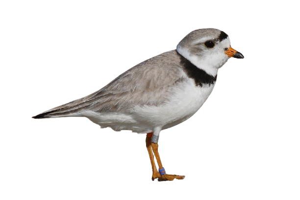

<div align="center"></div>

# Plover

Boundary-aware Traveling Salesperson routing for QGIS. Give it a point layer and a polygon boundary, get back the shortest tour that visits every point while staying inside the field and routing around any holes (sloughs, exclusion zones).

A companion to [Perch](https://github.com/Dozer3530/Perch) and [Lapwing](https://github.com/Dozer3530/Lapwing) — Perch lands your drone imagery, Lapwing watches from above, Plover walks the ground between your sample points.

AI assistance was used to make this plugin possible.

---

## Install

Grab the latest `tsp_route_generator-vX.Y.Z.zip` from the [Releases](https://github.com/Dozer3530/Plover/releases) page, then in QGIS:

**Plugins → Manage and Install Plugins → Install from ZIP** → select the file → **Install Plugin**.

Compatible with QGIS 3.x and QGIS 4.x (Qt5 and Qt6).

## What it does

Given a point layer (waypoints) and a polygon boundary, Plover:

1. Builds a visibility graph between waypoints and boundary vertices, respecting interior rings (holes).
2. Computes shortest paths between every pair of waypoints via Dijkstra.
3. Runs a nearest-neighbour TSP heuristic followed by 2-opt optimization on the waypoint-only distance matrix.
4. Stitches the optimized tour back into a continuous polyline using the cached shortest paths.
5. Adds the route as a new line layer in your QGIS project.

The output respects:

- The outer field boundary
- Interior rings (sloughs, rock piles, fenced exclusions modelled as polygon holes)
- An optional buffer to allow paths to follow the field edge slightly outside the strict boundary

## Use case

Built for field scouting and ground-truth sampling on Smart Farm research plots — you pick the points you need to visit, Plover plans the walking order that minimizes distance without crossing into the slough you weren't supposed to drive through.

Also useful for:

- Soil sampling routes
- Pest/disease scouting transects
- Manual sensor verification routes
- Any "visit N points in a constrained area" problem

## Usage

1. Load a point layer and a polygon boundary layer into your QGIS project. **Both layers must share the same projected CRS** (UTM, NAD83, etc. — not lat/lon).
2. Open Plover from the **Plugins** menu or the toolbar icon.
3. Select the point layer (POI) and boundary layer.
4. Set a buffer distance in map units (`0.1` is a reasonable default for meters).
5. Set the start point index (`0` for the first feature).
6. Click **Run**.
7. Once the route appears, click **Save Route** to export — defaults to GeoPackage; Shapefile and GeoJSON also available.

Diagnostic output is written to **View → Panels → Log Messages** under the `TSP Route Generator` tab.

## Known limitations

- The TSP solver is heuristic (nearest-neighbour + 2-opt), not exact. For large point sets (>50) results are good but not provably optimal.
- All points must lie within the buffered boundary. If any are outside, Plover will refuse to run and report which ones.
- Geographic CRS (EPSG:4326 etc.) will produce nonsense distances. Reproject to a projected CRS first.

## Why "Plover"

Piping Plovers are small, endangered shorebirds that nest on Alberta's prairie shorelines. They walk fast, in tight efficient zig-zags between feeding points, and famously avoid the obstacles in their path. Fitting for a TSP plugin.

## Project layout

```
Plover/
  assets/
    plover.png                              # logo
  tsp_route_generator/                      # QGIS plugin folder (name fixed for QGIS plugin identity)
    __init__.py
    metadata.txt
    tsp_route_generator.py                  # plugin entry, menu / toolbar registration
    tsp_route_generator_dialog.py           # dialog UI + TSP algorithm
    icon.png
    ... (Plugin Builder scaffolding: help/, i18n/, test/, scripts/, etc.)
  README.md
  LICENSE
  .gitignore
```

The QGIS plugin folder stays named `tsp_route_generator/` because QGIS identifies installed plugins by folder name on disk. Renaming it would orphan existing installs.

## License

MIT — see [LICENSE](LICENSE).

## Author

Zachary Komarnisky — Digital Agriculture program, Olds College of Agriculture & Technology.
