<div align="center">


# Plover User Guide

**Boundary-aware Travelling Salesperson routing for QGIS**

Plugin version 3.2.5 &nbsp;·&nbsp; MIT licence &nbsp;·&nbsp; QGIS 3.22+

</div>

> **Prefer an editable copy?** Download **[Plover-User-Guide.docx](Plover-User-Guide.docx)** —
> the same content as a Word document you can edit, annotate and print.

---

## Contents

| # | Chapter | Read it when |
|---|---|---|
| 1 | [Introduction and Key Concepts](#1-introduction-and-key-concepts) | You are new to Plover |
| 2 | [Installation and Setup](#2-installation-and-setup) | Installing or updating |
| 3 | [Preparing Your Data](#3-preparing-your-data) | Getting layers ready |
| 4 | [The Plover Dialog: Complete Reference](#4-the-plover-dialog-complete-reference) | Looking up a control |
| 5 | [Step-by-Step Workflows](#5-step-by-step-workflows) | Doing a real job |
| 6 | [Outputs, Styling and Exporting](#6-outputs-styling-and-exporting) | Saving and taking to the field |
| 7 | [Automation: Processing, Models and Scripting](#7-automation-processing-algorithm-models-and-scripting) | Many fields, or scripting |
| 8 | [Troubleshooting, How It Works, Limitations](#8-troubleshooting-how-it-works-and-limitations) | Something went wrong |
| A | [Quick Reference and Glossary](#appendix-a-quick-reference) | You need a fast answer |

---

## 1. Introduction and Key Concepts

### 1.1 What Plover is

Plover is a QGIS plugin that works out the **shortest order in which to visit a set of points**, and draws the resulting route on the map. Optionally, it keeps that route **inside a field boundary** and **around holes** in it — sloughs, wetlands, bush, rock piles, fenced-off areas — instead of drawing straight lines through them.

The plugin's own one-line description, from `metadata.txt`, is:

> Boundary-aware Traveling Salesperson routing: shortest tour through your points, around your sloughs.

| Item | Value |
|---|---|
| Plugin name | Plover |
| Version documented here | 3.2.5 |
| Author | Zachary Komarnisky (`zkomarnisky@oldscollege.ca`) |
| Licence | MIT |
| QGIS versions | `qgisMinimumVersion=3.22`, `qgisMaximumVersion=4.99` |
| Qt 6 support | `supportsQt6=True` |
| Menu category | `category=Vector` |
| Processing provider | Yes (`hasProcessingProvider=yes`) |
| Repository / issue tracker | `https://github.com/Dozer3530/Plover` / `https://github.com/Dozer3530/Plover/issues` |
| Plugin folder on disk | `tsp_route_generator` |

> **Note on the folder name.** The installed folder is called `tsp_route_generator`, not `plover`. That is deliberate: QGIS identifies installed plugins by their folder name, and renaming the folder would orphan existing installations. If you go looking in your QGIS profile for the plugin files, look for `tsp_route_generator`.

### 1.2 The problem Plover solves

Field work generates lists of places you have to stand: soil sample sites, scouting stops, sensors to check, plots to photograph. There are usually more of them than you can order sensibly in your head, and the order you happen to have digitized them in is almost never a sensible walking or driving order.

Two things go wrong when the order is chosen by eye:

1. **Wasted distance.** Zig-zagging back and forth across a quarter section adds kilometres of walking or driving per visit, and the penalty grows quickly with the number of stops.
2. **Illegal or impossible legs.** A straight line between two sample points may run through a slough, a wetland, a bush patch, a dugout, or off the field entirely onto someone else's land. A route that ignores obstacles is a route you cannot actually follow, so somebody in the field improvises — and the "optimized" plan stops meaning anything.

Plover addresses both. It computes a short visiting order **and** it can guarantee that every leg of the drawn route stays inside a polygon you supply and outside the holes in that polygon.

<p align="center">
  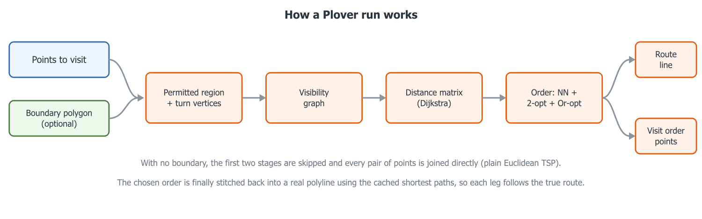
  <br><em>Figure 1.1. The Plover pipeline: point layer and optional boundary in, visibility graph and distance matrix in the middle, optimized order and stitched route out.</em>
</p>
### 1.3 Key concepts

This section defines the vocabulary used throughout the rest of the guide. If you are already comfortable with TSP solvers and visibility graphs, you can skim to section 1.4.

#### 1.3.1 The Travelling Salesperson problem (TSP)

The Travelling Salesperson problem is the classic question: *given a set of locations and the distance between each pair of them, what is the shortest route that visits every location exactly once?*

That is exactly the field-scouting question, with "locations" being your sample points and "distance" being how far you actually have to travel between them.

The problem is easy to state and famously hard to solve exactly. The number of possible orders grows factorially with the number of stops — a 20-point job already has more possible orders than you could enumerate in a lifetime. Practical software therefore uses **heuristics**: methods that reliably find a very good order quickly, without proving that no better order exists. Plover is one of these. See section 1.6 for what that honestly means for you.

Two variants matter here, and Plover supports both:

- **Closed tour (round trip)** — you finish where you started. Plover adds the final leg from the last stop back to the start point.
- **Open path (one-way)** — you start at a chosen point and finish wherever the last stop happens to be. No return leg is added.

#### 1.3.2 Waypoints

A **waypoint** in Plover is simply one point feature from your input point layer, converted to a coordinate for routing. Plover reads point geometries only; features whose geometry is empty or is not a point geometry are skipped and logged. A **multipart** point geometry is reduced to its **centroid** before routing.

The route visits every waypoint that survives that filtering (and, with a boundary in skip mode, every waypoint that falls inside the boundary).

#### 1.3.3 Boundary polygon

The **boundary** is a polygon layer describing the area the route is allowed to occupy — typically your field boundary. It is passed as the **`Boundary layer:`** dropdown in the dialog, or the **`Boundary polygon(s)`** parameter in Processing.

Points to understand about how Plover treats it:

- **All polygon features in the layer are merged into one routing region.** You do not need to pre-dissolve.
- Features are sorted by area, largest first. Any feature that is **wholly contained inside another feature** is **subtracted** — it becomes an exclusion zone. Everything else is unioned into the region. This exists because people commonly digitize a slough as a *separate polygon lying on top of* the field polygon rather than as a proper ring; Plover handles both. When this happens the plugin logs: `Treated a fully-enclosed boundary feature as an exclusion zone (hole).`
- **Invalid polygons are repaired where possible.** If a feature fails a GEOS validity check, Plover calls `makeValid()` and logs `Repaired an invalid boundary polygon with makeValid().` If the repair produces nothing usable, the feature is dropped with `Skipped an invalid boundary polygon that could not be repaired.`
- If the layer ends up contributing no usable polygons at all, the dialog reports `The boundary layer contains no usable polygons.` and Processing raises `Boundary layer contains no usable polygons.`

#### 1.3.4 Holes, interior rings and exclusion zones

A polygon in GIS has one **exterior ring** (the outline) and may have any number of **interior rings**, also called **holes**. A hole is a piece of the plane that is inside the outline but *not* part of the polygon.

In agronomic terms, an interior ring is the natural way to represent anything inside the field you must not drive through or walk across:

- sloughs, potholes and wetlands
- dugouts and water bodies
- bush, treed shelterbelts, riparian buffers
- rock piles, sinkholes, badly rutted ground
- yard sites, structures, fenced exclusions
- environmentally sensitive areas you are contractually or legally required to avoid

Throughout this guide these are referred to interchangeably as **holes**, **interior rings** or **exclusion zones**. Plover treats all three of the following identically:

1. A true interior ring digitized inside a field polygon.
2. A separate polygon feature that is fully enclosed by a larger polygon feature in the same layer (auto-subtracted, as described above).
3. Any combination of the two, across multiple features and multipart geometries.

Because a hole is not part of the polygon's interior, Plover's containment test naturally refuses any straight leg that would cross it. **You do not switch obstacle avoidance on** — it is a consequence of the geometry you supply.

#### 1.3.5 "Boundary-aware", and how it is achieved

**Boundary-aware** means the drawn route only ever consists of straight segments that lie inside the (buffered) boundary region. A leg between two waypoints is therefore not necessarily a straight line: if a straight line would leave the field or cross a slough, Plover bends the leg around the obstruction, and the *distance* it uses when optimizing the order is the length of that bent path, not the straight-line distance.

That last point is the important one agronomically. Two points on opposite sides of a large slough may be 200 m apart as the crow flies but 900 m apart as the quad drives. A plain straight-line optimizer will happily pair them as "neighbours" and produce an order that is terrible on the ground. Plover uses the real, obstacle-aware distance when it chooses the order, so the order it returns is optimized for the trip you will actually make.

Mechanically, Plover does this with a **visibility graph**:

1. **Nodes.** The waypoints, plus a small set of boundary vertices. Only vertices where a taut, shortest path could ever *turn* are kept — concave corners of the field outline and the corners of holes that stick into the field. Convex field corners and vertices that sit in a straight line along an edge can never appear on a shortest path, so they are discarded. A rectangular field with no holes contributes **zero** boundary nodes.
2. **Edges.** Two nodes are joined, with their straight-line distance as the weight, if and only if the straight segment between them lies inside the buffered region. Coincident nodes (a waypoint sitting exactly on a kept boundary vertex) are joined with a zero-cost hop.
3. **Distances.** Dijkstra's algorithm is run once from each waypoint over that graph, giving the true obstacle-aware shortest distance — and the actual path — between every pair of waypoints.
4. **Order.** The optimizer works on that distance matrix (section 1.6).
5. **Route.** The chosen order is expanded back into a continuous polyline using the cached paths, so every bend around every slough is preserved in the output line.


<p align="center">
  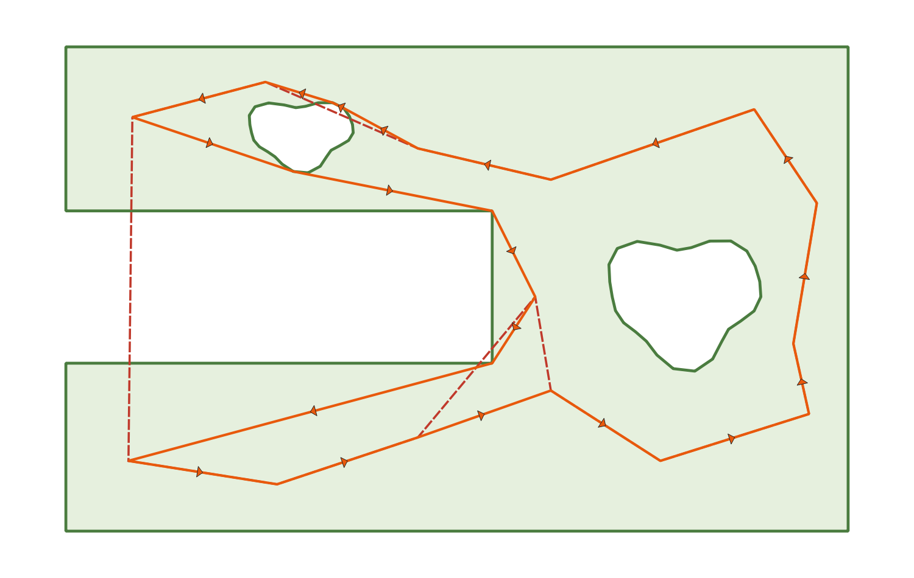
  <br><em>Figure 1.2. The same twelve points routed with no boundary (straight lines crossing the slough) and with a boundary (legs bending around it). Note that the visiting order itself changes, not just the drawn lines.</em>
</p>
#### 1.3.6 Buffer tolerance

The **boundary buffer** is a tolerance, in map units, around the boundary region. It answers the question: *how far outside the strict boundary is the route allowed to stray, and how far into an exclusion zone?*

The dialog exposes it as **`Boundary buffer:`**, a spin box with the suffix **` map units`**, two decimal places, a range of 0.00 to 1 000 000.00 and a default of **0.5**. Its tooltip reads:

> Tolerance around the boundary: the route may pass this far
> outside the field edge and this far into exclusion zones.

Processing exposes the same thing as the **`Boundary buffer`** distance parameter (`BUFFER`), default `0.5`, minimum `0.0`, with its distance units tied to the boundary layer.

Why a tolerance is needed at all:

- **Points on the edge.** GEOS's `contains` test excludes the polygon's own boundary line. With a buffer of exactly zero, a segment running precisely along the field edge would be rejected, and a sample point digitized exactly on the boundary line would be unreachable. Plover therefore always applies at least a microscopic whisker (`1e-6` map units) even if you set the buffer to 0. A realistic buffer such as the 0.5 default lets the route genuinely hug the field edge.
- **Digitizing slop.** Field boundaries and sample points frequently come from different sources — GPS walk-arounds, satellite tracing, a prescription file — and disagree by a metre or two. The buffer absorbs that disagreement instead of failing the run.
- **The containment check.** The buffer is also what the "points outside the boundary" check is measured against: a point is "outside" only if it is outside the *buffered* region. Raising the buffer is the usual first fix when Plover reports points outside the boundary.

The trade-off is direct: a larger buffer is more forgiving of data problems, but it also lets the route cut further into your sloughs and further outside your field. Set it to roughly the accuracy of your worst input dataset, not larger. In a metric projected CRS the units are metres, so `0.5` means half a metre.

The buffer applies **only when a boundary is supplied**. With the **`Boundary layer:`** dropdown left empty, the dialog disables the buffer spin box.

#### 1.3.7 Round trip versus one-way

- **Round trip (closed tour)** — the default. The dialog checkbox **`Return to start (round trip)`** is ticked by default; the Processing parameter is **`Return to start (round trip)`** (`ROUND_TRIP`, default `True`). The route ends with a leg from the last stop back to the start point, and the `round_trip` attribute on the output route is written as `yes`. Use this when you park the truck, walk or drive the points, and come back to the truck.
- **One-way (open path)** — untick the checkbox, or pass `ROUND_TRIP: False`. No return leg is added; the `round_trip` attribute is written as `no`. Use this when someone drops you at one end of the field and picks you up at the other, when the route ends at a gate or an approach on the far side, or when the route feeds into the next field's work.

The distinction changes more than just the last leg — it changes what "optimal" means, and Plover's optimizer accounts for it. A closed tour's length does not depend on where the cycle starts, so for round trips Plover is free to try several construction starting points and rotate the winning cycle back to your chosen start afterwards. An open path must genuinely begin at your chosen start, so that freedom does not exist.


#### 1.3.8 The boundary is optional

You may leave the boundary out entirely: leave **`Boundary layer:`** empty in the dialog, or omit / pass `None` for `BOUNDARY` in Processing.

What changes when you do:

| Behaviour | With a boundary | Without a boundary |
|---|---|---|
| Legs between waypoints | Bend around the field edge and holes | Always straight lines |
| Distances used for optimizing | Obstacle-aware shortest-path distance | Plain straight-line (Euclidean) distance |
| Graph built | Visibility graph over waypoints plus concave boundary/hole corners | Complete graph: every waypoint connected to every other |
| **`Boundary buffer:`** | Active | Disabled in the dialog; not applicable |
| **`Points outside boundary:`** | Active | Disabled in the dialog; no containment check runs |
| Unreachable-point check | Applies (a point can be cut off by a hole or a pinch) | Cannot occur — every point reaches every other |
| Working CRS | The **boundary** layer's CRS; points are reprojected to it | The **point** layer's CRS |
| Result | Boundary-aware TSP | Ordinary Euclidean TSP |

In short: without a boundary Plover is still a genuine TSP solver and still gives you a good visiting order and a numbered visit-order layer — it just has no idea what it is not allowed to drive across.


#### 1.3.9 Working CRS and why geographic coordinates are rejected

Plover measures distance with ordinary planar arithmetic, so its inputs must be in a **projected CRS** (UTM, a NAD83 provincial system, and so on) where one map unit is one linear unit on the ground.

- The **working CRS** is the boundary layer's CRS when a boundary is supplied, otherwise the point layer's CRS.
- The point layer is **automatically reprojected** to the working CRS if it differs. The dialog logs `Reprojecting points from … to … for routing.`
- If the working CRS is **geographic** (degrees — EPSG:4326 and similar) Plover refuses to run. The dialog reports that distances "would be meaningless" and asks you to reproject to a projected CRS such as UTM; Processing raises an equivalent `QgsProcessingException`.

All outputs are created in the working CRS. Only the GPX and KML exports are reprojected on the way out, to WGS84, because those formats require it.

#### 1.3.10 Terminology quick reference

| Term | Meaning in Plover |
|---|---|
| Waypoint | One point feature to be visited |
| Stop | A waypoint's position in the final visiting order (1, 2, 3 …) |
| Tour | A closed route that returns to the start |
| Path | An open, one-way route |
| Boundary / region | The merged polygon area the route must stay within |
| Hole / interior ring / exclusion zone | Area inside the boundary outline that the route must avoid |
| Buffer | Tolerance in map units around the boundary and exclusion zones |
| Visibility graph | Nodes (waypoints + turn vertices) joined where the straight line between them is legal |
| Turn vertex | A boundary corner where a shortest path could bend: concave field corners, hole corners |
| Leg | One segment of the route, from one stop to the next |
| Working CRS | The projected CRS all routing maths is done in |
| Map units | The linear unit of the working CRS — metres in a metric projection |

### 1.4 The two ways to run Plover

Plover offers the same routing engine through two front ends. Both call the identical `compute_route` pipeline, so a given set of inputs produces the same route either way.

#### 1.4.1 The dialog

Best for interactive, one-off work: you are looking at a field, you want a route now, and you want to eyeball it before saving.

1. Open QGIS with your point layer (and boundary layer, if you are using one) loaded.
2. Choose **Vector → Plover → Plover — Generate TSP Route**, or click the Plover toolbar button (status tip: `Boundary-aware TSP route through a point layer`).
3. The window **`Plover — TSP Route`** opens.

The dialog is **modeless** — the map stays fully usable while it is open, so you can pan, zoom, select features and re-run without closing it. Routing runs in a **background task**, so QGIS stays responsive, a live progress bar is shown, and long runs can be stopped with the **`Cancel`** button.

Dialog controls, in the order they appear:

| Control | Purpose |
|---|---|
| **`Points to visit:`** | Point-layer dropdown; tracks the layers in your project |
| **`Use only selected points`** | Route only the current selection on that layer |
| **`Boundary layer:`** | Polygon-layer dropdown; **may be left empty** |
| **`Start at point:`** | Feature picker for the starting waypoint |
| **`Boundary buffer:`** | Tolerance in map units (default 0.5); disabled with no boundary |
| **`Points outside boundary:`** | `Fail if any point is outside` / `Skip points outside the boundary`; disabled with no boundary |
| **`Return to start (round trip)`** | Ticked = closed tour, unticked = one-way path |
| **`Also create a numbered visit-order layer`** | Ticked by default |
| **`Total distance:`** | Read-only result field (placeholder: `Route length will appear here`) |
| Progress bar and status line | Live progress; the status line starts at `Ready.` |
| **`Run`** / **`Cancel`** / **`Save Route…`** / **`Close`** | Action buttons |

The dialog remembers the buffer, round-trip setting, visit-order-layer setting, outside-points mode and last save directory between sessions.


#### 1.4.2 The Processing algorithm

Best for repeatable, automated or bulk work: batch processing many fields, embedding routing in a Model Designer workflow, or scripting from PyQGIS.

Find it at **Processing Toolbox → Plover → Boundary-aware TSP route**. Its algorithm id is **`plover:tsproute`**.

| Parameter id | Label | Notes |
|---|---|---|
| `POINTS` | `Points to visit` | Point source, required |
| `BOUNDARY` | `Boundary polygon(s)` | Polygon source, **optional** |
| `BUFFER` | `Boundary buffer` | Distance, default `0.5`, minimum `0.0` |
| `START_INDEX` | `Start point index (order of the input layer)` | Integer, default `0`, minimum `0` — **zero-based** |
| `ROUND_TRIP` | `Return to start (round trip)` | Boolean, default `True` |
| `ON_OUTSIDE` | `Points outside the boundary` | Enum: `0` = `Fail if any point is outside`, `1` = `Skip points outside the boundary` |
| `OUTPUT_ROUTE` | `Route` | Line sink, required |
| `OUTPUT_ORDER` | `Visit order` | Point sink, optional, created by default |

```python
import processing
result = processing.run("plover:tsproute", {
    "POINTS": points_layer,
    "BOUNDARY": boundary_layer,  # optional — omit or pass None for a straight-line TSP
    "BUFFER": 0.5,
    "START_INDEX": 0,
    "ROUND_TRIP": True,
    "ON_OUTSIDE": 0,  # 0 = fail if any point is outside, 1 = skip outside points
    "OUTPUT_ROUTE": "memory:route",
    "OUTPUT_ORDER": "memory:visit_order",
})
```


#### 1.4.3 Choosing between them

| | Dialog | Processing |
|---|---|---|
| Start point chosen by | Feature picker (pick the actual feature) | Zero-based `START_INDEX` into the layer's feature order |
| Output layers | Added to the project, pre-styled (orange route with direction arrows; numbered orange badges) | Written to whatever sinks you specify; default QGIS styling |
| Export to GPX / KML | Yes, via **`Save Route…`** | Not built in — save the output layer yourself |
| Batch over many fields | No | Yes |
| Use inside a model | No | Yes |
| Progress and cancelling | Progress bar plus **`Cancel`** | Processing's own progress and cancel |
| Messages | Plover log panel (**View → Panels → Log Messages → Plover**) and the status line | The algorithm's Log tab |

### 1.5 What Plover produces

Covered in detail in a later chapter; in outline:

- A line layer named **`Plover route`** (dialog) or the **`Route`** output (Processing), containing one feature — the full stitched polyline — with the fields `length`, `stops` and `round_trip`.
- Optionally a point layer named **`Plover visit order`** (dialog) or the **`Visit order`** output (Processing), with one point per stop and the fields `visit_order` (1, 2, 3 …), `source_fid` (the feature id of the original input point) and `leg_length` (the length of the leg leaving that stop).
- From the dialog only, **`Save Route…`** exports the route to GeoPackage, Shapefile, GeoJSON, **GPX track** or **KML**. GPX and KML are reprojected to WGS84 automatically, so a GPX can be loaded straight onto a handheld or a phone app for field navigation.


### 1.6 Plover is a heuristic solver — what that means

This is the single most important expectation to set, so it is stated plainly.

Plover's order optimizer (`tsp_core.solve_order`) works like this:

1. **Multi-start nearest-neighbour construction.** Build a first order greedily by always hopping to the closest unvisited waypoint. For round trips, several different construction starting points are tried and the best result kept — 8 starts for up to 150 points, 4 starts for up to 400, 2 starts above that. One-way paths use a single start, because an open path must genuinely begin at your chosen point.
2. **2-opt local search.** Repeatedly reverse a section of the order when doing so shortens the route. This is what removes the crossings that make a route look obviously silly.
3. **Or-opt local search.** Repeatedly lift a run of one, two or three consecutive stops out of the order and reinsert it elsewhere (possibly reversed) when that shortens the route. This catches improvements 2-opt cannot express, such as pulling a single stop out of a detour.
4. Alternate 2-opt and Or-opt until neither can improve the route any further, and keep the best of all construction starts.

**Consequences you should understand:**

- **The result is very good but not provably optimal.** Tours are typically within a few percent of the true optimum. Plover will not tell you how far off it is, because computing that would mean solving the problem exactly.
- **The result is deterministic.** The same inputs and the same settings give the same route every time — there is no randomness. It is safe to re-run and compare.
- **Small manual improvements may exist.** If you look at a route and think "I would have done those two stops the other way round", you may occasionally be right. You are not seeing a bug.
- **It is a distance optimizer only.** It does not model time, speed, terrain difficulty, ground conditions, machinery turning radii, seeding row direction, tramlines, gates or approaches. A leg is a straight line through legal space, nothing more.
- **Distance is measured in map units of the working CRS.** In a metric projection that is metres. Plover never converts to acres, hours or fuel.

### 1.7 When should I use Plover?

Plover is a good fit when **all** of the following are true:

- You have a point layer with **at least two** point features. (Fewer is refused: `Need at least two point features to build a route.`)
- Your data is in, or can be reprojected to, a **projected CRS**.
- Travel between points is essentially **across open ground** — you go where you like within the field, rather than following a road or trail network.
- You care about the **order** of visits, and about not crossing certain areas.

Typical jobs it was built for:

- **Soil sampling routes** — a grid or zone sampling plan turned into an efficient walking or quad order.
- **Pest and disease scouting** — a set of scouting stops ordered for one pass through the field.
- **Ground-truth and plot work** — research plot visits on Smart Farm-style trial sites.
- **Manual sensor verification** — checking or downloading a set of in-field sensors.
- **Any "visit N points in a constrained area" problem** where sloughs, bush or the field edge genuinely constrain travel.

Cases where the **boundary is worth supplying** (as opposed to leaving it empty):

- The field contains sloughs, wetlands, bush or other no-go areas.
- The field is concave, L-shaped, split by a creek, or otherwise not a simple convex block.
- The route is being handed to somebody who will follow it literally, including on a GPS handheld.
- You have one large point layer covering many fields and want to route only the points inside one field — use the boundary together with `Skip points outside the boundary`.

Cases where **leaving the boundary empty** is fine:

- The field is a simple open block with nothing to avoid.
- You only want the visiting *order*, and the operator will navigate around obstacles by eye.
- You do not have a boundary polygon and it is not worth digitizing one.


### 1.8 When is Plover not the right tool?

Be honest about these up front rather than discovering them mid-season.

| Situation | Why Plover does not fit | What to do instead |
|---|---|---|
| Travel must follow roads, trails or tramlines | Plover routes across open space between visibility-graph vertices. It has no concept of a road network, one-way streets, speed limits or turn restrictions. | Use a network-analysis tool (QGIS's own network analysis, or a routing service) |
| You need a provably optimal tour | The solver is heuristic (multi-start nearest-neighbour + 2-opt + Or-opt) | Use a dedicated exact TSP solver; expect it to be far slower |
| Multiple vehicles or crews, capacity limits, time windows, shifts | Plover solves a single-vehicle TSP with no side constraints | Use a vehicle-routing (VRP) tool |
| Your data is in EPSG:4326 or another geographic CRS and must stay that way | Plover refuses geographic CRS outright — degree-based distances would be meaningless | Reproject to a projected CRS (UTM or your provincial system) before routing |
| Terrain, slope, wet spots, machinery turning radii or row direction should influence the route | None of these are modelled; a leg is a straight line through legal space | Digitize the areas to avoid as holes in the boundary, which Plover *does* respect |
| Full-coverage work: spraying, seeding, harvest passes | Plover visits discrete points; it does not plan coverage passes over an area | Use coverage/guidance path-planning software |
| You have only one point | A route needs at least two points | — |
| You want Plover to guess a route to a point it cannot legally reach | It never does. With a boundary, out-of-boundary points are either reported (fail mode) or dropped (skip mode), and points cut off by a hole or a pinch in the boundary are reported by number rather than silently straight-lined. | Fix the boundary, raise the buffer, or switch to skip mode |

### 1.9 Where to go next

- **Installation and first run** — getting the plugin into QGIS and producing your first route.
- **The dialog, control by control** — every field, checkbox and button in `Plover — TSP Route`.
- **The Processing algorithm** — batch runs, models and PyQGIS.
- **Outputs, styling and export** — the route and visit-order layers, and GPX/KML for the field.
- **Troubleshooting** — the exact messages Plover produces and what to do about each.

### 1.10 Why "Plover"

Piping Plovers are small shorebirds that nest on Alberta's prairie shorelines. They walk fast, in tight efficient zig-zags between feeding points, and they work around the obstacles in their path rather than through them — a reasonable mascot for a boundary-aware TSP tool. Plover is one of a family of bird-named QGIS plugins alongside Perch and Lapwing.


---

## 2. Installation and Setup

Plover installs like any other QGIS Python plugin. There is nothing to compile, no `pip install` step, and no configuration file to edit. This chapter covers the three ways to install it, how to confirm the installation worked, and how to enable, update, uninstall, and troubleshoot it.

Read section 2.1 first — it tells you which QGIS versions Plover will run on. Then pick **one** of sections 2.2 (plugin repository), 2.3 (ZIP file), or 2.4 (source checkout). Do not do more than one: a QGIS profile can hold only one copy of a plugin, and the later install silently replaces the earlier one.

---

### 2.1 Requirements

All of the following comes from the plugin's own `metadata.txt`.

| Item | Value | What it means for you |
|---|---|---|
| Plugin name | `Plover` | This is the name shown in the Plugin Manager and in the Processing Toolbox. |
| Version documented here | `3.2.5` | Check your installed version against this if behaviour differs from the guide. |
| `qgisMinimumVersion` | `3.22` | QGIS 3.22 (Białowieża LTR) or newer. QGIS 3.16 and older will not load it. |
| `qgisMaximumVersion` | `4.99` | Runs on the whole QGIS 3.x line and on QGIS 4.x. |
| `supportsQt6` | `True` | Works in both Qt5 builds (typical QGIS 3.x) and Qt6 builds (QGIS 4.x). |
| `category` | `Vector` | Determines where the menu entry appears — see section 2.5.1. |
| `hasProcessingProvider` | `yes` | The Processing algorithm is registered automatically; no extra step. |
| `experimental` | `False` | You do **not** need to tick "Show also experimental plugins" to find it. |
| `deprecated` | `False` | It is a current, supported plugin. |
| `server` | `False` | It is a desktop plugin. Do not expect it to do anything on QGIS Server. |
| `license` | `MIT` | The `LICENSE` file is bundled inside the plugin package. |
| Author | Zachary Komarnisky — `zkomarnisky@oldscollege.ca` | |
| Repository / homepage | `https://github.com/Dozer3530/Plover` | |
| Bug tracker | `https://github.com/Dozer3530/Plover/issues` | |

#### 2.1.1 No external Python dependencies

Plover imports only:

- the Python standard library (`os`, `math`, `heapq`, `traceback`, `datetime`), and
- the APIs that ship inside QGIS itself (`qgis.core`, `qgis.gui`, `qgis.PyQt`).

There is no NumPy, no SciPy, no Shapely, no NetworkX, no OR-Tools. You do not need to open the OSGeo4W Shell, and you do not need administrator rights to install Python packages. If QGIS starts, Plover will run.

The solver in `tsp_core.py` deliberately has no QGIS import at all, which is why it can be unit-tested with any plain Python interpreter (see the developer notes in section 2.4.4).

#### 2.1.2 Which QGIS profile you are installing into

QGIS keeps plugins **per user profile**. If your organisation uses more than one profile (`Settings ▸ User Profiles`), installing Plover into one profile does not install it into the others. When in doubt, note which profile you are in before you start, and install into that one.

To print the folder of the profile you are currently running, open `Plugins ▸ Python Console` and run:

```python
from qgis.core import QgsApplication
print(QgsApplication.qgisSettingsDirPath())
```

The plugins folder is `python/plugins` beneath the path this prints.

---

### 2.2 Procedure A — install from the official QGIS Plugin Repository (recommended)

This is the normal route for field and agronomy staff. It needs an internet connection the first time, and it gives you automatic update notifications afterwards.

1. Start QGIS.
2. From the main menu choose **`Plugins`** ▸ **`Manage and Install Plugins…`**.
3. In the left-hand list of the Plugin Manager, click **`All`**.
4. Click into the search box at the top and type `Plover`. If nothing comes back, try `TSP` instead — Plover carries the tags `tsp`, `routing`, `optimization`, `vector`, `agriculture`, `path planning`, `field work`, `visibility graph` and `processing`, so any of those words will also find it.
5. Select the entry named **`Plover`** in the results list. Confirm the description on the right reads: "Boundary-aware Traveling Salesperson routing: shortest tour through your points, around your sloughs."
6. Check the version shown on the right-hand panel. This guide documents version `3.2.5`.
7. Click **`Install Plugin`**.
8. Wait for the progress bar to finish. The Plugin Manager moves Plover into the **`Installed`** list and ticks its checkbox automatically.
9. Click **`Close`**.
10. Go to section 2.5 and verify the installation.

You do not normally need to restart QGIS after a repository install.

**If Plover does not appear in the search results**, the most common cause is that your QGIS is older than 3.22 — the Plugin Manager hides plugins whose `qgisMinimumVersion` is above your QGIS version. Check `Help ▸ About` for your QGIS version. See also section 2.9.

**If your site blocks the plugin repository** (some corporate networks do), use Procedure B instead.

---

### 2.3 Procedure B — install from a downloaded ZIP

Use this when the machine has no access to the QGIS plugin repository, when you need to pin a specific version, or when IT distributes the ZIP internally.

1. Download the release ZIP. Official releases are published at `https://github.com/Dozer3530/Plover/releases` and are named using the pattern **`plover-vX.Y.Z.zip`** — for example `plover-v3.2.5.zip`.
2. Save the ZIP somewhere you can find it, such as your Downloads folder. **Do not unzip it.** QGIS wants the ZIP itself.
3. Start QGIS.
4. Choose **`Plugins`** ▸ **`Manage and Install Plugins…`**.
5. In the left-hand list, click **`Install from ZIP`**.
6. Click the **`…`** browse button beside the file field and select the `plover-vX.Y.Z.zip` you downloaded.
7. Click **`Install Plugin`**.
8. QGIS may display a security warning that installing a plugin from an untrusted ZIP carries risk. This is a standard warning shown for every ZIP install, not something specific to Plover. Accept it only if you obtained the ZIP from the official releases page or from your own IT distribution point.
9. When the install finishes, click **`Installed`** in the left-hand list and confirm **`Plover`** is present and its checkbox is ticked.
10. Click **`Close`**.
11. Go to section 2.5 and verify the installation.

#### 2.3.1 What is inside the ZIP

The release ZIP is built by `build_zip.ps1` and contains exactly one top-level folder, `tsp_route_generator/`, holding ten runtime files:

| File | Role |
|---|---|
| `__init__.py` | The `classFactory` entry point QGIS calls when loading the plugin |
| `metadata.txt` | Version, menu category, changelog, requirements |
| `LICENSE` | The MIT licence text (bundled since 3.2.2) |
| `icon.png` | Toolbar, menu and Processing-provider icon |
| `tsp_route_generator.py` | Menu/toolbar wiring and Processing registration |
| `tsp_route_generator_dialog.py` | The dialog: inputs, outputs, save/export |
| `route_task.py` | The `compute_route` pipeline and its background-task wrapper |
| `geometry_utils.py` | Boundary merging and visibility-graph construction |
| `tsp_core.py` | Pure-Python solver (Dijkstra, 2-opt, Or-opt) |
| `processing_provider.py` | The `plover:tsproute` Processing algorithm |

Tests, caches and development files are deliberately excluded from the release ZIP.

> **The folder name matters.** QGIS identifies an installed plugin by its folder name on disk, and Plover's folder is `tsp_route_generator` — not `plover`. This is expected and documented in `__init__.py`: renaming the folder would orphan every existing install. Do not rename it.

---

### 2.4 Procedure C — install from source (developers)

Use this if you are working on Plover itself, or need to run an unreleased branch. It is a plain file copy into the active profile's plugins folder.

#### 2.4.1 Locate the profile plugins folder

| Platform | Path pattern |
|---|---|
| Windows | `%APPDATA%\QGIS\QGIS3\profiles\default\python\plugins` |
| Windows (QGIS 4.x) | `%APPDATA%\QGIS\QGIS4\profiles\default\python\plugins` |
| macOS | `~/Library/Application Support/QGIS/QGIS3/profiles/default/python/plugins` |
| macOS (QGIS 4.x) | `~/Library/Application Support/QGIS/QGIS4/profiles/default/python/plugins` |
| Linux | `~/.local/share/QGIS/QGIS3/profiles/default/python/plugins` |
| Linux (QGIS 4.x) | `~/.local/share/QGIS/QGIS4/profiles/default/python/plugins` |

Replace `default` with your profile name if you are not using the default profile. On Windows, `%APPDATA%` normally expands to `C:\Users\<you>\AppData\Roaming` — you can paste `%APPDATA%\QGIS` straight into the File Explorer address bar.

If you would rather have QGIS tell you than guess, run this in `Plugins ▸ Python Console`:

```python
import os
from qgis.core import QgsApplication
print(os.path.join(QgsApplication.qgisSettingsDirPath(), "python", "plugins"))
```

#### 2.4.2 Copy the plugin folder

1. Clone or download the repository, e.g. `git clone https://github.com/Dozer3530/Plover.git`.
2. Copy the **`tsp_route_generator`** folder from the repository root into the plugins folder from the table above. Copy the folder itself, not the repository root and not the folder's contents.
3. Confirm the resulting path looks like this (Windows example):

   ```
   %APPDATA%\QGIS\QGIS3\profiles\default\python\plugins\tsp_route_generator\__init__.py
   ```

   `__init__.py` and `metadata.txt` must sit **directly** inside `tsp_route_generator`. If your path has an extra level — for example `…\plugins\Plover\tsp_route_generator\__init__.py` or `…\plugins\plover-v3.2.5\tsp_route_generator\__init__.py` — QGIS will not see the plugin.
4. Restart QGIS.
5. Open **`Plugins`** ▸ **`Manage and Install Plugins…`** ▸ **`Installed`** and tick the checkbox beside **`Plover`**.
6. Go to section 2.5 and verify.

Instead of copying, developers on Linux and macOS often symlink the working tree into the plugins folder so edits take effect without re-copying:

```bash
ln -s ~/GIT/Plover/tsp_route_generator \
      ~/.local/share/QGIS/QGIS3/profiles/default/python/plugins/tsp_route_generator
```

On Windows the equivalent, run from an elevated prompt, is:

```powershell
New-Item -ItemType SymbolicLink `
  -Path "$env:APPDATA\QGIS\QGIS3\profiles\default\python\plugins\tsp_route_generator" `
  -Target "C:\Users\<you>\GIT\Plover\tsp_route_generator"
```

After editing source you must restart QGIS for the change to load, unless you use the separate third-party **Plugin Reloader** plugin, which reloads a named plugin in place.

#### 2.4.3 Building a release ZIP from source

`build_zip.ps1` reads the version out of `metadata.txt`, packages only the ten runtime files listed in section 2.3.1, and writes `plover-vX.Y.Z.zip` into the repository root. Run it from the repository root:

```powershell
.\build_zip.ps1
```

It writes forward-slash entry names on purpose, so the ZIP extracts correctly on Linux and macOS as well as Windows. It fails loudly if any runtime file is missing.

#### 2.4.4 Running the tests

The pure-Python solver core has no QGIS dependency, so its tests run under any Python interpreter:

```powershell
python -m unittest tsp_route_generator.test.test_tsp_core -v
```

The integration and dialog tests need the real QGIS API, so run them through the QGIS Python launcher:

```powershell
& "C:\Program Files\QGIS 4.0.1\bin\python-qgis.bat" -m unittest discover -s tsp_route_generator/test -t . -v
```

Adjust the path to match your installed QGIS version.

---

### 2.5 Verifying the installation

After any of the three procedures, check all three access points. Each one is wired up independently in `tsp_route_generator.py`, so if only one of them is missing the fault is narrow and section 2.9 will tell you where to look.

#### 2.5.1 The menu entry

Plover declares `category=Vector` in `metadata.txt` and registers itself with `addPluginToVectorMenu`, so it lives under the **Vector** menu — not the generic Plugins menu.

Navigate to:

> **`Vector`** ▸ **`Plover`** ▸ **`Plover — Generate TSP Route`**

Hovering the entry shows the status tip **`Boundary-aware TSP route through a point layer`** in the QGIS status bar.

> **Note for anyone upgrading from 3.2.4 or earlier:** the menu entry used to sit under the **Plugins** menu. It moved to the **Vector** menu in version 3.2.5. Older documentation, screenshots and the repository README may still say "Plugins menu"; the Vector menu is correct for 3.2.5 and later.

Click the entry. A modeless dialog titled **`Plover — TSP Route`** opens. "Modeless" means you can keep using the map while it is open — that is intended behaviour, not a bug.

<p align="center">
  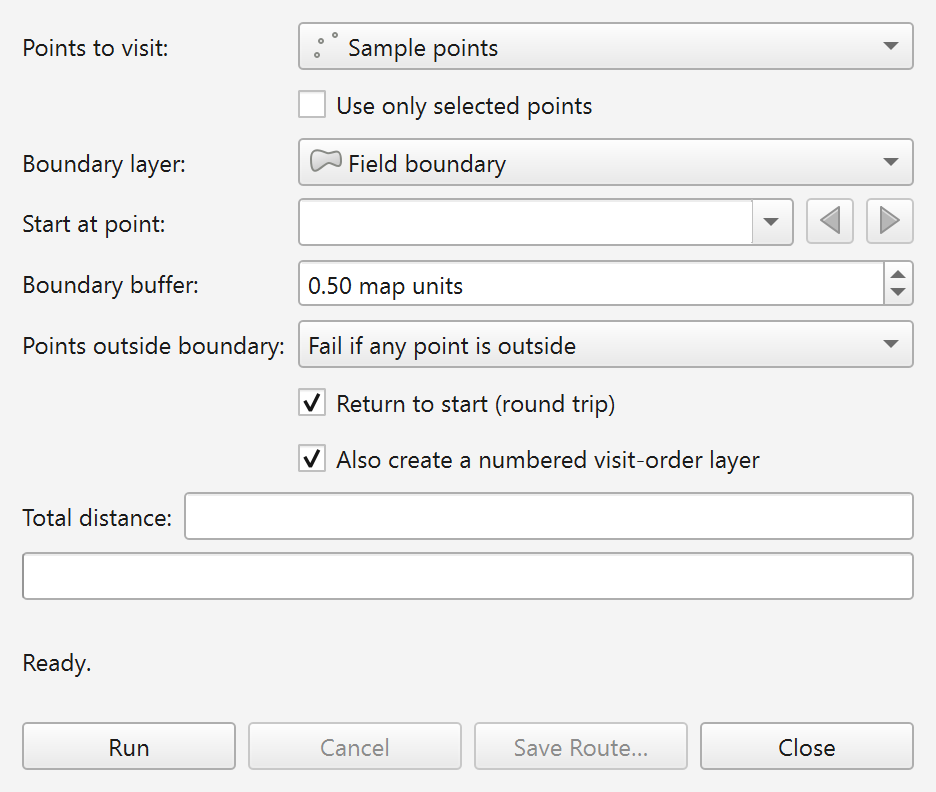
  <br><em>Figure 2.1. The Plover — TSP Route dialog as it opens on a fresh installation, before any layer is chosen.</em>
</p>
#### 2.5.2 The toolbar button

`initGui` also calls `addToolBarIcon`, which puts the Plover icon on the QGIS **Plugins Toolbar**. Look for the plover icon; its tooltip reads **`Plover — Generate TSP Route`**. Clicking it opens the same dialog as the menu entry.

If you cannot see it, the Plugins Toolbar may simply be hidden. Turn it on with **`View`** ▸ **`Toolbars`** ▸ **`Plugins Toolbar`** (tick it). Toolbars can also be dragged off-screen or collapsed into the `»` overflow arrow at the end of a toolbar row.

#### 2.5.3 The Processing Toolbox entry

Because `metadata.txt` sets `hasProcessingProvider=yes` and `initGui` calls `initProcessing`, Plover registers a Processing provider as soon as the plugin loads.

1. Open the Processing Toolbox with **`Processing`** ▸ **`Toolbox`** (or press `Ctrl+Alt+T`).
2. In the tree, find the provider group named **`Plover`**.
3. Expand it. It contains one algorithm: **`Boundary-aware TSP route`**.

The identifiers a technical user needs:

| Item | Value | Source |
|---|---|---|
| Provider id | `plover` | `PloverProcessingProvider.id()` |
| Provider display name | `Plover` | `PloverProcessingProvider.name()` |
| Algorithm name | `tsproute` | `PloverRouteAlgorithm.name()` |
| Algorithm display name | `Boundary-aware TSP route` | `PloverRouteAlgorithm.displayName()` |
| Fully qualified algorithm id | `plover:tsproute` | provider id + algorithm name |


To confirm registration from the QGIS Python Console (`Plugins ▸ Python Console`):

```python
import processing
processing.algorithmHelp("plover:tsproute")
```

If the algorithm is registered, this prints its description and its full parameter list. If it raises an error or prints nothing useful, the provider is not registered — see section 2.9.

You can also list every loaded plugin by folder name; Plover appears as `tsp_route_generator`:

```python
import qgis.utils
print(sorted(qgis.utils.plugins.keys()))
```

#### 2.5.4 A one-minute smoke test

If you want proof that the routing engine itself works, not just that the menus exist:

1. Load, or draw, a point layer with at least two points in a **projected** CRS (UTM, for example). Plover rejects geographic CRS such as EPSG:4326 outright, so a lat/long layer will produce an error message rather than a route — that is by design, not an installation problem.
2. Open **`Vector`** ▸ **`Plover`** ▸ **`Plover — Generate TSP Route`**.
3. Choose your layer in **`Points to visit:`**. Leave **`Boundary layer:`** empty — with no boundary Plover solves a plain straight-line tour, which is the fastest way to prove the install.
4. Click **`Run`**.
5. Within a second or two the status line should change from `Ready.` to a `Done — …` message, **`Total distance:`** should fill in, and a memory layer named **`Plover route`** should appear in the Layers panel (plus **`Plover visit order`** if the numbered-layer checkbox is ticked).

If that works, the installation is complete and correct.

---

### 2.6 Enabling and disabling the plugin

An installed plugin only loads when its checkbox is ticked. A plugin can end up unticked because someone disabled it deliberately, or because a previous load error caused QGIS to switch it off.

To enable:

1. **`Plugins`** ▸ **`Manage and Install Plugins…`**.
2. Click **`Installed`** in the left-hand list.
3. Find **`Plover`** in the list. (The list is sorted by display name, so look under P, not under T for `tsp_route_generator`.)
4. Tick the checkbox beside it.
5. Click **`Close`**.

The Vector menu entry, the toolbar button and the Processing provider all appear immediately — they are created in `initGui`, which runs when the plugin is enabled.

To disable, untick the same checkbox. `unload` runs and removes all three: the Vector menu entry, the toolbar icon and the `Plover` Processing provider. Any open Plover dialog is closed, and if a route is still computing in the background it is cancelled. Disabling does not delete the plugin files and does not touch your saved preferences.

---

### 2.7 Updating to a new version

#### 2.7.1 If you installed from the plugin repository

1. **`Plugins`** ▸ **`Manage and Install Plugins…`**.
2. Click **`Upgradable`** in the left-hand list. QGIS checks the repository on startup by default, so a new Plover release usually announces itself with a message-bar notification.
3. Select **`Plover`**.
4. Click **`Upgrade Plugin`**.
5. Restart QGIS if prompted.

#### 2.7.2 If you installed from a ZIP

Repeat Procedure B (section 2.3) with the newer `plover-vX.Y.Z.zip`. Installing from ZIP over an existing install replaces it; you do not need to uninstall first.

#### 2.7.3 If you installed from source

Pull the latest commits and copy the `tsp_route_generator` folder over the old one, then restart QGIS. If you symlinked the working tree, a `git pull` plus a QGIS restart is enough.

#### 2.7.4 After any upgrade

- Confirm the version in **`Plugins`** ▸ **`Manage and Install Plugins…`** ▸ **`Installed`**; the installed version is shown alongside the plugin.
- Read the `changelog` section of `metadata.txt`, or the release notes on GitHub. Behaviour genuinely moves between versions: the menu moved from Plugins to Vector in 3.2.5, the boundary became optional in 3.2.0, the "Points outside boundary" choice arrived in 3.1.0, and background/cancellable runs plus the `plover:tsproute` algorithm arrived in 3.0.0.
- Your saved preferences survive upgrades (section 2.8.1), so the dialog reopens with the buffer, round-trip and outside-mode settings you last used.

---

### 2.8 Uninstalling

1. **`Plugins`** ▸ **`Manage and Install Plugins…`**.
2. Click **`Installed`**.
3. Select **`Plover`**.
4. Click **`Uninstall Plugin`** and confirm.

This removes the menu entry, the toolbar icon and the Processing provider, and deletes the `tsp_route_generator` folder from the profile's plugins directory.

For a source install made by copying or symlinking the folder yourself, the Plugin Manager may not offer **`Uninstall Plugin`**. In that case close QGIS and delete (or unlink) the `tsp_route_generator` folder from the plugins path in section 2.4.1 by hand.

#### 2.8.1 What uninstalling does *not* remove

Plover remembers a few dialog preferences using QGIS's own settings store (`QgsSettings`), which lives in the user profile, not in the plugin folder. Uninstalling the plugin leaves these keys behind:

| Settings key | What it remembers |
|---|---|
| `plover/buffer` | Last value of **`Boundary buffer:`** (defaults to `0.5`) |
| `plover/round_trip` | Last state of **`Return to start (round trip)`** (defaults to ticked) |
| `plover/order_layer` | Last state of **`Also create a numbered visit-order layer`** (defaults to ticked) |
| `plover/outside_mode` | Last value of **`Points outside boundary:`** — stored as `fail` or `skip` (defaults to `fail`) |
| `plover/last_save_dir` | The folder last used by **`Save Route…`** |

These are harmless, take up a trivial amount of space, and are picked up again if you reinstall. If you genuinely want a clean slate, delete the `plover/*` keys through **`Settings`** ▸ **`Options`** ▸ **`Advanced`**, or simply create a fresh user profile.

Output layers Plover created (`Plover route`, `Plover visit order`) are ordinary QGIS memory layers. They belong to your project, not to the plugin, and are unaffected by uninstalling. Files you exported with **`Save Route…`** are likewise untouched.

---

### 2.9 Installation troubleshooting

#### 2.9.1 Plover does not appear in the Plugin Manager at all

| Check | Fix |
|---|---|
| Your QGIS version is older than 3.22 | Check `Help ▸ About`. The Plugin Manager hides plugins whose `qgisMinimumVersion` exceeds your QGIS version. Upgrade QGIS; there is no build of Plover for 3.16 or earlier. |
| You searched the wrong list | Repository installs: search under **`All`**. Already-installed copies: look under **`Installed`**. |
| You searched for the folder name | Search for `Plover`, not `tsp_route_generator`. The Plugin Manager lists the display name. |
| Repository is unreachable | In the Plugin Manager, open **`Settings`** and press **`Reload Repository`**. If your network blocks it, use Procedure B (ZIP). |
| Wrong profile | You may have installed into a different user profile. Check `Settings ▸ User Profiles`, or print the profile path as shown in section 2.1.2. |

#### 2.9.2 Source or manual install: nothing shows up after restarting QGIS

Almost always a folder-depth problem. The file `__init__.py` must be **exactly two levels** below the profile folder, at `…/python/plugins/tsp_route_generator/__init__.py`.

| Symptom | Cause | Fix |
|---|---|---|
| Path is `…/plugins/plover-v3.2.5/tsp_route_generator/__init__.py` | You unzipped the release ZIP into the plugins folder instead of using **Install from ZIP** | Move the inner `tsp_route_generator` folder up one level and delete the wrapper folder |
| Path is `…/plugins/Plover/tsp_route_generator/__init__.py` | You copied the whole repository instead of just the plugin folder | Move `tsp_route_generator` up one level |
| Path is `…/plugins/tsp_route_generator/tsp_route_generator/__init__.py` | The folder was copied into itself | Remove the extra level |
| Folder renamed to `plover` or similar | QGIS identifies plugins by folder name | Rename it back to `tsp_route_generator` exactly |
| Files copied but QGIS still not restarted | Plugins are discovered at startup | Restart QGIS |

#### 2.9.3 Plover is listed but the checkbox will not stay ticked

That is QGIS disabling a plugin that raised an error while loading. Open **`View`** ▸ **`Panels`** ▸ **`Log Messages`** and read the **`Plugins`** tab for the traceback. The two usual causes are an incomplete copy (one of the ten runtime files missing) and a QGIS version below 3.22. Re-copy the full folder, or upgrade QGIS.

#### 2.9.4 The plugin is enabled but the menu entry is missing

| Check | Fix |
|---|---|
| You are looking under the **Plugins** menu | From version 3.2.5 the entry lives under **`Vector`** ▸ **`Plover`** ▸ **`Plover — Generate TSP Route`**. Older notes and the README may still say Plugins. |
| You are running 3.2.4 or older | On those versions the entry *is* under the Plugins menu. Check your installed version, and upgrade if you want the documented layout. |
| The Vector menu is short or missing entries | Some QGIS setups hide menus per profile/customisation. Check `Settings ▸ Interface Customization` and make sure menu customisation is not hiding the entry. |
| Checkbox is unticked | Section 2.6. The menu entry only exists while the plugin is enabled. |

The toolbar button is registered by the same code as the menu entry, so if the toolbar icon is present but the menu entry is not, suspect interface customisation rather than the plugin.

#### 2.9.5 The toolbar button is missing

Turn the toolbar back on with **`View`** ▸ **`Toolbars`** ▸ **`Plugins Toolbar`**. If the toolbar is visible but crowded, the Plover icon may be hidden behind the `»` overflow arrow at the right-hand end of the toolbar row. As a fallback, the menu entry always does the same thing as the button.

#### 2.9.6 The Processing Toolbox has no Plover provider

| Check | Fix |
|---|---|
| The Toolbox panel is closed | **`Processing`** ▸ **`Toolbox`**, or `Ctrl+Alt+T` |
| The core Processing plugin is disabled | **`Plugins`** ▸ **`Manage and Install Plugins…`** ▸ **`Installed`**, tick **`Processing`**. Plover's provider cannot register if Processing itself is not running. |
| Plover itself is disabled | The provider is added in `initGui`. A disabled plugin registers nothing. Tick Plover (section 2.6). |
| A search filter is active | Clear the Toolbox's search box; a stale filter hides whole providers. |
| Providers hidden in options | **`Settings`** ▸ **`Options`** ▸ **`Processing`** ▸ **`Providers`**, and make sure **`Plover`** is activated. |
| Just installed, provider still absent | Restart QGIS, then re-check with `processing.algorithmHelp("plover:tsproute")` from the Python Console. |

#### 2.9.7 Where to look when something else goes wrong

Plover writes its own diagnostics to a dedicated log tab. Open **`View`** ▸ **`Panels`** ▸ **`Log Messages`** and select the **`Plover`** tab. Reprojection notices, boundary repairs, skipped features, points outside the boundary and full tracebacks for unexpected failures all land there. The **`Plugins`** tab in the same panel is the place to look for load-time errors instead.

If a problem survives all of the above, raise it at `https://github.com/Dozer3530/Plover/issues`, and include your QGIS version (`Help ▸ About`), your operating system, the Plover version from the Plugin Manager, and the relevant text from the `Plover` and `Plugins` log tabs.


---

## 3. Preparing Your Data

Plover is deliberately undemanding about attributes — it never reads a single field from your input layers. What it *is* strict about is geometry and coordinate reference systems. Almost every "Plover won't run" support question comes down to one of three things: a layer in degrees, a boundary that is not really closed around the points, or a slough that was digitised in a way Plover cannot recognise as a hole.

This chapter explains exactly what the inputs must look like, exactly what Plover does to them, and how to fix them when they are wrong.

### 3.1 What Plover needs, at a glance

| Input | Required? | Geometry | Attributes needed | Notes |
|---|---|---|---|---|
| Points to visit | Yes | Point layer (single or multipart) | None | At least two usable point features |
| Boundary layer | No | Polygon layer (single or multipart) | None | All features are merged into one routing region |

Both dropdowns in the dialog are filtered by geometry type, so a line layer or a table simply will not appear in the list. In the dialog the labels are **Points to visit:** and **Boundary layer:**. In the Processing algorithm they are **Points to visit** and **Boundary polygon(s)**.

Plover writes its own output fields (`length`, `stops`, `round_trip` on the route; `visit_order`, `source_fid`, `leg_length` on the visit-order layer). Nothing in your input layer is copied through, so you do not need to add an "order" or "id" column before running. The only link back to your source data is `source_fid`, which stores the QGIS feature ID of the input point.

<p align="center">
  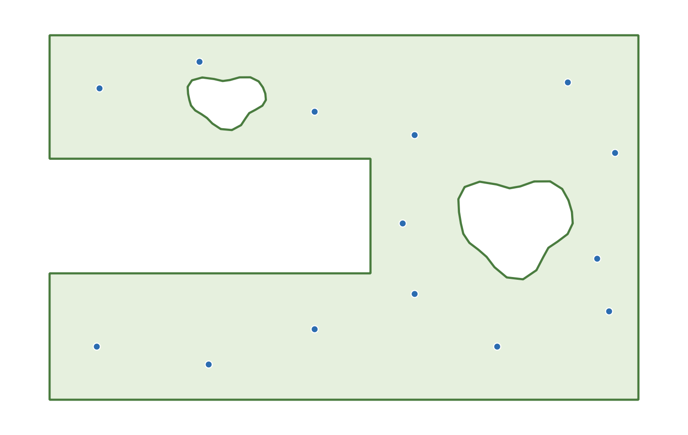
  <br><em>Figure 3.1. A typical Plover input set: a sampling point layer, a field boundary polygon, and a slough digitised as an interior ring inside that polygon.</em>
</p>
---

### 3.2 Coordinate reference systems

This is the single most important section in the chapter. Plover measures everything in straight-line map units. If the map units are degrees, every distance it reports and every tolerance you type is nonsense — so Plover refuses to run rather than produce a plausible-looking, wrong answer.

#### 3.2.1 The "working CRS"

Plover picks one CRS and does all of its geometry work in it. That CRS is called the *working CRS* in this guide, and which layer supplies it depends on whether you gave Plover a boundary:

| Situation | Working CRS is taken from | What gets reprojected |
|---|---|---|
| A boundary layer is selected | The **boundary layer's** CRS | The points are reprojected into the boundary's CRS |
| **Boundary layer** is left empty | The **point layer's** CRS | Nothing — the points are already in the working CRS |

The boundary geometry is never reprojected. It is used exactly as it is stored, and it defines the coordinate space that everything else is pulled into.

Three consequences worth internalising:

1. **The output layers are created in the working CRS**, not in your project CRS. A route computed against a boundary in NAD83 / UTM zone 11N comes back as a NAD83 / UTM zone 11N layer, whatever the project is set to. QGIS will reproject it on the fly for display, so it will still line up on screen.
2. **The boundary buffer is in working-CRS units.** The dialog spin box is labelled **Boundary buffer:** and its suffix is literally `" map units"`. With a UTM boundary those units are metres, so the default `0.5` means half a metre.
3. **Only the working CRS is checked** for being geographic (see below). Your point layer's own CRS is not checked when a boundary is present, because the points are going to be reprojected anyway.

#### 3.2.2 The projected-CRS rule

Before it does anything else, Plover tests whether the working CRS is geographic (an angular, latitude/longitude system such as EPSG:4326 WGS 84). If it is, the run stops immediately with an error. The wording differs slightly between the dialog and Processing, and the word "boundary" or "point" is substituted depending on which layer supplied the working CRS:

| Where | Exact message |
|---|---|
| Dialog, with a boundary selected | `The boundary layer uses a geographic CRS (degrees). Distances would be meaningless — reproject to a projected CRS (e.g. UTM) first.` |
| Dialog, no boundary selected | `The point layer uses a geographic CRS (degrees). Distances would be meaningless — reproject to a projected CRS (e.g. UTM) first.` |
| Processing, with a boundary | `The boundary layer uses a geographic CRS (degrees); reproject to a projected CRS (e.g. UTM) first.` |
| Processing, no boundary | `The point layer uses a geographic CRS (degrees); reproject to a projected CRS (e.g. UTM) first.` |

In the dialog this appears as red text in the status line under the progress bar; nothing is computed and no layers are added. In Processing it is raised as an algorithm exception, so the run fails and appears in the algorithm's **Log** tab.

Note the asymmetry that follows from 3.2.1: **a point layer in EPSG:4326 is perfectly acceptable as long as you also supply a boundary in a projected CRS.** Plover will reproject the points into the boundary's CRS and carry on. It is only when the *working* CRS is geographic that the run is refused. If you drop the boundary from that same setup, the run will now fail, because the point layer has become the working CRS.

#### 3.2.3 Why degrees would be meaningless

A projected CRS has axes measured in a real ground unit — metres, usually — and one unit is the same length everywhere on the map. A geographic CRS measures in degrees of latitude and longitude, and a degree is not a fixed ground distance:

- One degree of latitude is roughly 111 km anywhere.
- One degree of longitude is about 111 km at the equator but only about 68 km at 52° N (central Alberta), because the meridians converge as you go north.

So in degrees the x and y axes have different scales, and the x scale changes with latitude. Every calculation Plover performs — the straight-line distance between two points, the total tour length, the buffer around the field edge — uses plain Pythagorean arithmetic on those coordinates. In degrees that produces a number with no physical meaning, and it is systematically biased: east–west legs would be over-weighted relative to north–south legs, so the "optimised" visiting order would genuinely be the wrong order, not merely a right order with wrong units.

The tolerances go wrong even more dramatically. The default buffer of `0.5` map units means half a metre in UTM. In degrees it would mean half a degree — roughly 55 km. Every point in the province would count as "inside the boundary".

#### 3.2.4 Automatic reprojection of the points

When a boundary is present and the point layer's CRS differs from it, Plover builds a coordinate transform and converts each point on the fly. Your point layer on disk is never modified.

In the dialog this is announced in the log (see 3.4.5) as, for example:

```
Reprojecting points from EPSG:4326 to EPSG:26911 for routing.
```

If an individual point cannot be transformed, the dialog skips just that feature and logs:

```
Skipping feature 42: reprojection failed.
```

The Processing algorithm performs the same transform (using the Processing context's transform context) but does not trap per-feature transform failures — a transform error there will fail the whole algorithm rather than silently drop a point.

Because the transform is silent-by-default and per-feature, it is worth checking the log after a run that mixed CRSs, especially if the reported number of stops is lower than the number of points you expected.

#### 3.2.5 How to reproject a layer

If you are told to reproject, use one of these. All of them create a **new** dataset; none of them alter the original.

**Method A — Processing (recommended, repeatable):**

1. Open **Vector → Data Management Tools → Reproject Layer…**
2. **Input layer**: your boundary (or point) layer.
3. **Target CRS**: a projected CRS covering your field — for the Canadian prairies, NAD83 / UTM zone 11N (`EPSG:26911`) or zone 12N (`EPSG:26912`) are the usual choices; pick the zone your field actually falls in. If your organisation standardises on an Alberta 3TM or 10TM zone, use that instead.
4. **Reprojected**: give it a real filename (a GeoPackage is a good default) rather than leaving it as a temporary layer.
5. Click **Run**, then use the new layer in Plover.

**Method B — Export:**

1. Right-click the layer in the **Layers** panel → **Export → Save Features As…**
2. Set **Format** (GeoPackage), **File name**, and importantly the **CRS** selector to your projected CRS.
3. Tick **Add saved file to map** and click **OK**.

**Method C — from the Python console:**

```python
import processing

processing.run("native:reprojectlayer", {
    "INPUT": "C:/data/field_boundary.shp",
    "TARGET_CRS": "EPSG:26911",
    "OUTPUT": "C:/data/field_boundary_utm11n.gpkg",
})
```

> **Do not confuse reprojecting with re-declaring.** Layer **Properties → Source → Set Source Coordinate Reference System** (and the "assign CRS" tools) only change the label QGIS attaches to the existing coordinates. If your data really is in degrees, telling QGIS it is UTM will not convert anything — it will place your field somewhere off the coast of Africa and Plover will happily compute a route through nonsense coordinates. Always convert the geometry, do not relabel it.

Changing the **project** CRS also has no effect on this check. Plover reads the *layer's* CRS, not the project's.

---

### 3.3 The point layer

#### 3.3.1 Basic requirements

- It must be a point layer. The **Points to visit:** dropdown only lists point layers; the Processing parameter only accepts point vector sources.
- At least two features must survive the filtering described below.
- No attributes are required.
- Any provider works: GeoPackage, shapefile, delimited text (CSV loaded as points), memory/scratch layers, a database layer, and so on.

#### 3.3.2 How each feature is treated

Plover walks the features in layer order and applies these rules, in this order:

| Condition | What Plover does | Dialog log message |
|---|---|---|
| Geometry is NULL or empty | Skipped | `Skipping feature <id>: empty geometry.` |
| Geometry is not a point (e.g. a mixed-geometry layer) | Skipped | `Skipping feature <id>: not a point.` |
| Geometry is **multipart** (MultiPoint) | The geometry's **centroid** is used as the single waypoint | *(no message)* |
| Single-part point | Its coordinate is used | *(no message)* |
| Reprojection fails for that feature | Skipped (dialog only) | `Skipping feature <id>: reprojection failed.` |

Two behaviours deserve emphasis:

**Multipart points collapse to a centroid.** A MultiPoint feature holding three cluster members does not become three stops — it becomes one stop at the centroid of those three, which may be a location where no sample was actually taken. Shapefiles in particular are often written as MultiPoint even when every feature has exactly one point; in that harmless case the centroid *is* the point and nothing changes. But if you genuinely have multi-member features, run **Vector → Geometry Tools → Multipart to Singleparts** first so that each sample site becomes its own waypoint.

**The dialog logs skips; Processing does not.** The Processing algorithm applies the same NULL / empty / non-point filter but drops those features silently. If you are running in batch or in a model, reconcile the `stops` count in the output against your expected point count rather than assuming everything was included.

#### 3.3.3 Too few points

If fewer than two usable points remain, the run stops:

| Where | Exact message |
|---|---|
| Dialog | `Need at least two point features to build a route.` |
| Processing | `Need at least two point features.` |

If you see this on a layer that visibly has plenty of points, the cause is almost always the filtering table above (empty geometries, or a layer whose "points" are actually something else) or the **Use only selected points** option below.

#### 3.3.4 Using a selection

The dialog has a checkbox labelled **Use only selected points**. When it is ticked, Plover routes only the currently selected features of the point layer. If nothing is selected you get:

```
'Use only selected points' is on, but no points are selected.
```

In the Processing algorithm the equivalent is the standard **Selected features only** option on the **Points to visit** input.

The boundary layer is different: the dialog always reads **every** feature of the boundary layer, regardless of what is selected on it. A selection on the boundary layer has no effect in the dialog. (In Processing, the boundary is an ordinary feature source, so its own **Selected features only** option does apply.)

#### 3.3.5 Point ordering and the start point

The dialog lets you choose the start with the **Start at point:** feature picker, so ordering does not matter to you there.

The Processing algorithm instead takes **Start point index (order of the input layer)**, a zero-based number. Be aware that this indexes the list of points Plover actually kept, *after* the NULL/empty/non-point filter has run. If features 0 and 1 of your layer have empty geometries, index `0` refers to what you think of as the third feature. An out-of-range value fails with:

```
Start point index must be between 0 and <n-1>.
```

where `<n-1>` is one less than the number of kept points. This is a good reason to clean empty geometries out of a layer before using it in a model or batch run, where you cannot see what was dropped.

---

### 3.4 The boundary layer

The boundary is optional. Leave **Boundary layer:** empty (the dropdown allows an empty entry) and Plover solves a plain straight-line tour with no obstacle avoidance; the **Boundary buffer:** and **Points outside boundary:** controls are greyed out because they have nothing to act on. Everything in this section applies only when you do supply a boundary.

#### 3.4.1 Basic requirements

- It must be a polygon layer. The dropdown filters to polygon layers; the Processing parameter accepts polygon vector sources only.
- Its CRS must be projected (section 3.2.2) — it is the working CRS.
- No attributes are required.
- It may contain one feature or many. It may contain multipart polygons. It may contain interior rings (holes).

#### 3.4.2 How multiple boundary features are merged

Plover does not ask you which polygon is "the field". It reads every boundary feature that has a geometry and merges them into a single routing region using a fixed rule. Understanding this rule is what lets you model sloughs as separate polygons.

The merge works like this:

1. **Filter.** Features with no geometry, empty geometry, or non-polygon geometry are dropped.
2. **Repair.** Any geometry that is not GEOS-valid is passed through `makeValid()` (see 3.4.4).
3. **Sort by area, largest first.**
4. **Seed.** The largest polygon becomes the working region.
5. **Fold in each remaining polygon, in descending area order:**
   - If the current region **fully contains** the polygon, the polygon is **subtracted** — it becomes a hole, an exclusion zone.
   - Otherwise, the polygon is **unioned** into the region — the routable area grows.

Two details follow from step 5 that are easy to get wrong:

- **The test is against the region as it stands at that moment,** not against the original largest polygon. So if two adjacent quarter-sections are unioned into one region first, a slough polygon sitting inside either of them will still be recognised as fully enclosed and subtracted.
- **"Fully contains" means fully.** If any part of the inner polygon pokes outside the region — even slightly, because it was snapped sloppily to a field edge — the containment test fails and the polygon is **unioned instead of subtracted**. Instead of an exclusion zone you get a bump added to the field. This failure is quiet: the only symptom is a route that happily drives straight through the slough. If that happens, check that the slough polygon is genuinely inside the field polygon and does not overhang it.

When a polygon is subtracted, Plover records a note (see 3.4.5):

```
Treated a fully-enclosed boundary feature as an exclusion zone (hole).
```

If nothing usable survives step 1 and 2, the run stops:

| Where | Exact message |
|---|---|
| Dialog | `The boundary layer contains no usable polygons.` |
| Processing | `Boundary layer contains no usable polygons.` |

#### 3.4.3 Multipart boundary features

A multipart polygon feature is accepted, and its parts all contribute to the region. But note carefully: **the enclosure rule compares whole features against each other, never parts within one feature.** Plover never inspects the parts of a single multipart geometry to see whether one encloses another.

Practical consequence: if you draw the field as part 1 and the slough as part 2 of the *same* multipart feature, the slough will **not** become an exclusion zone. That geometry is also self-overlapping and therefore invalid, so it will be pushed through `makeValid()` first and you will end up routing across whatever that repair produces. Use one of the two supported patterns in section 3.5 instead.

Multipart features are entirely fine when the parts are genuinely separate areas — two disjoint blocks of the same field, for instance.

#### 3.4.4 Invalid polygons and automatic repair

Self-intersecting rings, bow ties, duplicated vertices and rings that cross themselves are common in hand-digitised and legacy boundary data. Plover checks each polygon with a GEOS validity test and, if it fails, attempts `makeValid()`:

| Outcome | Note recorded |
|---|---|
| Repair produced a usable geometry | `Repaired an invalid boundary polygon with makeValid().` |
| Repair produced nothing usable | `Skipped an invalid boundary polygon that could not be repaired.` |

Both of these are notes about your data, not about Plover. Repair is a best-effort rescue: `makeValid()` will produce *a* valid geometry, but not necessarily the geometry you meant. A bow-tie polygon can come back as two lobes; a self-overlapping outline can come back with the overlap merged away. **If you see a repair note, treat the resulting route as provisional and fix the source polygon properly** with **Vector → Geometry Tools → Check Validity** and the vertex tool, or with **Vector → Geometry Tools → Fix Geometries** to produce a cleaned copy you can inspect.

The second message means a polygon was thrown away entirely. If your route looks like it is ignoring part of the field, that message is the first thing to look for.

#### 3.4.5 Where the notes appear

The boundary notes above are informational; they never stop the run, so they are easy to miss.

- **In the dialog** they are written to the QGIS message log under the tag `Plover`, at warning level. Open it with **View → Panels → Log Messages**, then select the **Plover** tab. Get into the habit of checking this tab after any run on unfamiliar boundary data.
- **In Processing** they are pushed into the algorithm feedback, so they appear in the **Log** tab of the algorithm dialog (and in the model/batch log).

---

### 3.5 Modelling a slough (or any exclusion zone)

A slough, rock pile, wetland, fenced yard site or no-drive zone is anything you want the route to go *around* rather than *through*. Plover supports exactly two ways to express one, and both end up in the same place — an area that is not part of the routing region, so no straight visibility segment is allowed to cross it.

| | Option A: interior ring | Option B: separate enclosed polygon |
|---|---|---|
| How it is stored | A hole inside the field polygon feature | Its own polygon feature in the same boundary layer |
| Recognised by | Native polygon geometry — holes are not part of a polygon's interior | The enclosure rule in 3.4.2 |
| Feature count in the layer | 1 | 2 or more |
| Must be fully inside the field | Yes, by construction | Yes — and this is enforced by a containment test that fails quietly |
| Can it be toggled on and off easily | No — you must delete the ring | Yes — delete or filter out the feature |
| Best for | A stable, permanent field description | Wetland inventories, seasonal exclusions, zones maintained by someone else |

#### 3.5.1 Option A — digitise the slough as an interior ring

This is the most robust option, because the hole is part of the polygon itself and there is no containment test to fail.

1. Turn on the **Advanced Digitizing** toolbar if it is not visible: **View → Toolbars → Advanced Digitizing Toolbar**.
2. Select the boundary layer in the **Layers** panel and click **Toggle Editing** (the pencil).
3. Select the field polygon feature.
4. Choose the **Add Ring** tool.
5. Digitise the slough outline **entirely inside** the field polygon. Do not let any vertex fall outside the outer ring — a ring that crosses the outer boundary is rejected or produces an invalid geometry.
6. Right-click to close the ring.
7. Click **Save Layer Edits**, then **Toggle Editing** off.
8. Verify with **Vector → Geometry Tools → Check Validity** that the result reports no invalid geometries.

If the slough already exists as its own polygon layer, the **Fill Ring** tool's counterpart workflow is to use **Vector → Geoprocessing Tools → Difference**, with the field layer as **Input layer** and the slough layer as **Overlay layer**. The output is the field polygon with the slough punched out as a proper interior ring, ready to hand to Plover.

#### 3.5.2 Option B — digitise the slough as a separate polygon inside the field

This suits the common case where sloughs are maintained as their own inventory layer and the field outline must stay a clean, simple polygon.

1. Put the field polygon and the slough polygons **in the same layer**. Plover reads one boundary layer, so if they live in separate files, merge them first with **Vector → Data Management Tools → Merge Vector Layers** (both layers must be in the same CRS, and that CRS must be projected).
2. Enable snapping (**Project → Snapping Options…**) so the slough vertices are placed precisely.
3. Digitise the slough as an ordinary new polygon feature, **entirely within** the field polygon.
4. Critically: **keep it strictly inside.** Do not let the slough overhang the field edge anywhere. If it does, the containment test fails and Plover will union it into the field instead of subtracting it — you will get no error, just a route that ignores the slough.
5. Save the edits and run Plover. Confirm in the log that you see `Treated a fully-enclosed boundary feature as an exclusion zone (hole).` once per slough. **That log line is your confirmation that Option B worked.** If it is absent, the polygon was not recognised as enclosed.

#### 3.5.3 What not to do

- **Do not put the field and the slough in the same multipart feature.** Parts within one feature are never compared to each other, so the slough will not become a hole (see 3.4.3).
- **Do not use a separate slough layer and expect Plover to read it.** Plover takes exactly one boundary layer.
- **Do not rely on a slough polygon that shares or crosses the field edge.** If the excluded area genuinely touches the field boundary — a wetland running off the edge of the quarter — model it by cutting it out of the field outline instead (Option A, or **Difference**), so the field polygon simply does not extend into it.
- **Do not model an exclusion zone as a line or as an unclosed polygon.** Only polygon geometries are considered.

#### 3.5.4 A note on the buffer

The **Boundary buffer:** value (default `0.5`, in working-CRS map units) enlarges the region slightly before routing, so that points sitting exactly on the field edge are still routable. The same enlargement applies to holes, which means the route may also cut this far *into* an exclusion zone. If you have a slough with a hard no-entry requirement, keep the buffer small; if your sample points were captured on the fence line with a metre of GPS drift, you will need it larger. Either way, remember that the number is in working-CRS units — metres under UTM.

---

### 3.6 Data hygiene checklist

Run through this before your first Plover run on a new dataset. It takes two minutes and prevents nearly every failure mode described above.

**Coordinate reference systems**

- [ ] The layer that will supply the working CRS (the boundary if you have one, otherwise the points) is in a **projected** CRS — check **Layer Properties → Information**, and confirm the units are metres, not degrees.
- [ ] If you reprojected anything, you *converted* the geometry (Reproject Layer / Save Features As) rather than re-declaring the CRS.
- [ ] You know what one map unit means, because you are about to type a buffer in those units.

**Point layer**

- [ ] It is a point layer and it contains at least two features.
- [ ] No NULL or empty geometries (**Vector → Geometry Tools → Check Validity**, or a `$geometry is null` expression filter).
- [ ] Multipart points converted to single parts if any feature genuinely holds more than one point (**Multipart to Singleparts**).
- [ ] Points are where you think they are — zoom in and look, rather than trusting the extent.
- [ ] If you plan to use **Use only selected points**, the selection is made *before* you click **Run**.
- [ ] For Processing runs, you have accounted for the fact that **Start point index** counts kept points, not raw layer rows.

**Boundary layer (if used)**

- [ ] It is a polygon layer, in the same projected CRS you intend as the working CRS.
- [ ] Every polygon is valid — **Check Validity** reports zero invalid geometries. Fix them at source rather than relying on `makeValid()`.
- [ ] Sloughs and exclusion zones are modelled as interior rings, or as separate polygons **fully** inside the field polygon (and in the *same* layer).
- [ ] No stray polygons from other fields are sitting in the layer — remember that everything is merged, so an unrelated polygon elsewhere in the section will be unioned into your routing region.
- [ ] Field and slough are not two parts of one multipart feature.

**After the first run**

- [ ] Open **View → Panels → Log Messages → Plover** (or the Processing **Log** tab) and read the notes. Look specifically for `Repaired an invalid boundary polygon with makeValid().`, `Skipped an invalid boundary polygon that could not be repaired.`, `Treated a fully-enclosed boundary feature as an exclusion zone (hole).`, and any `Skipping feature …` lines.
- [ ] Check that the number of stops reported matches the number of points you expected to visit.
- [ ] Look at the route on the map and confirm it goes around, not through, every exclusion zone.


---

## 4. The Plover Dialog: Complete Reference

This chapter documents every control in the Plover dialog: what it is called on screen, what it does, what value it starts at, what its tooltip says, when it is greyed out, and whether Plover remembers it. Use it as a lookup table while you work.

Everything in this chapter is taken from `tsp_route_generator_dialog.py` (the dialog itself), `route_task.py` (the background task), and `tsp_route_generator.py` (the menu wiring). Where a message or label is quoted, it is quoted exactly as the plugin displays it.

---

### 4.1 Opening the dialog

The dialog is reached in either of two ways:

1. **Vector ▸ Plover ▸ Plover — Generate TSP Route**
2. The Plover toolbar button (the plover icon). Hovering it shows the status tip `Boundary-aware TSP route through a point layer`.

Both run the same command. The dialog window is titled:

> **Plover — TSP Route**

Its minimum width is 420 pixels; you can widen or resize it freely.

<p align="center">
  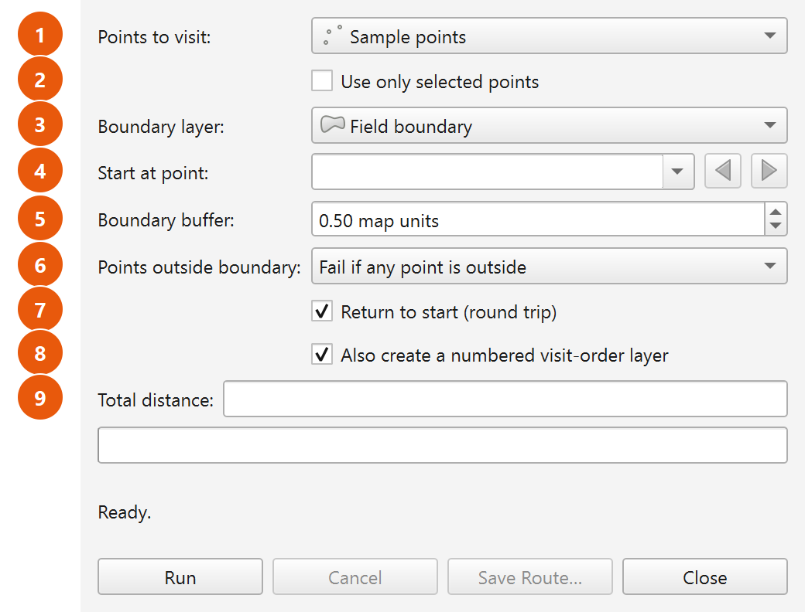
  <br><em>Figure 4.1. The Plover dialog with every control labelled: layer pickers at the top, routing options in the middle, distance / progress / status readout, and the four buttons along the bottom.</em>
</p>
#### One dialog per QGIS session

The plugin creates the dialog the first time you open it and then keeps that same window object for the rest of the QGIS session. Choosing the menu item again simply shows the existing window, brings it to the front and gives it focus — it does **not** open a second copy and does **not** reset your entries. Closing the dialog and reopening it therefore returns you to exactly the controls you left behind (subject to §4.11 on what is written to disk versus what merely stays in memory).

---

### 4.2 How the dialog behaves while it is open

Two behaviours matter before you touch any individual control.

**The dialog is modeless.** It is shown with a plain `show()`, not as a blocking modal window. QGIS is not locked while it is open: you can pan and zoom the map canvas, switch layers, select features, open the attribute table, and use any other part of QGIS with the Plover window still sitting on screen. This is deliberate — it is how you select the points you want to route, or zoom to a suspect point, without losing your dialog settings.

**The route is computed in a background task.** When you press **Run**, Plover packages the inputs into a `QgsTask` (described as `Plover: computing route`) and hands it to the QGIS task manager. The calculation runs off the user-interface thread, so:

- QGIS stays responsive during long solves — the interface does not freeze.
- The run appears in the QGIS task manager (the progress indicator in the QGIS status bar), in addition to Plover's own progress bar.
- The run can be cancelled at any point (see **Cancel**, §4.7.2).
- Closing the dialog while a run is in progress cancels that run automatically.

While a task is running, the input controls are disabled so the inputs cannot change underneath the calculation. See §4.10 for the full enabled/disabled matrix.

---

### 4.3 Layout at a glance

The dialog is a single column, in this order from top to bottom:

| Row | Control | Type |
|---|---|---|
| 1 | `Points to visit:` | Layer dropdown (point layers) |
| 2 | `Use only selected points` | Tick box |
| 3 | `Boundary layer:` | Layer dropdown (polygon layers, plus an empty entry) |
| 4 | `Start at point:` | Feature picker |
| 5 | `Boundary buffer:` | Number box, suffix ` map units` |
| 6 | `Points outside boundary:` | Dropdown, two choices |
| 7 | `Return to start (round trip)` | Tick box |
| 8 | `Also create a numbered visit-order layer` | Tick box |
| 9 | `Total distance:` | Read-only text box |
| 10 | (progress bar) | Progress bar, 0–100 |
| 11 | (status line) | Wrapping text label, starts at `Ready.` |
| 12 | `Run` / `Cancel` / `Save Route…` / `Close` | Buttons, left to right |

---

### 4.4 Input controls

#### 4.4.1 Points to visit

| | |
|---|---|
| **On-screen label** | `Points to visit:` |
| **Type** | QGIS map-layer dropdown, filtered to **point layers only** |
| **Tooltip** | None |
| **Default** | Not preselected by Plover; QGIS fills the list with the point layers currently in the project. If a point layer is already showing when the dialog opens, the start picker is filled from it immediately. |
| **Remembered?** | No — not written to settings. It keeps its value while the dialog object lives (i.e. for the QGIS session), but a QGIS restart starts fresh. |
| **Disabled when** | A route is running. |

This is the layer whose features become the stops on the route. Only point layers appear in the list; line and polygon layers are filtered out. The list tracks the project, so layers you add or remove while the dialog is open appear and disappear in the dropdown without reopening it.

Changing this dropdown immediately re-points the **Start at point** picker at the newly chosen layer.

**How features are read.** When you press Run, Plover walks the layer's features (or just the selected ones — see §4.4.2) and converts each to a single routing point:

- A single-part point is used as-is.
- A **multi-part** point feature is reduced to its **centroid**.
- A feature with no geometry or an empty geometry is skipped, and logged as `Skipping feature <id>: empty geometry.`
- A feature whose geometry is not a point is skipped, and logged as `Skipping feature <id>: not a point.`
- If the points must be reprojected (see below) and the reprojection of one point fails, that feature is skipped and logged as `Skipping feature <id>: reprojection failed.`

**Coordinate reference system.** Routing happens in a single *working CRS*:

- If a boundary layer is chosen, the working CRS is the **boundary layer's** CRS.
- If no boundary layer is chosen, the working CRS is the **point layer's** CRS.

If the point layer's CRS differs from the working CRS, Plover reprojects the points automatically and logs `Reprojecting points from <authid> to <authid> for routing.` If the working CRS is geographic (degrees), Plover refuses to run — see the error table in §4.8.

**Minimum count.** At least two usable point features are required. Fewer gives `Need at least two point features to build a route.`

---

#### 4.4.2 Use only selected points

| | |
|---|---|
| **On-screen label** | `Use only selected points` (tick box; the label column beside it is blank) |
| **Tooltip** | None |
| **Default** | **Unticked** |
| **Remembered?** | No — not written to settings, and not restored on start-up. It keeps its state while the dialog object lives. |
| **Disabled when** | A route is running. |

When ticked, Plover routes **only the features currently selected on the layer chosen in Points to visit**, ignoring everything else in the layer. When unticked, every feature in the layer is considered.

Because the dialog is modeless, the normal working pattern is: leave the dialog open, select the points you want on the map or in the attribute table, then tick this box and press **Run**.

Two behaviours depend on this tick box:

1. **If it is ticked and nothing is selected**, the run stops immediately with:
   `'Use only selected points' is on, but no points are selected.`
2. **In `Fail if any point is outside` mode** (§4.4.6), Plover normally *selects* the offending points on the layer so you can find them. It deliberately does **not** do this when *Use only selected points* is ticked — overwriting your selection would destroy the very input you asked it to route.

If the feature chosen in **Start at point** is not part of the selection, Plover falls back to the first selected point and logs `Chosen start point is not in the selection; starting from the first selected point instead.`

---

#### 4.4.3 Boundary layer

| | |
|---|---|
| **On-screen label** | `Boundary layer:` |
| **Type** | QGIS map-layer dropdown, filtered to **polygon layers**, with an additional **empty entry** |
| **Tooltip** | see below |
| **Default** | Not preselected by Plover. Always check what it shows before running. |
| **Remembered?** | No — not written to settings. |
| **Disabled when** | A route is running. |

Tooltip, exactly as displayed:

> Optional. With a boundary, the route stays inside it and routes
> around holes (sloughs / exclusion zones). Leave empty for a plain
> straight-line route through the points (ordinary Euclidean TSP).

**The empty entry.** This dropdown allows an empty selection — that is the "no boundary" option. It is not a mistake or a placeholder; choosing it is a supported mode of operation.

**With a boundary chosen:**

- The route is kept inside the boundary and routed around its holes.
- All polygon features in the layer are merged into a single routing region. A feature that lies wholly inside another feature is subtracted as an exclusion zone, and this is logged as `Treated a fully-enclosed boundary feature as an exclusion zone (hole).` Invalid polygons are repaired where possible (`Repaired an invalid boundary polygon with makeValid().`) or dropped (`Skipped an invalid boundary polygon that could not be repaired.`).
- If nothing usable survives, the run stops with `The boundary layer contains no usable polygons.`
- The working CRS is the boundary layer's CRS, and distances are reported in that CRS's units.

**With the empty entry (no boundary):**

- Plover solves an ordinary straight-line (Euclidean) travelling-salesperson problem: every point can see every other point, and the route runs in straight lines between stops with no obstacle avoidance whatsoever.
- The working CRS is the point layer's CRS.

**What greys out when the boundary is empty.** Two controls only have meaning when there is a boundary to respect, and Plover disables them the moment the boundary dropdown is set to the empty entry:

- `Boundary buffer:`
- `Points outside boundary:`

They re-enable as soon as you pick a polygon layer. Their values are preserved while greyed out — nothing is reset — and the greyed-out buffer value is still what gets written to settings when you press Run.

---

#### 4.4.4 Start at point

| | |
|---|---|
| **On-screen label** | `Start at point:` |
| **Type** | QGIS feature picker, with the browse (previous/next) buttons switched on |
| **Tooltip** | None |
| **Default** | Whatever the picker shows for the current layer; no specific feature is forced by Plover. |
| **Remembered?** | No — not written to settings. |
| **Disabled when** | A route is running. |

The picker lists the features of the layer chosen in **Points to visit** and follows that dropdown: change the point layer and the picker repopulates. The browse buttons let you step through features one at a time.

**How the start is resolved at run time.** Plover resolves the start *after* it has built the final list of points to route (that is, after any selection filter and after any outside-boundary points have been skipped):

- If the picked feature is valid **and** its feature ID is in the final routed set, that point is the start.
- Otherwise the start falls back to the **first point in the final set** — the first feature in the order the layer supplied them (or the first selected feature when *Use only selected points* is on). Two cases are logged:
  - `Chosen start point lies outside the boundary and was skipped; starting from the first in-boundary point instead.`
  - `Chosen start point is not in the selection; starting from the first selected point instead.`

Note that the fallback is silent on screen — the run proceeds normally, and only the log records that your chosen start was not used. If the start matters to you, check the Plover log tab after the run.

**Round trips versus one-way paths.** For a **one-way path** (`Return to start` unticked) the start point genuinely fixes where the route begins. For a **round trip**, the route is a closed loop; the loop is rotated so that it is *reported* beginning at your chosen point, but the loop itself — and therefore its length — is the same whichever stop you nominate.

---

#### 4.4.5 Boundary buffer

| | |
|---|---|
| **On-screen label** | `Boundary buffer:` |
| **Type** | Number box with two decimal places, range `0.00` to `1000000.00`, suffix ` map units` |
| **Tooltip** | see below |
| **Default** | `0.50` |
| **Remembered?** | **Yes** — `plover/buffer` |
| **Disabled when** | The boundary dropdown is on the empty entry, or a route is running. |

Tooltip, exactly as displayed:

> Tolerance around the boundary: the route may pass this far
> outside the field edge and this far into exclusion zones.

The buffer is a tolerance, not a setback. It **enlarges** the legal routing region: the route may run up to this distance outside the outer field edge, and up to this distance into a slough or other exclusion zone. It is expressed in the working CRS's map units — normally metres — which is why the box carries the ` map units` suffix rather than naming a unit.

The buffer is used in two places:

1. **The containment test.** Points are checked against the *buffered* boundary, so a point sitting a few centimetres outside a digitized field edge counts as inside.
2. **The routing region.** The visibility graph is built inside the *buffered* boundary, so a route may legitimately hug or slightly cross the field edge.

**Why a buffer of zero is not really zero.** Plover always applies a minimum sliver of tolerance (0.000001 map units) even when the box reads `0.00`. Without it, GEOS treats a line running exactly along the boundary as *not* contained by the boundary, and points digitized precisely on the field edge become unroutable. You can therefore set `0.00` safely; you simply do not get an exact-zero tolerance.

**Practical guidance.** If a run fails because points are outside the boundary, or because points cannot be reached, raising the buffer is usually the first thing to try. Raising it too far lets the route cut corners across sloughs, because the exclusion zones shrink by the same amount.

---

#### 4.4.6 Points outside boundary

| | |
|---|---|
| **On-screen label** | `Points outside boundary:` |
| **Type** | Dropdown with exactly two entries |
| **Entries** | `Fail if any point is outside` (stored value `fail`) · `Skip points outside the boundary` (stored value `skip`) |
| **Tooltip** | see below |
| **Default** | `Fail if any point is outside` |
| **Remembered?** | **Yes** — `plover/outside_mode` (stores `fail` or `skip`) |
| **Disabled when** | The boundary dropdown is on the empty entry, or a route is running. |

Tooltip, exactly as displayed:

> What to do with points that fall outside the buffered boundary.
> Fail: stop and report them (good when every point should be in-field).
> Skip: drop them and route only the points inside (good for one big
> point layer spanning many fields — route just this field's points).

This setting only comes into play if at least one point falls outside the **buffered** boundary. If every point is inside, the two modes behave identically.

Regardless of mode, every offending point is written to the log first, one line each:

```
Point fid=1234 at (512340.55, 5766120.10) is 3.87 units outside the boundary.
```

The distance quoted is measured to the **unbuffered** boundary, so it tells you how much buffer would be needed to bring that point inside.

##### Mode 1 — `Fail if any point is outside` (default)

The run **stops**. Nothing is computed and no layers are created. Plover does three things:

1. Logs each offending point as shown above.
2. **Selects the offending features on the point layer**, so you can immediately zoom to them and inspect them — *unless* `Use only selected points` is ticked, in which case the selection is left untouched.
3. Shows this in red on the status line:

   `<n> point(s) fall outside the buffered boundary (now selected on the layer; details in the log). Increase the buffer, switch 'Points outside boundary' to skip, or fix the data.`

Note that step 2 **replaces** whatever was selected on that layer before.

Use this mode when every point in the layer is supposed to be inside the field. It turns a data problem into a visible, fixable list rather than a quietly wrong route.

##### Mode 2 — `Skip points outside the boundary`

The offending points are **dropped** and the route is built from the points that remain inside. Specifically:

1. The outside points are removed from the routing set, and their feature IDs are remembered as "skipped".
2. If fewer than two points remain, the run stops with:
   `Only <n> point(s) fall inside the boundary — need at least two to build a route. Increase the buffer or pick a boundary that contains more points.`
3. Otherwise the log records `Skipping <n> point(s) outside the boundary; routing the <m> inside.`
4. The route is computed over the remaining points, and the success status line adds a sentence: ` Skipped <n> point(s) outside the boundary.`
5. If the point you chose in **Start at point** was one of the skipped ones, the start falls back to the first in-boundary point (logged, see §4.4.4).

Use this mode when a single point layer covers many fields and you want to route only the points that fall inside the boundary you have chosen. Change the boundary layer, run again, and you get that field's route from the same point layer.

Because skipped points never enter the calculation, they also never appear in the numbered visit-order layer.

---

#### 4.4.7 Return to start (round trip)

| | |
|---|---|
| **On-screen label** | `Return to start (round trip)` (tick box; the label column beside it is blank) |
| **Tooltip** | None |
| **Default** | **Ticked** |
| **Remembered?** | **Yes** — `plover/round_trip` |
| **Disabled when** | A route is running. |

- **Ticked** — the route is a closed loop: it visits every point and returns to the starting point. The closing leg is part of the route geometry and is included in the reported total distance.
- **Unticked** — the route is a one-way path: it starts at the chosen start point, visits every other point, and stops at the last one. No return leg is drawn or counted.

This choice feeds through to three visible places:

| Where | Round trip ticked | Round trip unticked |
|---|---|---|
| Status line trip type | `round trip` | `one-way path` |
| `round_trip` field on the route layer | `yes` | `no` |
| Route geometry | closes back on the start | ends at the final stop |

---

#### 4.4.8 Also create a numbered visit-order layer

| | |
|---|---|
| **On-screen label** | `Also create a numbered visit-order layer` (tick box; the label column beside it is blank) |
| **Tooltip** | None |
| **Default** | **Ticked** |
| **Remembered?** | **Yes** — `plover/order_layer` |
| **Disabled when** | A route is running. |

When ticked, a successful run adds a **second** layer to the project, named `Plover visit order`, alongside the `Plover route` line layer. It contains one point per stop, in the working CRS, with three fields:

| Field | Type | Meaning |
|---|---|---|
| `visit_order` | integer | 1, 2, 3 … the position of this stop in the tour |
| `source_fid` | integer | the feature ID of the original point in your input layer |
| `leg_length` | double | length of the leg **leaving** this stop, in map units |

Plover also styles it: orange circular markers matching the route colour, with a white outline, and the `visit_order` number drawn in bold white over each marker with a dark halo — so it reads as a numbered badge at map scale. If your QGIS build rejects any part of the styling it is logged (`Could not style visit-order markers on this QGIS version.` / `Could not enable visit-order labels on this QGIS version.`) and the layer is still created with default symbology. Styling is never fatal.


This layer is a **memory (scratch) layer**, like the route layer. It exists only in the current QGIS project until you save it somewhere. Note that the **Save Route…** button saves the *route line* only — it does not export the visit-order layer.

---

### 4.5 Total distance

| | |
|---|---|
| **On-screen label** | `Total distance:` (a caption to the left of the box) |
| **Type** | Read-only text box. You cannot type into it. |
| **Placeholder text** | `Route length will appear here` |
| **Remembered?** | No |

After a successful run it shows the total route length formatted with a thousands separator and one decimal place, followed by the unit wording — for example:

```
6,405.2 map units
```

"Map units" means the units of the working CRS (§4.4.1) — metres for a UTM or other metric projected CRS. Plover does not convert to kilometres, miles or acres.

The box is **cleared at the start of every run**, so a stale figure never sits next to a fresh failure. If a run fails or is cancelled, it stays empty.

For a round trip the figure includes the closing leg back to the start. With a boundary, it is the true obstacle-aware path length, not the straight-line distance between stops.

---

### 4.6 Progress bar and status line

#### 4.6.1 The progress bar

An ordinary 0–100 progress bar sits below the distance box. It is driven by the background task, and it is reset to 0 at the start of every run and when a run is cancelled.

The percentage maps onto the pipeline stages as follows, which is useful for diagnosing where a slow run is spending its time:

| Progress range | Stage |
|---|---|
| 0 – 45 % | Building the visibility graph (testing which node pairs can see each other) |
| 45 – 70 % | Shortest paths between every pair of waypoints (one Dijkstra run per waypoint) |
| 70 – 95 % | Optimizing the visiting order (multi-start nearest-neighbour, 2-opt, Or-opt) |
| 100 % | Route stitched and complete |

Because the work runs as a QGIS task, the same run also shows in the QGIS task manager in the main-window status bar, described as `Plover: computing route`.

#### 4.6.2 The status line

Below the progress bar is a wrapping text label. It starts at:

> `Ready.`

It reports every stage of every run. Error messages are shown in **red** (`#c0392b`); informational messages are shown in the normal text colour. The message list is in §4.8.

---

### 4.7 The buttons

The four buttons run left to right along the bottom of the dialog.

#### 4.7.1 Run

| | |
|---|---|
| **Label** | `Run` |
| **Enabled** | Always, except while a route is running |

Validates the inputs, saves the remembered settings (§4.11), and launches the background task. If validation fails, the reason appears in red on the status line and nothing is launched. The full validation sequence is in §4.8.

On launch, the status line reads `Routing <n> points…`, where `<n>` is the number of points actually being routed — after the selection filter and after any skipped outside-boundary points.

Each successful run **adds new layers to the project**; it does not overwrite the layers from the previous run. Run three times and you will have three `Plover route` layers. Remove the ones you do not want.

#### 4.7.2 Cancel

| | |
|---|---|
| **Label** | `Cancel` |
| **Enabled** | Only while a route is running. Disabled at all other times, including when the dialog first opens. |

Requests cancellation of the running task. The status line changes to `Cancelling…` immediately; the task stops at its next cancellation checkpoint (checkpoints exist inside every stage of the pipeline, so cancellation is normally near-instant). When the task actually stops, the status line reads `Cancelled.` and the progress bar returns to 0.

No layers are created by a cancelled run and the distance box stays empty.

`Cancel` does **not** close the dialog — that is `Close`.

#### 4.7.3 Save Route…

| | |
|---|---|
| **Label** | `Save Route…` |
| **Enabled** | Disabled until a route has been computed successfully; enabled from then on |

Opens a standard save-file dialog titled `Save Route`, offering these formats:

| Filter shown | Driver used | Extension |
|---|---|---|
| `GeoPackage (*.gpkg)` | GPKG | `.gpkg` |
| `Shapefile (*.shp)` | ESRI Shapefile | `.shp` |
| `GeoJSON (*.geojson)` | GeoJSON | `.geojson` |
| `GPX track (*.gpx)` | GPX | `.gpx` |
| `KML (*.kml)` | KML | `.kml` |

Points to note at reference level (the export chapter covers the workflow in full):

- The extension is appended automatically if you do not type it. If the chosen filter cannot be matched, Plover infers the driver from the extension you typed; if that also fails, it reports `Unsupported file format — use .gpkg, .shp, .geojson, .gpx or .kml.`
- The written layer is named `plover_route`.
- **GPX and KML are reprojected to WGS84 (EPSG:4326)** on the way out, because those formats are defined in geographic coordinates.
- If you save to an existing GeoPackage that already contains a `plover_route` layer, a question box titled `Layer already exists` appears, offering `Yes = overwrite it`, `No = add a timestamped layer`, `Cancel = don't save`. The timestamped name is `plover_route_YYYYMMDD_HHMMSS`.
- The folder you last saved into is remembered (`plover/last_save_dir`) and offered again next time.
- Only the **route line layer** is written. The numbered visit-order layer is not part of this export.

#### 4.7.4 Close

| | |
|---|---|
| **Label** | `Close` |
| **Enabled** | Always, including while a route is running |

Hides the dialog. If a route is still running, closing the dialog **cancels** it.

Closing does not discard your entries: the same dialog window is reused next time you open Plover, so every control comes back as you left it for the remainder of the QGIS session. Layers already added to the project are unaffected.

---

### 4.8 What happens when you press Run

Plover checks the inputs in a fixed order and stops at the first problem. Knowing the order makes messages easier to interpret — a later check never runs if an earlier one failed.

1. Progress bar reset to 0; distance box cleared; settings saved.
2. A point layer must be chosen.
3. The working CRS (boundary CRS if a boundary is chosen, otherwise point-layer CRS) must not be geographic.
4. If a boundary is chosen, its polygons are merged into a usable region.
5. The point features are gathered — all of them, or only the selection.
6. Points are reprojected to the working CRS if needed; unusable features are skipped and logged.
7. At least two points must remain.
8. If a boundary is chosen, points are tested against the **buffered** boundary and the `Points outside boundary` mode is applied.
9. The start point is resolved against the final point set.
10. The background task is launched.

#### 4.8.1 Status-line messages, in full

Messages shown in red are failures; the run stops and no layers are created.

| Message (exactly as shown) | Colour | Meaning / what to do |
|---|---|---|
| `Ready.` | normal | Dialog just opened; nothing has run yet. |
| `Select a point layer.` | red | `Points to visit:` has no layer. Add or choose a point layer. |
| `The boundary layer uses a geographic CRS (degrees). Distances would be meaningless — reproject to a projected CRS (e.g. UTM) first.` | red | The chosen boundary layer is in degrees. Reproject it. |
| `The point layer uses a geographic CRS (degrees). Distances would be meaningless — reproject to a projected CRS (e.g. UTM) first.` | red | No boundary chosen, and the point layer is in degrees. Reproject it. |
| `The boundary layer contains no usable polygons.` | red | Every polygon was empty, non-polygon or unrepairable. Check the log for the repair notes. |
| `'Use only selected points' is on, but no points are selected.` | red | Select some features, or untick the box. |
| `Need at least two point features to build a route.` | red | Fewer than two usable points survived reading (empty/non-point/failed reprojection features are skipped — see the log). |
| `<n> point(s) fall outside the buffered boundary (now selected on the layer; details in the log). Increase the buffer, switch 'Points outside boundary' to skip, or fix the data.` | red | Fail mode found outside points; they are now selected on the layer for you. |
| `Only <n> point(s) fall inside the boundary — need at least two to build a route. Increase the buffer or pick a boundary that contains more points.` | red | Skip mode dropped too many points. |
| `Routing <n> points…` | normal | The background task has started. |
| `Cancelling…` | normal | Cancel was pressed; waiting for the task to stop. |
| `Cancelled.` | normal | The run stopped at your request. Progress bar back to 0. |
| `<n> point(s) cannot be reached from the start point (point number <list>). They are likely separated by a hole/exclusion zone or a pinched-off part of the boundary. Increase the buffer distance or check the boundary geometry.` | red | The boundary cuts the field into disconnected pieces. The numbers are **positions in the routed point list** (1-based), not feature IDs; at most 12 are listed, followed by `…`. |
| `Waypoint graph is disconnected; some points cannot be reached.` | red | Same class of problem, raised deeper in the solver. Rarely seen — the message above normally catches it first. |
| `Routing failed unexpectedly — see the Plover log panel for the full traceback.` | red | An unhandled error. The full traceback is in the Plover log tab; send it with a bug report. |
| `Route computed but creating layers failed: <detail>` | red | The route solved, but building the output layers failed. |
| `Done — <stops> stops, <length> units (<trip>).<skipped note> Visibility graph: <nodes> nodes / <edges> edges.` | normal | Success. Decoded in §4.9. |
| `No route layer to save — generate a route first.` | red | `Save Route…` pressed with no route in hand. |
| `Unsupported file format — use .gpkg, .shp, .geojson, .gpx or .kml.` | red | The save filename had no recognised extension. |
| `Save failed: <detail>` | red | The writer refused. The detail and an error code go to the log. |
| `Route saved to <path>` | normal | Export succeeded. |

#### 4.8.2 Where the detail goes

Warnings and diagnostics that are too long for the status line go to the QGIS message log, under the tab named **Plover** (**View ▸ Panels ▸ Log Messages**). Messages you will see there include:

| Log message | Raised when |
|---|---|
| `Repaired an invalid boundary polygon with makeValid().` | A boundary polygon was invalid but repairable. |
| `Skipped an invalid boundary polygon that could not be repaired.` | A boundary polygon was invalid beyond repair. |
| `Treated a fully-enclosed boundary feature as an exclusion zone (hole).` | A boundary feature sits entirely inside another and was subtracted. |
| `Reprojecting points from <authid> to <authid> for routing.` | The point layer's CRS differs from the working CRS. |
| `Skipping feature <id>: empty geometry.` / `: not a point.` / `: reprojection failed.` | An individual feature could not be used. |
| `Point fid=<id> at (<x>, <y>) is <d> units outside the boundary.` | Per-point detail behind an outside-boundary failure or skip. |
| `Skipping <n> point(s) outside the boundary; routing the <m> inside.` | Skip mode dropped points. |
| `Chosen start point lies outside the boundary and was skipped; starting from the first in-boundary point instead.` | Your start point was skipped. |
| `Chosen start point is not in the selection; starting from the first selected point instead.` | Your start point is outside the current selection. |
| `Route created: <stops> stops, <length> units, <trip>.` | Success. |
| `Could not apply route symbology on this QGIS version; using defaults.` | Route styling was rejected; the layer is still created. |
| `Route saved to <path> (layer <name>)` | Successful export, including the layer name actually written. |

---

### 4.9 Reading the success status line

A successful run produces one dense line. Here is a worked example:

```
Done — 42 stops, 6,405.2 units (round trip). Skipped 3 point(s) outside the boundary. Visibility graph: 118 nodes / 2 431 edges.
```

| Part | What it means |
|---|---|
| `42 stops` | How many points are in the tour. This is the number of points actually routed — after the selection filter and after skipping — so if it is lower than you expected, check the selection and the skip count. |
| `6,405.2 units` | Total route length in working-CRS map units, same figure as the **Total distance** box. Includes the closing leg on a round trip. |
| `(round trip)` | The trip type: `round trip` when **Return to start** is ticked, `one-way path` when it is not. |
| `Skipped 3 point(s) outside the boundary.` | Appears **only** when skip mode actually dropped points. Absent when nothing was skipped. |
| `118 nodes / 2 431 edges` | Size of the visibility graph — a diagnostic, not a quality measure. |

**About nodes and edges.** *Nodes* are the routed points plus the boundary's "turn vertices" — the only corners a shortest path can ever bend around (concave corners of the outer boundary and corners of holes poking into the field). A convex, hole-free field contributes **zero** extra nodes, so `nodes` equals the number of stops. *Edges* count the node pairs that can see each other in a straight line inside the buffered boundary.

Practical readings:

- Node count much larger than the stop count → a complicated boundary (many concave corners, several sloughs). Expect longer run times.
- Edge count near the maximum for the node count → few obstructions between points.
- A low edge count relative to nodes → the boundary is chopping up visibility, which is also the situation that produces "cannot be reached from the start point" failures.

With **no boundary**, `nodes` always equals the number of stops and `edges` is the complete-graph count, because every point can see every other point.

---

### 4.10 Enabled and disabled: the full picture

Two independent things grey controls out: the boundary being empty, and a run being in progress.

| Control | Greyed out when boundary is empty | Greyed out while a run is in progress |
|---|---|---|
| `Points to visit:` | No | **Yes** |
| `Use only selected points` | No | **Yes** |
| `Boundary layer:` | No | **Yes** |
| `Start at point:` | No | **Yes** |
| `Boundary buffer:` | **Yes** | **Yes** |
| `Points outside boundary:` | **Yes** | **Yes** |
| `Return to start (round trip)` | No | **Yes** |
| `Also create a numbered visit-order layer` | No | **Yes** |
| `Total distance:` | n/a (always read-only) | n/a |
| `Run` | No | **Yes** |
| `Cancel` | No | No — this is the only time it is *enabled* |
| `Save Route…` | No | No (but disabled until the first successful run) |
| `Close` | No | No — always available |

When a run finishes, fails or is cancelled, everything is re-enabled and the boundary-dependent rule is re-applied, so `Boundary buffer:` and `Points outside boundary:` come back greyed out if the boundary dropdown is still empty.

---

### 4.11 What Plover remembers

Plover stores a small number of preferences in QGIS's own settings store (`QgsSettings`), under the `plover/` prefix. They survive closing QGIS and apply across all projects and all user profiles that share the same QGIS profile.

**When they are saved.** The four routing settings are written **when you press Run** — not when you change a control and not when you close the dialog. Changing a setting and closing without running therefore leaves the stored value untouched. The save directory is written when you complete a save.

**When they are restored.** The four routing settings are read once, when the dialog object is created — that is, the first time you open Plover in a QGIS session.

| Setting key | Control | Default | Stored value |
|---|---|---|---|
| `plover/buffer` | `Boundary buffer:` | `0.5` | number |
| `plover/round_trip` | `Return to start (round trip)` | `True` (ticked) | true / false |
| `plover/order_layer` | `Also create a numbered visit-order layer` | `True` (ticked) | true / false |
| `plover/outside_mode` | `Points outside boundary:` | `fail` | `fail` or `skip` |
| `plover/last_save_dir` | Folder offered by `Save Route…` | empty | folder path |

Everything else — the point layer, the boundary layer, the start point, and the `Use only selected points` tick — is **not** written to settings. It persists only for as long as the dialog object lives, which in practice means until QGIS is closed.

---

### 4.12 Summary: every control at a glance

| Control (exact label) | Type | Default | Remembered | Greyed out when |
|---|---|---|---|---|
| `Points to visit:` | Point-layer dropdown | none forced | No (session only) | Run in progress |
| `Use only selected points` | Tick box | Unticked | No (session only) | Run in progress |
| `Boundary layer:` | Polygon-layer dropdown, empty entry allowed | none forced | No (session only) | Run in progress |
| `Start at point:` | Feature picker with browse buttons | none forced | No (session only) | Run in progress |
| `Boundary buffer:` | Number, 2 dp, 0.00–1000000.00, suffix ` map units` | `0.50` | Yes — `plover/buffer` | Boundary empty; run in progress |
| `Points outside boundary:` | Dropdown: `Fail if any point is outside` / `Skip points outside the boundary` | Fail | Yes — `plover/outside_mode` | Boundary empty; run in progress |
| `Return to start (round trip)` | Tick box | Ticked | Yes — `plover/round_trip` | Run in progress |
| `Also create a numbered visit-order layer` | Tick box | Ticked | Yes — `plover/order_layer` | Run in progress |
| `Total distance:` | Read-only text, placeholder `Route length will appear here` | empty | No | Always read-only |
| Progress bar | 0–100 | 0 | No | — |
| Status line | Wrapping label | `Ready.` | No | — |
| `Run` | Button | Enabled | — | Run in progress |
| `Cancel` | Button | Disabled | — | Enabled only during a run |
| `Save Route…` | Button | Disabled | Last folder — `plover/last_save_dir` | Enabled after the first successful run |
| `Close` | Button | Enabled | — | Never |


---

## 5. Step-by-Step Workflows

This chapter is a set of self-contained recipes. Each one is a complete procedure you can follow from an empty QGIS project to a finished route. Work through **5.1** first — the later recipes assume you have done it once and refer back to it rather than repeating every click.

Everything here describes the **dialog**. Where the same job can be done from the Processing Toolbox, a short note names the exact parameters; the Processing algorithm itself is documented in its own chapter.

---

### 5.0 Things that apply to every recipe

Read this once. It saves repeating the same five warnings eight times.

#### Opening Plover

Plover installs into two places:

1. **Vector → &Plover → Plover — Generate TSP Route**
2. The **Plover — Generate TSP Route** toolbar button (status tip: `Boundary-aware TSP route through a point layer`)

Either opens the dialog, whose window title is **Plover — TSP Route**. The dialog is *modeless*: you can pan, zoom, select features and open the attribute table while it is open. It stays open after a run, so you can change one setting and run again.

#### Pre-flight checklist

| Check | Why | What happens if you skip it |
|---|---|---|
| Point layer is a **point** layer | Only point layers appear in **Points to visit:** | The layer will not be listed in the dropdown |
| Boundary layer is a **polygon** layer | Only polygon layers appear in **Boundary layer:** | The layer will not be listed in the dropdown |
| Working CRS is **projected** (UTM, NAD83 / Alberta 10-TM, …) | Distances must be in linear units | Plover refuses to run: `The boundary layer uses a geographic CRS (degrees). Distances would be meaningless — reproject to a projected CRS (e.g. UTM) first.` (the message says `point layer` when there is no boundary) |
| At least **two** usable points | A route needs two ends | `Need at least two point features to build a route.` |

The **working CRS** is the boundary layer's CRS when you choose a boundary, and the point layer's CRS when you do not. If the points are in a different CRS from the boundary, Plover reprojects the points to the working CRS automatically and notes it in the log. It is the *working* CRS that has to be projected.

#### Where messages appear

- **Status line** at the bottom of the dialog — starts as `Ready.`, turns dark red for errors.
- **Total distance:** read-only box — placeholder `Route length will appear here`, then e.g. `12,345.6 map units`.
- **Log Messages Panel**, tab **Plover** (`View → Panels → Log Messages`) — per-point diagnostics, skipped features, reprojection notes, boundary repairs. Whenever a recipe says "check the log", this is what it means.

#### Two facts that surprise new users

- **Every run adds new layers.** A run creates a fresh memory layer called **Plover route**, and (if the checkbox is ticked) a fresh **Plover visit order**. Running again does not overwrite them — you end up with several layers of the same name. Delete the old ones as you iterate.
- **The output layers are temporary.** They are scratch (memory) layers and disappear when the project closes. Use **Save Route…** to write the route to a file. Note that **Save Route… writes the route line only** — if you also need the numbered points on disk, export **Plover visit order** with QGIS's own layer export.

#### Settings Plover remembers

Between sessions Plover restores **Boundary buffer**, **Return to start (round trip)**, **Also create a numbered visit-order layer** and **Points outside boundary:**. It does **not** remember the chosen layers, the selection checkbox or the start point. Always glance at the checkboxes before clicking **Run** — they may be set the way you left them last week.

---

### 5.1 Recipe 1 — Your first route: a round trip inside a field boundary

#### When to use this

The standard job. You have a set of sample or scouting points that all sit inside one field, and you want the shortest walking or driving loop that visits all of them and returns to where you parked.

#### Steps

1. Start QGIS and open (or create) the project holding your data.
2. Load the **point layer** of places to visit, and the **polygon layer** holding the field boundary.
3. Confirm the CRS of the boundary layer is projected. In the **Layers** panel, hover the layer (or open `Layer Properties → Information`) and look for something like `EPSG:32612 - WGS 84 / UTM zone 12N`, not `EPSG:4326`. If it is geographic, reproject it before continuing.
4. Open **Vector → &Plover → Plover — Generate TSP Route** (or click the toolbar button).
5. In **Points to visit:**, choose your point layer. The **Start at point:** picker fills itself from whichever layer you choose here.
6. Leave **Use only selected points** unticked (recipe 5 covers selections).
7. In **Boundary layer:**, choose your field polygon. As soon as a boundary is chosen, **Boundary buffer:** and **Points outside boundary:** become enabled — they are greyed out while the boundary is empty because they have nothing to act on.
8. Leave **Start at point:** alone for now, or pick the point you want to begin at (recipe 6 explains it properly). If nothing sensible is chosen, Plover starts at the first point in the layer.
9. Leave **Boundary buffer:** at `0.50 map units` unless you already know your points sit exactly on the field edge (recipe 8).
10. Leave **Points outside boundary:** on `Fail if any point is outside`. For a first run this is the safest setting — it tells you loudly if a point is not where you think it is.
11. Tick **Return to start (round trip)**.
12. Tick **Also create a numbered visit-order layer**.
13. Click **Run**.

While it runs: the progress bar fills, the status line reads `Routing 47 points…` (with your count), and every input widget is disabled. **Cancel** is enabled throughout — click it to stop a long solve; the status changes to `Cancelling…` and then to `Cancelled.`

<p align="center">
  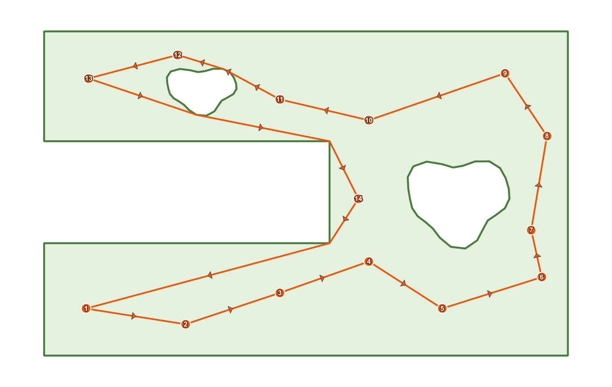
  <br><em>Figure 5.1. A finished round trip: the orange route line with direction arrows, the numbered visit-order badges, and the field boundary.</em>
</p>
#### What you should see

- The status line turns to something of this shape:

  `Done — 47 stops, 6,405.2 units (round trip). Visibility graph: 63 nodes / 1,204 edges.`

- **Total distance:** shows e.g. `6,405.2 map units`.
- Two new layers appear in the **Layers** panel:

  | Layer | Geometry | Styling | Fields |
  |---|---|---|---|
  | **Plover route** | one LineString feature | orange (`#e8590c`) line with filled arrowheads showing direction of travel | `length` (double), `stops` (integer), `round_trip` (`yes` / `no`) |
  | **Plover visit order** | one point per stop | orange circles with a white outline, labelled with a bold white number and a dark halo | `visit_order` (integer, 1..n), `source_fid` (integer), `leg_length` (double) |

- **Save Route…** is now enabled.

If the new layers are not in view, right-click **Plover route** in the Layers panel and use QGIS's **Zoom to Layer**.

<p align="center">
  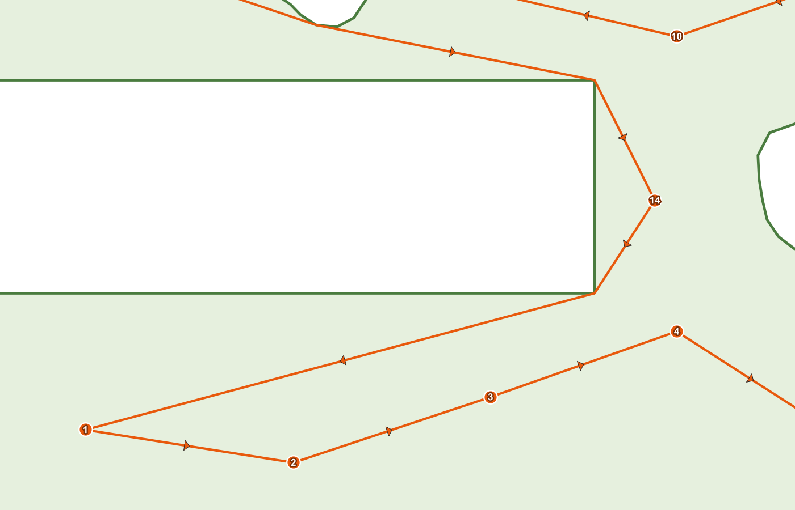
  <br><em>Figure 5.2. Close-up of the visit-order layer: orange badges numbered 1, 2, 3 … along the route.</em>
</p>
#### Reading the outputs

- `visit_order` is the sequence you follow: 1 first, then 2, and so on.
- `source_fid` is the feature ID of the original point in your input layer, so you can join the route order back to your own attributes.
- `leg_length` is the length of the leg **leaving** that stop. On a round trip the last stop's `leg_length` is the closing leg back to stop 1. On a one-way route the last stop's `leg_length` is `0`, because nothing leaves it.
- `stops` on the route layer equals the number of points actually routed — which can be lower than the number of points in your layer if any were skipped (recipe 3).

#### Saving it

1. Click **Save Route…**.
2. Choose a folder and file name in the **Save Route** dialog and pick a format: **GeoPackage (\*.gpkg)**, **Shapefile (\*.shp)**, **GeoJSON (\*.geojson)**, **GPX track (\*.gpx)** or **KML (\*.kml)**.
3. Click Save. The layer inside the file is named `plover_route`.

GPX and KML are written in WGS84 (`EPSG:4326`) — Plover reprojects on the way out, so a `.gpx` can be loaded straight onto a handheld GPS or a phone app. If you save to a GeoPackage that already contains a `plover_route` layer, Plover asks (dialog title **Layer already exists**): **Yes** overwrites it, **No** adds a timestamped layer such as `plover_route_20260820_143012`, **Cancel** aborts the save. On success the status line reads `Route saved to C:\...\route.gpkg`.

---

### 5.2 Recipe 2 — Routing around a slough or other exclusion zone

#### When to use this

The field has something in it you must not drive or walk through: a slough, a wetland, a rock pile, a fenced-off trial block, a construction area. You want the route to go *around* it rather than straight across.

#### How to represent the exclusion zone

Plover recognises two forms, and the difference matters:

| How the slough is digitized | What Plover does |
|---|---|
| As an **interior ring (hole)** in the field polygon | The hole is not part of the polygon interior, so no route segment can cross it. Works directly. |
| As a **separate polygon feature, entirely inside** the field polygon, in the same boundary layer | Plover detects that it is fully contained and **subtracts** it, logging `Treated a fully-enclosed boundary feature as an exclusion zone (hole).` |
| As a separate polygon that **overlaps or pokes out of** the field polygon | It is **not** subtracted — it is unioned into the region, making the routable area *bigger*. This is almost never what you want. |

So: an exclusion polygon must be **wholly inside** the field polygon, or be a real hole. If part of your slough hangs over the field edge, clip it to the field first.

Plover also merges all boundary features into one routing region: the largest-area polygon is the base, fully-contained features are subtracted, and everything else is unioned. Invalid polygons are repaired where possible (log note `Repaired an invalid boundary polygon with makeValid().`) or dropped (`Skipped an invalid boundary polygon that could not be repaired.`).

#### Steps

1. Load the point layer and the boundary layer that contains the field and its slough.
2. Confirm the slough is a hole in the field polygon, or a separate polygon fully inside it. Use QGIS's editing/geometry-checking tools to fix it if not.
3. Open Plover. Set **Points to visit:** and **Boundary layer:**.
4. Set **Boundary buffer:** to a **small** value — `0.50` is a sensible default. The buffer is a two-way tolerance: it lets the route stray that far outside the field edge **and** that far *into* the exclusion zone. A 20-unit buffer means the route is allowed to clip 20 units into your slough.
5. Leave **Points outside boundary:** on `Fail if any point is outside` — if a sample point has accidentally been placed inside the slough, you want to know.
6. Click **Run**.
7. Open the **Log Messages Panel → Plover** tab and confirm you see the exclusion-zone note if you relied on a separate polygon.

#### What you should see

- A route that bends around the slough instead of crossing it, with the bends occurring at the slough's corners. Plover only adds *turn vertices* to its graph — the concave corners of the field and the corners of holes — because a taut shortest path can only ever bend there.
- The status line's `Visibility graph: N nodes / M edges` count will be larger than for a plain rectangular field, because the hole contributes nodes.

#### Troubleshooting

- **`4 point(s) cannot be reached from the start point (point number 12, 13, 27, 31). They are likely separated by a hole/exclusion zone or a pinched-off part of the boundary. Increase the buffer distance or check the boundary geometry.`**
  This means the exclusion zone (or a pinch in the field outline) has cut part of the field off from the start. Common causes: a slough that touches both sides of the field and splits it in two; a boundary drawn as two polygons that touch only at a single point; a buffer of `0` with a very narrow gap. The numbers in brackets are the **positions of the points in the routing set** (1-based), not feature IDs — count from the beginning of the routed point list, and remember the list is shorter than your layer if points were skipped.
  Fixes, in order of preference: widen the real gap in the geometry, increase **Boundary buffer:** slightly, or exclude the cut-off points from the run.

- **The route crosses the slough anyway.** Either the slough is a separate polygon that is not fully inside the field polygon (so it was unioned, not subtracted), or the **Boundary buffer:** is large enough to swallow the slough. Check both.

---

### 5.3 Recipe 3 — One point layer covering many fields: route only the current field

#### When to use this

You have one master point layer — every sample site on the farm, or every scouting point for the season — and you want a route for **one** field only, without splitting the layer or making a selection by hand. You supply that field's boundary and let Plover discard everything else.

#### Steps

1. Load the master point layer and the boundary layer for the single field you want to route. If the boundary layer contains many fields, filter or select it down to the one field first — Plover merges *all* features in the boundary layer into one region, so a multi-field boundary layer would route across all of them.
2. Open Plover.
3. Set **Points to visit:** to the master point layer.
4. Set **Boundary layer:** to the single-field boundary.
5. Set **Boundary buffer:** as usual (`0.50` unless edge points need more — see recipe 8). Remember: the buffer decides what counts as "inside" for this test, so a large buffer will pull in points from just over the fence line.
6. Set **Points outside boundary:** to **`Skip points outside the boundary`**.
7. Set **Start at point:** if you have a preferred first stop (see the start-point note below).
8. Click **Run**.

<p align="center">
  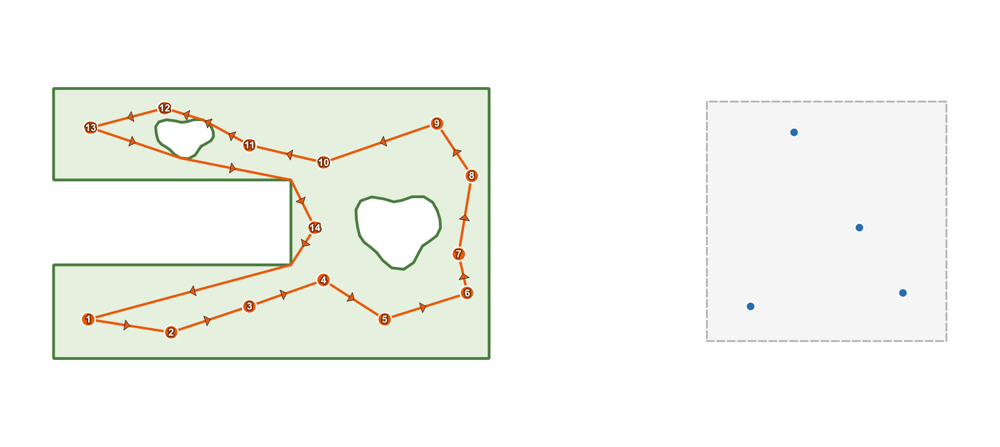
  <br><em>Figure 5.3. A master point layer spanning four fields. Only the points inside the highlighted field are routed; the rest are ignored.</em>
</p>
#### Exactly what gets dropped

Two different filters run, in this order:

1. **Unusable features are dropped before anything else**, whether or not you use skip mode. A feature is dropped if it has no geometry or an empty geometry (`Skipping feature 118: empty geometry.`), if it is not a point (`Skipping feature 119: not a point.`), or if it cannot be reprojected into the working CRS (`Skipping feature 120: reprojection failed.`). Multipart points are **not** dropped — Plover uses their centroid.
2. **The containment test.** Plover buffers the merged boundary by the **Boundary buffer:** value and keeps only the points that fall inside (or exactly on the edge of) that buffered region. Every point that fails is logged individually, with its distance from the *unbuffered* boundary:

   `Point fid=204 at (412355.10, 5765990.44) is 187.63 units outside the boundary.`

   In skip mode those points are then removed from the routing set, and a summary is logged:

   `Skipping 312 point(s) outside the boundary; routing the 18 inside.`

Skipped points are simply not routed. Nothing is deleted, edited or moved in your source layer, and — unlike fail mode — skip mode does **not** change the layer's selection.

If fewer than two points survive, the run stops with:

`Only 1 point(s) fall inside the boundary — need at least two to build a route. Increase the buffer or pick a boundary that contains more points.`

#### How the start point is re-resolved when your chosen start was skipped

This is the part that catches people out. The start point is resolved **after** the skipping, against the surviving point list:

1. If the feature chosen in **Start at point:** is still in the routed set, the route starts there. Nothing unusual happens.
2. If it is **not** in the routed set, Plover falls back to **the first point of the surviving list** — that is, the first in-boundary point in the order the layer returned its features (normally the lowest feature ID that survived). It does not fail, and it does not warn you in the dialog.
3. If the reason it is missing is that it was skipped as outside the boundary, Plover writes a warning to the log:

   `Chosen start point lies outside the boundary and was skipped; starting from the first in-boundary point instead.`

So if your start matters, always check the log after a skip-mode run, or pick a start that you know is inside the field.

#### What you should see

- The status line includes the skipped count:

  `Done — 18 stops, 2,140.7 units (round trip). Skipped 312 point(s) outside the boundary. Visibility graph: 22 nodes / 231 edges.`

- **Plover visit order** contains one point per *routed* stop only. Its `source_fid` values let you trace each stop back to the master layer.
- The `stops` field on **Plover route** equals the routed count (18 above), not the size of the input layer.

#### Doing the same in Processing

Run **Boundary-aware TSP route** (`plover:tsproute`) with `ON_OUTSIDE` set to `1` (`Skip points outside the boundary`). The Processing version behaves the same way, with one difference worth knowing: the start is given as `START_INDEX` (a position in the input layer, 0-based, validated *before* skipping). Plover remembers which feature that index referred to, and after skipping either re-finds it or falls back to the first surviving point with the warning `Start point lies outside the boundary and was skipped; starting from the first in-boundary point instead.`

---

### 5.4 Recipe 4 — A one-way route (no return to start)

#### When to use this

- You will be picked up at the far end, or you carry on to the next field from wherever you finish.
- The field entrance and exit are different gates.
- You are planning a transect or a pass that ends at a road, a shed or a bin.

A one-way route is always the same length or shorter than the equivalent round trip, because the closing leg is not counted — do not compare the two numbers as if they measure the same thing.

#### Steps

1. Set up the run exactly as in recipe 1 (points, boundary if any, buffer, outside-points mode).
2. Choose the point where you want to **begin** in **Start at point:**. For a one-way route this matters much more than for a round trip — see "What you cannot control" below.
3. **Untick** **Return to start (round trip)**.
4. Click **Run**.

<p align="center">
  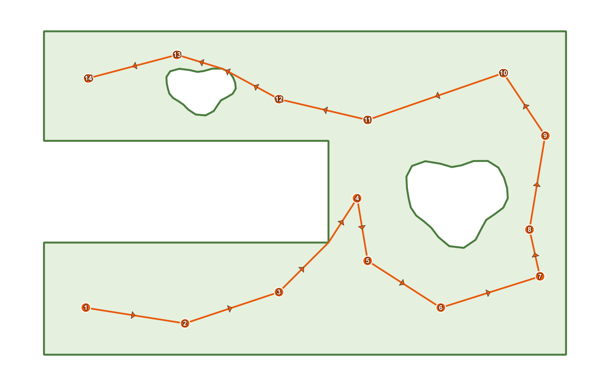
  <br><em>Figure 5.4. A one-way route: the arrows run from stop 1 to the final stop, with no closing leg back to the start.</em>
</p>
#### What you should see

- The status line says `one-way path` instead of `round trip`:

  `Done — 24 stops, 3,812.4 units (one-way path). Visibility graph: 31 nodes / 402 edges.`

- On **Plover route**, the `round_trip` field is `no`.
- The drawn line ends at the last stop; there is no leg from the last badge back to badge 1.
- In **Plover visit order**, the highest-numbered stop has `leg_length` `0`, because no leg leaves it.

#### What you cannot control

You choose where the route **starts**. You cannot choose where it **ends** — the optimizer picks the finishing point as part of minimising the total length. If you need to finish at a specific gate, the practical approach is to run the route twice (once starting at each candidate gate) and compare the results, or to place the route by choosing the start that puts the far end where you want it.

Also note the difference in how the solver treats the two modes. For a round trip, the loop's length does not depend on where you start it, so Plover tries several construction starts spread across the points and rotates the winning loop back to your chosen start. For a one-way route only **your** start is used, and the optimizer is additionally free to reverse the tail of the path. The upshot: a one-way result depends genuinely on the start you pick, so it is worth trying two or three.

#### Doing the same in Processing

Set `ROUND_TRIP` to `False`.

---

### 5.5 Recipe 5 — Routing only selected points

#### When to use this

- Today you only need to revisit the points that failed QC, or only the ones due for sampling this week.
- The layer covers several fields and you would rather pick the points by hand than by boundary.
- You want a quick "what if" route over a handful of points without editing any data.

#### Steps

1. Load the point layer and make it the active layer in the **Layers** panel.
2. Select the points you want, using any normal QGIS method:
   - the **Select Features by area or single click** tool, holding <kbd>Ctrl</kbd> to add to the selection;
   - **Select Features by Value** or an expression select;
   - selecting rows in the attribute table.
3. Confirm the selection count in the QGIS status bar before continuing.
4. Open Plover (or bring the already-open dialog to the front — selecting features on the map does not disturb it).
5. Set **Points to visit:** to that layer.
6. Tick **Use only selected points**.
7. Set the boundary, buffer and outside-points mode as needed.
8. Set **Start at point:** — see the caution below.
9. Click **Run**.

#### What you should see

- The status line during the run counts only the selected points: `Routing 9 points…`
- The finished route visits exactly the selected points; unselected points are ignored entirely, even if they sit right on the line.

#### Cautions specific to selections

- **Empty selection.** If the box is ticked but nothing is selected, Plover refuses to run with:

  `'Use only selected points' is on, but no points are selected.`

- **The start picker still lists the whole layer.** **Start at point:** is not filtered to your selection. If you pick a feature that is not in the selection, Plover starts at the first selected point instead and logs:

  `Chosen start point is not in the selection; starting from the first selected point instead.`

- **Your selection is preserved in fail mode.** Normally, when points fall outside the buffered boundary, Plover *selects* the offending features on the layer so you can find them. When **Use only selected points** is ticked it deliberately does not do this — otherwise it would destroy the selection you just made. The offending points are still listed in the log.
- **Fewer than two selected points** produces `Need at least two point features to build a route.`

#### Note

There is no equivalent tick-box in the Processing algorithm's own parameters — instead, use the **Selected features only** option that Processing offers on the `POINTS` input, or pre-filter the layer.

---

### 5.6 Recipe 6 — Choosing and changing the start point

#### When to use this

- You always park at the same gate or approach.
- You want the numbering on the visit-order layer to begin at a specific, recognisable point.
- You are planning a one-way route, where the start genuinely changes the path (recipe 4).

#### Steps

1. Set **Points to visit:** first. The **Start at point:** picker is bound to that dropdown — changing the point layer resets the picker to the new layer.
2. Click into the **Start at point:** widget and start typing to filter, or use the small browse arrows beside it to step through features one at a time.
3. Pick the feature you want. The widget shows features using the layer's display name, so if every entry looks blank or shows only a number, set a sensible display field in `Layer Properties → Display` (a site name or ID column) and reopen the picker.
4. Set everything else as usual and click **Run**.
5. To change the start, pick a different feature and click **Run** again — a new pair of output layers is created, so delete the previous **Plover route** / **Plover visit order** if you do not want them stacking up.

#### What you should see

- In **Plover visit order**, the badge numbered `1` sits on the point you chose.
- For a round trip, the loop closes back to that same badge.

#### What happens if you do not choose one

If no feature is chosen, or the chosen feature is not part of the routed set, Plover starts at **the first point in the routed list** — the first feature the layer returned that survived filtering. That is usually, but not guaranteed to be, the lowest feature ID. Two cases produce a log warning rather than silence:

| Situation | Result | Log message |
|---|---|---|
| The chosen start was skipped as outside the boundary (skip mode) | Starts at the first in-boundary point | `Chosen start point lies outside the boundary and was skipped; starting from the first in-boundary point instead.` |
| **Use only selected points** is on and the chosen start is not selected | Starts at the first selected point | `Chosen start point is not in the selection; starting from the first selected point instead.` |
| Nothing chosen at all | Starts at the first point in the routed list | (no message) |

#### How much does the start actually matter?

- **Round trip:** the length of a loop does not depend on where you enter it, so changing the start mainly changes where the numbering begins. Because your start is also one of the construction candidates the solver tries, the resulting loop can differ slightly from run to run with different starts, but the length should be close to identical.
- **One-way route:** the start is fixed by design and the path is built from it, so different starts give genuinely different — and differently long — routes.

#### Doing the same in Processing

The algorithm has no feature picker. Use `START_INDEX`, "Start point index (order of the input layer)", a 0-based position in the input layer's feature order. Out-of-range values fail with `Start point index must be between 0 and N-1.`

---

### 5.7 Recipe 7 — A quick route with no boundary at all

#### When to use this

- There is no obstacle worth modelling: an open field, a yard, a set of bins, a line of weather stations.
- You have not digitized a boundary and do not want to.
- You want a fast sanity check, or a baseline length to compare a boundary-constrained route against.

With no boundary the problem becomes an ordinary straight-line (Euclidean) travelling-salesperson tour: every point can go directly to every other point, and nothing is avoided.

#### Steps

1. Load the point layer. It must be in a **projected** CRS, because with no boundary it is the point layer's CRS that becomes the working CRS.
2. Open Plover.
3. Set **Points to visit:**.
4. Leave **Boundary layer:** on its **empty** entry (the blank item at the top of the dropdown). If a boundary is already selected from a previous run, choose the blank entry to clear it.
5. Notice that **Boundary buffer:** and **Points outside boundary:** grey out. That is expected — with no boundary there is nothing to buffer and nothing can be "outside". Whatever values they hold are ignored.
6. Set **Return to start (round trip)** and **Also create a numbered visit-order layer** as you want them.
7. Optionally set **Start at point:**.
8. Click **Run**.

<p align="center">
  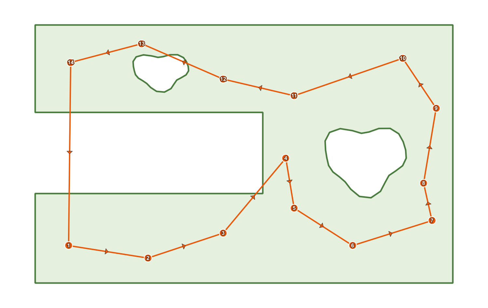
  <br><em>Figure 5.5. A straight-line tour with no boundary: legs run directly between points, crossing anything in their way.</em>
</p>
#### What you should see

- A fast result — with no boundary there are no turn vertices to add, so the visibility graph has exactly as many nodes as you have points, and the `Visibility graph: N nodes / M edges` figures in the status line reflect a complete graph.
- Route legs that are dead-straight between consecutive stops, crossing sloughs, roads and fences without noticing them.
- No possibility of the "points outside the boundary" or "cannot be reached from the start point" errors — every point is reachable from every other by definition.

#### When not to use it

If there is anything in the field you must not cross, do not use this mode and eyeball the result. Draw the boundary and use recipe 2. Plover will not warn you that a straight leg went through the slough, because in this mode it has no idea the slough exists.

---

### 5.8 Recipe 8 — Re-running with a different buffer to fix edge points

#### When to use this

You ran with a boundary in fail mode and got:

`3 point(s) fall outside the buffered boundary (now selected on the layer; details in the log). Increase the buffer, switch 'Points outside boundary' to skip, or fix the data.`

…but you are fairly sure all the points *are* in the field. This is the classic case of points digitized right on the field edge, or a boundary traced slightly inside the true edge, where the points miss the polygon by centimetres.

#### What the buffer actually does

**Boundary buffer:** (default `0.50 map units`, two decimals, minimum `0.00`) is used in two places:

1. **The containment test.** A point counts as inside when it falls within the boundary grown outwards by the buffer distance.
2. **The routing region itself.** Route segments must stay inside that same grown region — which means the route may pass up to the buffer distance **outside** the field edge, and up to the buffer distance **into** any exclusion zone.

Both effects come from the same number, so the buffer is a genuine trade-off, not a free tolerance. Even a buffer of `0.00` gets a microscopic tolerance internally, so that a segment running exactly along the boundary line is not rejected.

The value is in the **working CRS's map units** — metres for UTM and most projected agricultural CRSs.

#### Steps

1. Do not change anything yet. Open **View → Panels → Log Messages** and click the **Plover** tab.
2. Find the per-point lines from the failed run. Each names the feature ID, the coordinates, and the distance from the field boundary:

   ```
   Point fid=57 at (412355.10, 5765990.44) is 0.31 units outside the boundary.
   Point fid=61 at (412420.88, 5766014.02) is 1.12 units outside the boundary.
   Point fid=63 at (412498.55, 5766040.71) is 0.44 units outside the boundary.
   ```

3. Note the **largest** distance — `1.12` in this example.
4. Look at the offending points on the map. Fail mode has already **selected them on your point layer**, so open the attribute table and switch it to **Show Selected Features** to inspect them, or just zoom to the selection. Confirm they are edge points and not, say, a point in the wrong field or a point in the wrong CRS.
5. Back in the Plover dialog, set **Boundary buffer:** to a little more than the largest reported distance — `1.50` here. Round up rather than matching exactly; the distance reported is to the strict boundary and a small margin avoids borderline failures.
6. Click **Run** again.
7. If it now succeeds, sanity-check the drawn route: with a 1.5 unit buffer the line is allowed to cut 1.5 units outside the field edge and 1.5 units into any slough. At field scale that is usually irrelevant; if your exclusion zone is small and safety-critical, it may not be.
8. Delete the extra **Plover route** / **Plover visit order** layers left behind by the failed and successful attempts as you iterate.

#### What you should see

- The error clears and you get the normal `Done — …` status line.
- The route now includes the edge points, hugging the boundary where necessary.

#### How to decide between the three fixes

| Symptom | Best fix |
|---|---|
| Points miss the boundary by centimetres to a couple of metres, all along the field edge | Increase **Boundary buffer:** (this recipe) |
| Points are tens or hundreds of metres out and belong to other fields | Switch **Points outside boundary:** to `Skip points outside the boundary` (recipe 3) |
| Points are thousands of units out, or in a straight offset line | Neither — this is a CRS or data problem. Check the point layer's CRS and the boundary's CRS |
| Only one or two genuinely bad points | Fix the data: move or delete the offending features (they are already selected for you) |

#### Do not over-buffer

A very large buffer makes the failure go away by making the boundary meaningless: exclusion zones shrink by the buffer distance and can vanish entirely, the route is free to leave the field, and points from neighbouring fields start counting as inside. If you find yourself typing a buffer larger than the width of your headland, stop and fix the data instead.

---

### 5.9 Quick reference: which recipe do I need?

| Your situation | Recipe | Key settings |
|---|---|---|
| All points in one field, loop back to the truck | 5.1 | Boundary set, `Fail if any point is outside`, **Return to start (round trip)** ticked |
| Slough or exclusion zone in the field | 5.2 | Hole or fully-enclosed polygon in the boundary layer, small buffer |
| One layer covering the whole farm | 5.3 | Boundary = the one field, `Skip points outside the boundary` |
| Finish somewhere other than the start | 5.4 | **Return to start (round trip)** unticked |
| Only some points today | 5.5 | Select on the map, tick **Use only selected points** |
| Start at a specific gate | 5.6 | **Start at point:** picker |
| No obstacles worth modelling | 5.7 | **Boundary layer:** left empty |
| "…points fall outside the buffered boundary" but they look fine | 5.8 | Raise **Boundary buffer:** just above the largest logged distance |


---

## 6. Outputs, Styling and Exporting

This chapter covers everything a Plover run produces: the two output layers, every attribute field on them, the symbology Plover applies automatically, why the layers are temporary, and how to get the route out of QGIS and onto a handheld GPS or phone.

---

### 6.1 What a run produces

A successful run from the Plover dialog adds up to **two new layers** to the current QGIS project:

| Layer name (exactly as it appears in the Layers panel) | Geometry | Created when |
|---|---|---|
| `Plover route` | LineString (one feature) | Always |
| `Plover visit order` | Point (one feature per stop) | Only when **Also create a numbered visit-order layer** is ticked (ticked by default) |

Both layers are created in the **working CRS**, which is:

- the **boundary layer's** CRS when a boundary layer is chosen, or
- the **point layer's** CRS when the **Boundary layer** dropdown is left empty.

If the point layer used a different CRS, Plover reprojected the points into the working CRS before routing, and the outputs use the reprojected coordinates.

Alongside the layers, the dialog fills in two on-screen readouts:

- The **Total distance:** box shows the route length formatted with thousands separators and one decimal, for example `4,182.6 map units`. Before a run it shows the placeholder text `Route length will appear here`.
- The status line under the progress bar reads, for example:
  `Done — 24 stops, 4182.6 units (round trip). Visibility graph: 61 nodes / 812 edges.`
  If points were skipped, a sentence such as ` Skipped 3 point(s) outside the boundary.` is inserted before the visibility-graph counts.

The **Save Route…** button becomes enabled at this moment, and stays enabled until the next run.

> Running the same job through the Processing algorithm `plover:tsproute` produces the **same two attribute schemas**, but as Processing sinks rather than styled scratch layers. See section 6.9 for the differences.


---

### 6.2 The route layer — `Plover route`

One line feature containing the entire tour, stitched from the shortest paths between consecutive stops. Where a boundary was used, the line bends around field corners and exclusion zones; with no boundary, it is straight between stops.

#### 6.2.1 Attribute fields

| Field | Type | Meaning |
|---|---|---|
| `length` | double (real) | Total length of the tour in **map units** of the working CRS. For a round trip this **includes the closing leg** back to the first stop. This is the same number shown in the **Total distance:** box. |
| `stops` | integer | Number of stops in the tour, i.e. the number of points actually routed. Each point is counted **once**; on a round trip the start point is *not* counted a second time at the end. Points skipped by the *Skip points outside the boundary* mode are not counted. |
| `round_trip` | string, width 3 | `yes` when **Return to start (round trip)** was ticked, `no` when it was not. |

#### 6.2.2 Geometry notes

- The layer holds exactly **one** feature. The whole tour is a single LineString.
- For a round trip, the last vertex of the line has the same coordinates as the first vertex — the line visibly closes.
- For a one-way path, the line simply ends at the last stop.
- Vertices are the stops themselves plus any boundary "turn" vertices the route had to bend around. Consecutive duplicate vertices are removed during stitching, so a zero-length hop never leaves a doubled vertex behind.
- "Map units" means the units of the working CRS. With a projected CRS in metres (UTM, most provincial systems), `length` is metres. Plover refuses geographic CRS precisely so this number is meaningful.

#### 6.2.3 Reading the values in PyQGIS

```python
from qgis.core import QgsProject

layer = QgsProject.instance().mapLayersByName("Plover route")[0]
feature = next(layer.getFeatures())
print(feature["length"], feature["stops"], feature["round_trip"])
# e.g. 4182.61... 24 yes
```

---

### 6.3 The visit-order layer — `Plover visit order`

One point feature per stop, placed at the routed location of that stop, in visiting order. This is the layer you print, label, or load onto a device when you want to know *what to visit next*.

#### 6.3.1 Attribute fields

| Field | Type | Meaning |
|---|---|---|
| `visit_order` | integer | Position in the tour, starting at **1**. Stop `1` is always the start point that Plover used. Values run 1 … *n*, where *n* equals the `stops` value on the route layer. |
| `source_fid` | integer | The **feature ID** of the corresponding feature in your original input point layer. Use it to join Plover's ordering back onto your own attributes (sample ID, plot name, notes). |
| `leg_length` | double (real) | Length of the leg **leaving this stop**, measured along the actual routed path in map units — see below. |

#### 6.3.2 What `leg_length` measures, rank by rank

`leg_length` is always the **outgoing** leg: the distance from this stop to the stop you travel to next, following the route as drawn (including any detour around a slough or field corner). It is not a straight-line distance unless the route happens to be straight there.

| `visit_order` value | **Return to start** ticked (round trip) | **Return to start** unticked (one-way) |
|---|---|---|
| `1` … `n-1` | Distance from this stop to the next stop | Distance from this stop to the next stop |
| `n` (the last stop) | Distance of the **closing leg**: from the last stop back to stop `1` | `0.0` — there is no onward leg, so the field is filled with zero |

Consequences worth knowing:

1. **Summing `leg_length` over every feature gives the total route length** — the same value as the route layer's `length` field, to within floating-point rounding. This holds for both round trips and one-way paths (in the one-way case the final `0.0` contributes nothing).
2. A `leg_length` of `0.0` on the last stop is **not an error** — it is the documented one-way behaviour. A `0.0` anywhere else would mean two stops sit at the same coordinates.
3. To find the longest walk between two stops, sort the layer's attribute table by `leg_length` descending. The row's `visit_order` tells you which leg it is (from *v* to *v+1*, or from *n* back to *1*).
4. To label a leg with its length on the map, label the visit-order layer with `leg_length` — the value belongs to the stop the leg *starts* from.

#### 6.3.3 Geometry notes

- Point geometry, single-part, in the working CRS.
- The coordinates are the **routed** coordinates: if your points were reprojected into the boundary's CRS, these are the reprojected positions.
- If an input feature was multi-part, Plover routed its **centroid**, and that centroid is the position stored here.
- Points that were skipped (in *Skip points outside the boundary* mode) do not appear in this layer at all.

<p align="center">
  
  <br><em>Figure 6.1. Close-up of the visit-order layer: orange badges with bold white numbers, and the matching attribute table showing visit_order, source_fid and leg_length.</em>
</p>
---

### 6.4 Automatic styling

Plover applies symbology to both layers as it creates them, so a finished run is readable on the map without any manual work. Everything described here is applied only by the **dialog** — Processing outputs are unstyled (section 6.9).

#### 6.4.1 Route layer symbology

| Element | Setting |
|---|---|
| Line colour | `#e8590c` (orange) |
| Line width | `0.7` (millimetres, QGIS's default symbol unit) |
| Direction arrows | A marker-line symbol layer added on top of the line |
| Arrow marker | `filled_arrowhead`, colour `#e8590c`, size `3` (millimetres) |
| Arrow placement | Centre of every segment of the line |

The arrows show the direction of travel, so you can tell at a glance whether the tour runs clockwise or counter-clockwise, and where it starts heading after stop 1.

#### 6.4.2 Visit-order layer symbology

**Marker (the badge):**

| Element | Setting |
|---|---|
| Shape | `circle` |
| Fill colour | `#e8590c` (matching the route) |
| Outline colour | `white` |
| Outline width | `0.4` |
| Size | `4` (millimetres) |

**Labels (the number inside the badge):**

| Element | Setting |
|---|---|
| Labelled field | `visit_order` |
| Font | Arial, bold, size 8 |
| Text colour | white |
| Halo (text buffer) | Enabled, size `0.8`, colour `#7a2e06` (dark orange) |
| Placement | Over the point — the number is centred on the marker so it reads as a badge |

#### 6.4.3 These are ordinary QGIS layers

Nothing about the symbology is locked or special. Both outputs are plain QGIS vector layers, so:

- Open **Layer Properties → Symbology** and change colours, sizes or units freely.
- Open **Layer Properties → Labels** to relabel — for example switch the label field from `visit_order` to `leg_length`, or to a field you joined on via `source_fid`.
- Apply a saved `.qml` style, or save Plover's style as a `.qml` for reuse.
- Restyling has no effect whatsoever on the geometry, the attributes or the route itself.

#### 6.4.4 When styling cannot be applied

Symbology is applied on a best-effort basis, because the relevant QGIS APIs differ between QGIS 3 (Qt5) and QGIS 4 (Qt6). If a step fails, the run still succeeds — you get correct data with QGIS's default symbols, and a warning is written to the log panel (**View → Panels → Log Messages**, tab **Plover**):

| Log warning | What it means |
|---|---|
| `Could not apply route symbology on this QGIS version; using defaults.` | The route line is drawn with QGIS's default line style, without direction arrows. |
| `Could not style visit-order markers on this QGIS version.` | The badges are drawn with QGIS's default point marker. |
| `Could not enable visit-order labels on this QGIS version.` | The visit numbers are not shown on the map. The `visit_order` field is still present and correct — you can label the layer manually. |

---

### 6.5 Important: the outputs are temporary scratch layers

Both `Plover route` and `Plover visit order` are created with the QGIS **memory** provider. They exist only in the running QGIS session:

- They are **not** files on disk. There is nothing in a folder to find later.
- Closing QGIS, or removing the layer, destroys them.
- Saving the **project** does not save their contents — a project file only records that the layers existed.

This is easy to miss because on the map they look exactly like any other layer. QGIS itself flags temporary scratch layers with an indicator icon beside the layer name in the Layers panel.

**If you need the result to survive, you must write it to a file.** There are three ways:

1. **Save Route…** in the Plover dialog — the fastest path for the route line, and the only one that handles GPX/KML reprojection for you (section 6.6). Note that it saves the **route layer only**.
2. **QGIS's own export** — right-click the layer in the Layers panel → **Export → Save Features As…**. This works for either layer and is how you export the visit-order layer (section 6.7).
3. **QGIS's "Make Permanent"** — right-click the layer → **Make Permanent**, which writes the scratch layer to a file and re-points the layer at it. This is a QGIS feature, not a Plover one, and is available in current QGIS versions.

A practical habit: run Plover, sanity-check the route on the map, then immediately save both layers into one GeoPackage before doing anything else.

---

### 6.6 Saving the route with **Save Route…**

#### 6.6.1 What this button does and does not do

- It saves the **route layer only** (`Plover route`, the single line feature and its three attributes).
- It does **not** save the visit-order layer. For that, use section 6.7.
- It is disabled until a run has completed successfully.
- If it is somehow triggered with no route available, the status line shows, in red:
  `No route layer to save — generate a route first.`

#### 6.6.2 Step by step

1. Complete a run so the status line reads `Done — …`.
2. Click **Save Route…**.
3. A **Save Route** file dialog opens. It starts in the folder you last saved to (Plover remembers this in the QGIS setting `plover/last_save_dir`) — the first time, it opens in the default location.
4. Choose a format from the file-type dropdown. The five entries are exactly:
   - `GeoPackage (*.gpkg)`
   - `Shapefile (*.shp)`
   - `GeoJSON (*.geojson)`
   - `GPX track (*.gpx)`
   - `KML (*.kml)`
5. Type a file name. **You do not have to type the extension** — if the name does not already end with the extension for the chosen format, Plover appends it.
6. Click **Save**.
7. Answer the GeoPackage prompt if it appears (section 6.6.5).
8. Check the status line: on success it reads `Route saved to <full path>`; on failure it turns red and reads `Save failed: <message from the writer>`.

#### 6.6.3 Format reference

| Filter entry | Extension appended | Writer (OGR driver) | Reprojected by Plover? | Layer name written |
|---|---|---|---|---|
| `GeoPackage (*.gpkg)` | `.gpkg` | `GPKG` | No — keeps the working CRS | `plover_route` (the table name inside the GeoPackage) |
| `Shapefile (*.shp)` | `.shp` | `ESRI Shapefile` | No — keeps the working CRS | `plover_route` |
| `GeoJSON (*.geojson)` | `.geojson` | `GeoJSON` | No — keeps the working CRS | `plover_route` |
| `GPX track (*.gpx)` | `.gpx` | `GPX` | **Yes — to EPSG:4326 (WGS84)** | `plover_route` |
| `KML (*.kml)` | `.kml` | `KML` | **Yes — to EPSG:4326 (WGS84)** | `plover_route` |

All formats are written with the file encoding **UTF-8**.

**Extension inference.** If the chosen filter cannot be matched (some platforms return an empty filter), Plover falls back to reading the extension you typed. If that also fails to match one of the five, nothing is written and the status line shows, in red:

`Unsupported file format — use .gpkg, .shp, .geojson, .gpx or .kml.`

The fix is to type a name ending in one of those five extensions, or to pick a format from the dropdown.

**Note on CRS.** Only GPX and KML are reprojected. GeoPackage, Shapefile and GeoJSON are written without a coordinate transform, so they carry the working CRS. If a downstream system requires latitude/longitude, either export to GPX/KML, or reproject the layer in QGIS first and export that.

**Note on Shapefile.** All three field names (`length`, `stops`, `round_trip`) are ten characters or fewer, so none of them are truncated by the DBF 10-character limit. Remember that a shapefile is a set of sidecar files (`.shp`, `.shx`, `.dbf`, `.prj`, …) — copy them all, or prefer GeoPackage.

#### 6.6.4 GPX specifics

GPX is the format handheld GPS units and phone navigation apps understand. Plover configures the writer as follows:

- **Reprojection to EPSG:4326** is applied automatically, because GPX is a WGS84-only format. You do not need to reproject anything yourself.
- **`FORCE_GPX_TRACK=YES`** (layer creation option) — the route is written as a GPX **track**, not as a GPX *route*. Tracks are the more widely supported of the two and are what most devices draw as a breadcrumb line to follow.
- **`GPX_USE_EXTENSIONS=YES`** (dataset creation option) — the three attribute fields (`length`, `stops`, `round_trip`) are written into GPX `<extensions>` elements. This option is not cosmetic: without it the GPX schema rejects Plover's attribute fields and the write fails outright.

What lands in the file is the **track line only**. GPX waypoints (individual numbered stops) are *not* written by **Save Route…**, because that button only ever saves the route layer. If you want numbered waypoints on the device as well, export the visit-order layer separately (section 6.7) and copy both files across.

#### 6.6.5 GeoPackage: the existing-layer prompt

GeoPackage files hold many layers, so Plover checks before writing.

- **If the target `.gpkg` does not exist**, it is created with a single layer named `plover_route`. No prompt.
- **If the target `.gpkg` exists but contains no readable layer named `plover_route`**, the route is **added as a new layer alongside the existing layers**. The rest of the GeoPackage is left untouched. No prompt.
- **If the target `.gpkg` exists and already contains a valid layer named `plover_route`**, a dialog appears, titled **Layer already exists**, reading:

  ```
  A layer named 'plover_route' already exists in:
  <full path to the file>

  Yes = overwrite it
  No = add a timestamped layer
  Cancel = don't save
  ```

  | Button | Result |
  |---|---|
  | **Yes** | The existing `plover_route` layer is replaced with the new route. Other layers in the GeoPackage are untouched. |
  | **No** | The new route is written to a second layer named `plover_route_YYYYMMDD_HHMMSS` (for example `plover_route_20260820_143015`). The old `plover_route` layer is kept. This is the safe choice when you want to compare runs. |
  | **Cancel** | Nothing is written. The dialog closes and no status message is shown. |

A GeoPackage is the recommended working format: one file, many runs, no sidecar files, no field-name limits.

#### 6.6.6 Messages you may see

| Where | Message | Meaning |
|---|---|---|
| Dialog status line | `Route saved to <path>` | Success. |
| Dialog status line (red) | `Save failed: <message>` | The writer refused. The `<message>` comes from QGIS's vector file writer — common causes are a locked or read-only file, an open GeoPackage held by another program, or a folder you lack permission to write to. |
| Dialog status line (red) | `Unsupported file format — use .gpkg, .shp, .geojson, .gpx or .kml.` | No recognised format or extension. |
| Dialog status line (red) | `No route layer to save — generate a route first.` | No route in memory. |
| Log panel, tab **Plover** | `Route saved to <path> (layer <name>)` | Success, including which layer name was actually used — check here to confirm whether a timestamped name was applied. |
| Log panel, tab **Plover** | `Save failed: <message> (code <n>)` | The full writer error plus its numeric error code. |

---

### 6.7 Exporting the visit-order layer

**Save Route…** does not cover this layer, so use QGIS's own export.

1. In the **Layers** panel, right-click `Plover visit order`.
2. Choose **Export → Save Features As…**.
3. Pick the format:
   - **GeoPackage** — best general choice; you can write it into the *same* `.gpkg` you saved the route to by choosing that file and giving the layer a name such as `plover_visit_order`.
   - **GPX** — for numbered waypoints on a handheld. QGIS writes a point layer to GPX as **waypoints**.
   - **CSV** — for a simple stop list to print or paste into a spreadsheet.
4. **For GPX, set the CRS in the export dialog to `EPSG:4326 - WGS 84`.** QGIS does not do this for you here; Plover's automatic WGS84 reprojection applies only to its own **Save Route…** button.
5. For GPX, be aware that attribute fields which do not correspond to GPX's own waypoint fields may be dropped unless the dataset option `GPX_USE_EXTENSIONS=YES` is set in the export dialog's *Custom Options*. If you only need the numbered positions, the default export is fine.
6. Click **OK**.

If you prefer to script it, the following mirrors the call Plover makes internally, pointed at the visit-order layer:

```python
from qgis.core import (
    QgsCoordinateReferenceSystem,
    QgsCoordinateTransform,
    QgsProject,
    QgsVectorFileWriter,
)

order = QgsProject.instance().mapLayersByName("Plover visit order")[0]

options = QgsVectorFileWriter.SaveVectorOptions()
options.driverName = "GPX"
options.fileEncoding = "UTF-8"
options.datasourceOptions = ["GPX_USE_EXTENSIONS=YES"]
options.ct = QgsCoordinateTransform(
    order.crs(),
    QgsCoordinateReferenceSystem("EPSG:4326"),
    QgsProject.instance(),
)

QgsVectorFileWriter.writeAsVectorFormatV3(
    order,
    r"C:\field\visit_order.gpx",
    QgsProject.instance().transformContext(),
    options,
)
```

---

### 6.8 Getting the route into the field

The usual field kit is **one GPX file for the line to follow, plus one GPX file for the numbered stops**.

#### 6.8.1 Produce the files

1. Run Plover and check the route on the map.
2. Click **Save Route…**, choose `GPX track (*.gpx)`, and save as, for example, `field12_route.gpx`. This is the track your device draws as a line.
3. Right-click `Plover visit order` → **Export → Save Features As…**, choose **GPX**, set the CRS to `EPSG:4326 - WGS 84`, and save as, for example, `field12_stops.gpx`. These are the waypoints your device lists and navigates to one at a time.

Both files are already in WGS84 latitude/longitude, which is what every GPS device and phone app expects.

#### 6.8.2 Handheld GPS (Garmin and similar)

1. Connect the unit by USB and wait for it to appear as a drive.
2. Copy both `.gpx` files into the unit's `Garmin\GPX` folder (folder names vary by manufacturer and model — consult the unit's manual).
3. Eject the unit safely and disconnect.
4. On the unit, the track appears under its track/saved-tracks list and the waypoints under its waypoint list. Select the track to display it, and navigate to waypoint `1` first.

Practical notes:

- Waypoint names on the device come from the exported attributes. If the numbers do not show the way you want, add a text field to the visit-order layer holding the number (or a name built from `visit_order` and your own sample ID) before exporting.
- Some older units cap the number of points in a single track. If the track is rejected, simplify the route geometry in QGIS before exporting, or rely on the waypoints alone.

#### 6.8.3 Phone and tablet apps

Most mobile GIS and outdoor navigation apps (QField, Avenza Maps, Gaia GPS, OsmAnd, Organic Maps, and others) import GPX directly.

1. Transfer both `.gpx` files to the device — email, cloud storage, or a USB cable.
2. Open the file with the app, or use the app's own **Import** function.
3. Display the track for the line to walk or drive, and the waypoints for the ordered stop list.

For QField specifically, the more capable route is to package the whole QGIS project — including the saved (non-temporary) route and visit-order layers — with QFieldSync, rather than importing loose GPX files. That keeps your styling, your attributes, and any joins on `source_fid`.

#### 6.8.4 KML for Google Earth

Save with the `KML (*.kml)` filter and open the file in Google Earth (desktop or mobile). Like GPX, the KML is reprojected to WGS84 automatically. KML is convenient for showing a planned route to someone who does not have QGIS.

---

### 6.9 Outputs from the Processing algorithm

When you run **Processing Toolbox → Plover → Boundary-aware TSP route** (`plover:tsproute`), the outputs carry the **same fields with the same names, types and meanings** as described in sections 6.2 and 6.3, but they are delivered differently.

| Aspect | Dialog | Processing (`plover:tsproute`) |
|---|---|---|
| Route output | Layer named `Plover route`, memory provider | Sink parameter `OUTPUT_ROUTE`, labelled **Route** |
| Visit-order output | Layer named `Plover visit order`, memory provider, controlled by the tick box **Also create a numbered visit-order layer** | Sink parameter `OUTPUT_ORDER`, labelled **Visit order**, optional but created by default |
| Route fields | `length`, `stops`, `round_trip` | Identical |
| Visit-order fields | `visit_order`, `source_fid`, `leg_length` | Identical |
| Automatic symbology | Yes (section 6.4) | **No** — outputs use QGIS's default symbols |
| Persistence | Temporary scratch layers | Whatever you set the sink to: a temporary layer, or a real file path you choose in the algorithm dialog |
| Where the summary appears | Dialog status line | Processing **Log** tab, for example `Route: 24 stops, 4182.61 units (round trip).`, with `, 3 skipped` appended when points were skipped |

Because the sink can be pointed straight at a file, Processing is the tidier option when you want a persistent result without a separate save step, and the only sensible option for batch runs and Model Designer workflows.

```python
import processing

result = processing.run("plover:tsproute", {
    "POINTS": points_layer,
    "BOUNDARY": boundary_layer,   # optional
    "BUFFER": 0.5,
    "START_INDEX": 0,
    "ROUND_TRIP": True,
    "ON_OUTSIDE": 0,              # 0 = fail, 1 = skip
    "OUTPUT_ROUTE": r"C:\field\field12.gpkg",
    "OUTPUT_ORDER": "memory:visit_order",
})
```

If you want Plover's orange-and-arrows look on Processing outputs, save the dialog's styling as a `.qml` once (**Layer Properties → Style → Save Style…**) and load it onto the Processing results afterwards.

---

### 6.10 Quick reference

| Question | Answer |
|---|---|
| What is the route layer called? | `Plover route` |
| What is the numbered layer called? | `Plover visit order` |
| Which field holds the total distance? | `length`, on the route layer, in map units |
| Does `length` include the trip back to the start? | Yes, when `round_trip` is `yes` |
| What does `leg_length` measure? | The leg **leaving** that stop, along the routed path |
| What is `leg_length` on the last stop? | The closing leg back to stop 1 for a round trip; `0.0` for a one-way path |
| How do I link a stop back to my own data? | Join on `source_fid` = the input layer's feature ID |
| Are the outputs saved automatically? | **No.** They are memory (scratch) layers and vanish when QGIS closes |
| Does **Save Route…** save the numbered points too? | No — route line only. Export the visit-order layer separately |
| Which formats are reprojected to WGS84? | GPX and KML only |
| Which layer name goes into the file? | `plover_route`, or `plover_route_YYYYMMDD_HHMMSS` if you chose *add a timestamped layer* |
| Where do I look when something went wrong? | **View → Panels → Log Messages**, tab **Plover** |


---

## 7. Automation: Processing Algorithm, Models and Scripting

Everything the Plover dialog does can also be done from the QGIS **Processing** framework. This matters when you have more than one field to route, when routing needs to be one step inside a larger workflow, or when you want the job to run unattended.

The Processing version uses the same engine as the dialog — both call an identical routing pipeline — so anything you can produce in the dialog you can reproduce exactly in Processing.

### 7.1 Where to find it

Plover registers a Processing **provider**:

| Item | Value |
|---|---|
| Provider name | **Plover** |
| Provider id | `plover` |
| Algorithm display name | **Boundary-aware TSP route** |
| Algorithm name | `tsproute` |
| Full algorithm id | **`plover:tsproute`** |

Open **Processing ▸ Toolbox** (or press `Ctrl+Alt+T`), then expand the **Plover** group. Double-click **Boundary-aware TSP route** to open the algorithm dialog.

If the **Plover** group is not in the Toolbox, see section 7.9.

<p align="center">
  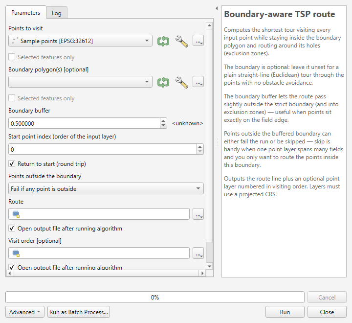
  <br><em>Figure 7.1. The Boundary-aware TSP route algorithm in the Processing Toolbox. The boundary is optional and may be left blank.</em>
</p>
### 7.2 Parameter reference

These are the parameters exactly as the algorithm defines them. The **Key** column is the string used when scripting; the **Label** column is what appears in the dialog.

| Key | Label | Type | Optional | Default |
|---|---|---|---|---|
| `POINTS` | Points to visit | Point feature source | No | — |
| `BOUNDARY` | Boundary polygon(s) | Polygon feature source | **Yes** | *(unset)* |
| `BUFFER` | Boundary buffer | Distance (minimum `0.0`) | No | `0.5` |
| `START_INDEX` | Start point index (order of the input layer) | Integer (minimum `0`) | No | `0` |
| `ROUND_TRIP` | Return to start (round trip) | Boolean | No | `True` |
| `ON_OUTSIDE` | Points outside the boundary | Enum | No | `0` |
| `OUTPUT_ROUTE` | Route | Line feature sink | No | — |
| `OUTPUT_ORDER` | Visit order | Point feature sink | Yes (created by default) | — |

#### The ON_OUTSIDE enum

Enum parameters are passed as **integers** when scripting. The index order is part of the algorithm's public interface and will not change:

| Index | Option string | Behaviour |
|---|---|---|
| `0` | `Fail if any point is outside` | Any point outside the buffered boundary aborts the run with an error listing the offending feature ids. |
| `1` | `Skip points outside the boundary` | Points outside the buffered boundary are dropped; only the points inside are routed. |

Index `0` is the default. See section 7.6 for what skip mode does to the start point.

> **The buffer is tied to the boundary.** `BUFFER` is declared as a distance parameter whose parent is `BOUNDARY`, so the Processing dialog shows it in the boundary layer's map units. With no boundary supplied, the buffer has no effect.

#### START_INDEX is positional, not a feature id

`START_INDEX` is an index into the points **in the order the algorithm reads them from the input layer**, starting at `0`. It is *not* a feature id. The valid range is `0` to the number of usable points minus one; anything outside that range raises:

```
Start point index must be between 0 and <n>.
```

The count is of *usable* points — features with empty or non-point geometries are skipped before the index is checked.

### 7.3 Outputs

Two sinks are produced. Field names and types are exactly as follows.

**`OUTPUT_ROUTE` — "Route"** (LineString, one feature):

| Field | Type | Meaning |
|---|---|---|
| `length` | double | Total route length in the working CRS's map units |
| `stops` | integer | Number of stops visited |
| `round_trip` | string(3) | `yes` for a round trip, `no` for a one-way path |

**`OUTPUT_ORDER` — "Visit order"** (Point, one feature per stop):

| Field | Type | Meaning |
|---|---|---|
| `visit_order` | integer | Rank in the tour, starting at `1` |
| `source_fid` | integer | Feature id of the originating point in the input layer |
| `leg_length` | double | Length of the leg *leaving* this stop |

`OUTPUT_ORDER` is optional but is created by default. To suppress it, pass `None` for that parameter.

> **The output CRS depends on the boundary.** If a boundary is supplied, both outputs use the **boundary layer's** CRS and the points are reprojected into it. With no boundary, both outputs use the **point layer's** CRS. Plan for this when chaining outputs into other algorithms.

### 7.4 Running from the Toolbox

1. Open **Processing ▸ Toolbox**.
2. Expand **Plover** and double-click **Boundary-aware TSP route**.
3. Set **Points to visit**.
4. Set **Boundary polygon(s)**, or leave it blank for a plain straight-line tour.
5. Adjust **Boundary buffer**, **Start point index**, **Return to start** and **Points outside the boundary** as needed.
6. Choose output locations, or leave them as temporary layers.
7. Click **Run**.

Progress is reported to the dialog's progress bar and the run can be cancelled. Informational notes — repaired boundary polygons, enclosed features treated as holes, skipped points — are written to the **Log** tab of the algorithm dialog.

### 7.5 Using it in the Graphical Model Designer

Because Plover is a normal Processing algorithm, it can be dropped into a model like any other.

1. Open **Processing ▸ Graphical Modeler**.
2. Add model inputs — typically a vector layer input for the points and one for the boundary.
3. On the **Algorithms** tab, search for `Boundary-aware TSP route` and add it.
4. Connect the inputs, then set the remaining parameters as fixed values or expose them as model inputs.
5. Name and save the model.

A common pattern is to place an **Extract by location** step before Plover so a project-wide point layer is filtered to one field, then routed. Plover's own skip mode (`ON_OUTSIDE = 1`) usually achieves the same result in one step.

### 7.6 Batch mode: many fields in one run

Batch mode is the fastest way to route a set of fields.

1. In the Toolbox, right-click **Boundary-aware TSP route** and choose **Execute as Batch Process…**.
2. Each row is one run. Fill in the points layer, boundary layer and outputs per row.
3. Use **Autofill** on a column to populate it quickly — for example, filling the boundary column from a folder of field polygons.
4. Click **Run**.

Batch runs are where `ON_OUTSIDE = 1` (skip) earns its keep: point one shared point layer at every field boundary in turn, and each row routes only the points inside that field.

**Start point in skip mode.** The algorithm resolves `START_INDEX` against the *original* point list, remembers that feature, then re-finds it after the outside points are dropped. If the point you nominated was itself outside the boundary and was skipped, the run does not fail — it falls back to the first remaining point and warns:

```
Start point lies outside the boundary and was skipped;
starting from the first in-boundary point instead.
```

### 7.7 Scripting with PyQGIS

Open **Plugins ▸ Python Console** and run:

```python
import processing

result = processing.run("plover:tsproute", {
    "POINTS": points_layer,        # QgsVectorLayer, or a layer id / file path
    "BOUNDARY": boundary_layer,    # optional - omit or pass None for a straight-line tour
    "BUFFER": 0.5,
    "START_INDEX": 0,
    "ROUND_TRIP": True,
    "ON_OUTSIDE": 0,               # 0 = fail if any point is outside, 1 = skip them
    "OUTPUT_ROUTE": "TEMPORARY_OUTPUT",
    "OUTPUT_ORDER": "TEMPORARY_OUTPUT",
})

print(result["OUTPUT_ROUTE"], result["OUTPUT_ORDER"])
```

To read the total length back out:

```python
from qgis.core import QgsVectorLayer

route = result["OUTPUT_ROUTE"]
layer = route if isinstance(route, QgsVectorLayer) else QgsVectorLayer(route, "route", "ogr")
feature = next(layer.getFeatures())
print(f"{feature['stops']} stops, {feature['length']:.1f} map units, round trip: {feature['round_trip']}")
```

A minimal straight-line run with no boundary at all:

```python
result = processing.run("plover:tsproute", {
    "POINTS": points_layer,
    "OUTPUT_ROUTE": "TEMPORARY_OUTPUT",
})
```

Looping over several field boundaries, routing each field's points:

```python
import processing
from qgis.core import QgsProject

points = QgsProject.instance().mapLayersByName("All sample points")[0]

for boundary in QgsProject.instance().mapLayersByName("Fields"):
    out = processing.run("plover:tsproute", {
        "POINTS": points,
        "BOUNDARY": boundary,
        "BUFFER": 1.0,
        "ON_OUTSIDE": 1,           # skip anything outside this field
        "ROUND_TRIP": True,
        "OUTPUT_ROUTE": "TEMPORARY_OUTPUT",
        "OUTPUT_ORDER": None,      # suppress the visit-order layer
    })
    print(boundary.name(), "->", out["OUTPUT_ROUTE"])
```

> Use `processing.run` inside scripts rather than `processing.runAndLoadResults`, unless you actually want every intermediate layer added to the project.

### 7.8 Running headless from the command line

`qgis_process` runs algorithms without opening QGIS, which suits scheduled jobs and servers.

```bash
qgis_process run plover:tsproute --POINTS=points.gpkg --BOUNDARY=field.gpkg --BUFFER=0.5 --ROUND_TRIP=true --ON_OUTSIDE=1 --OUTPUT_ROUTE=route.gpkg
```

**Important quirk — `qgis_process` does not see profile plugins.** By default `qgis_process` loads only core plugins. A plugin installed normally into your user profile is invisible to it, and the command above fails with an unknown-algorithm error.

The fix is to point `QGIS_PLUGINPATH` at a directory that *contains* the plugin folder, then enable the plugin by its folder name — `tsp_route_generator`, not `plover`:

Windows PowerShell:

```powershell
$env:QGIS_PLUGINPATH = "C:\path\to\folder-containing-the-plugin"
qgis_process plugins enable tsp_route_generator
qgis_process run plover:tsproute --POINTS=points.gpkg --OUTPUT_ROUTE=route.gpkg
```

Linux or macOS:

```bash
export QGIS_PLUGINPATH="/path/to/folder-containing-the-plugin"
qgis_process plugins enable tsp_route_generator
qgis_process run plover:tsproute --POINTS=points.gpkg --OUTPUT_ROUTE=route.gpkg
```

Confirm it is visible with:

```bash
qgis_process list
```

> **PowerShell and the pipe character.** Data source strings often contain a pipe, as in `field.gpkg|layername=fields`. PowerShell treats `|` as its own pipe operator and will mangle the argument. Put the stop-parsing token `--%` before the arguments, or quote the whole value.

### 7.9 If the Plover group is missing from the Toolbox

1. Confirm the plugin is installed and ticked in **Plugins ▸ Manage and Install Plugins ▸ Installed**.
2. Restart QGIS — the provider is registered when the plugin loads.
3. Check **Processing ▸ Options ▸ Providers** and make sure **Plover** is enabled.
4. Look in **View ▸ Panels ▸ Log Messages** for load errors on the **Plugins** tab.

### 7.10 Validation the algorithm performs

The algorithm checks its inputs before doing any work and raises a clear error rather than producing a wrong answer:

- The working layer must use a **projected** CRS. A geographic CRS raises `The boundary layer uses a geographic CRS (degrees); reproject to a projected CRS (e.g. UTM) first.` — or `point layer` in place of `boundary layer` when no boundary was supplied.
- A boundary that contributes no usable polygons raises `Boundary layer contains no usable polygons.`
- Fewer than two usable points raises `Need at least two point features.`
- An out-of-range start index raises `Start point index must be between 0 and <n>.`
- Points outside the buffered boundary in fail mode raise an error naming up to twelve feature ids.
- Fewer than two points remaining after skipping raises `Only <n> point(s) fall inside the boundary — need at least two. Increase the buffer or use a boundary that contains more points.`

All of these are covered in detail in chapter 8.


---

## 8. Troubleshooting, How It Works, and Limitations

### Part A — Troubleshooting

#### 8.1 First place to look: the Plover log

Plover writes detailed diagnostics to the QGIS message log. The status line in the dialog gives you the short version; the log gives you the specifics — which feature, at which coordinate, how far outside.

Open it with **View ▸ Panels ▸ Log Messages**, then select the **Plover** tab.

Get into the habit of opening this panel *before* a run on unfamiliar data. Most "why did it do that?" questions are answered there.

#### 8.2 Errors that stop a run

These appear in red on the dialog's status line, or as an error in Processing.

##### "Select a point layer."

**Cause.** No point layer is chosen in **Points to visit**.

**Fix.** Choose a point layer. If the dropdown is empty, no point layer is loaded in the project — add one. Note that the boundary layer is *optional*, so this message never refers to the boundary.

##### "The boundary layer uses a geographic CRS (degrees). Distances would be meaningless — reproject to a projected CRS (e.g. UTM) first."

The message says `point layer` instead of `boundary layer` when you are running without a boundary.

**Cause.** The working CRS is geographic — latitude/longitude in degrees, such as EPSG:4326. A degree of longitude is a different ground distance at every latitude, so tour lengths and the buffer distance would be meaningless.

**Fix.** Reproject to a projected CRS that suits your location, then re-run. For most of the Canadian prairies that is a UTM zone (for example EPSG:32612, UTM zone 12N) or a provincial 10TM. Use **Vector ▸ Data Management Tools ▸ Reproject Layer**, or export with **Export ▸ Save Features As…** and set the CRS there.

Note this is checked against the *working* CRS: the boundary layer's CRS when a boundary is supplied, otherwise the point layer's.

##### "The boundary layer contains no usable polygons."

In Processing: `Boundary layer contains no usable polygons.`

**Cause.** Every feature in the boundary layer was rejected — the layer is empty, has no geometries, contains no polygon geometries, or every polygon was invalid and could not be repaired.

**Fix.**

1. Confirm the layer really is a polygon layer with features in it.
2. Check the Plover log for `Skipped an invalid boundary polygon that could not be repaired.`
3. Run **Vector ▸ Geometry Tools ▸ Check Validity**, or **Fix Geometries**, and route against the repaired output.

##### "'Use only selected points' is on, but no points are selected."

**Cause.** The checkbox is ticked but the point layer has no active selection.

**Fix.** Either select features on the map or in the attribute table first, or untick **Use only selected points**.

##### "Need at least two point features to build a route."

In Processing: `Need at least two point features.`

**Cause.** Fewer than two usable points were found. This counts points *after* Plover discards unusable features, so a layer with plenty of rows can still trip it.

**Fix.** Check the log for `Skipping feature <id>:` lines, which give the reason per feature:

| Log message | Meaning |
|---|---|
| `Skipping feature <id>: empty geometry.` | The feature has no geometry at all |
| `Skipping feature <id>: not a point.` | The geometry is not a point geometry |
| `Skipping feature <id>: reprojection failed.` | The point could not be transformed into the working CRS |

If you are using **Use only selected points**, check that at least two points are actually selected.

##### "<n> point(s) fall outside the buffered boundary (now selected on the layer; details in the log). Increase the buffer, switch 'Points outside boundary' to skip, or fix the data."

In Processing the equivalent error names the offending feature ids, up to twelve of them.

**Cause.** You are in **Fail if any point is outside** mode and at least one point lies outside the boundary once the buffer has been applied.

**This is often the most useful error Plover produces** — it is usually telling you something true about your data.

**Fix.** Work out which of these you actually have:

1. **Points genuinely belong to another field.** This is the common case with one project-wide sample layer. Switch **Points outside boundary** to **Skip points outside the boundary**. See chapter 5.
2. **Points sit just barely outside the line.** GPS drift or a boundary digitized slightly tight. Increase **Boundary buffer** until they are inside. The log tells you exactly how far out each one is, so you can pick a sensible value rather than guessing.
3. **Points really are wrong.** Bad coordinates, wrong CRS on import, a typo. Fix the data.

The offending features are **selected on the point layer** automatically (in the dialog, and only when you are not already restricted to a selection), so you can zoom straight to them with **Ctrl+J**. The log lists each one as:

```
Point fid=<id> at (<x>, <y>) is <d> units outside the boundary.
```

##### "Only <n> point(s) fall inside the boundary — need at least two to build a route. Increase the buffer or pick a boundary that contains more points."

**Cause.** You are in skip mode, and after dropping the outside points fewer than two remain.

**Fix.** You have almost certainly selected the wrong boundary feature, or the boundary does not overlap this point set at all. Confirm the two layers overlap on the map. If the points sit just outside, increase the buffer.

##### "<n> point(s) cannot be reached from the start point (point number <list>). They are likely separated by a hole/exclusion zone or a pinched-off part of the boundary. Increase the buffer distance or check the boundary geometry."

**Cause.** The points are inside the boundary, but no legal path exists between them and the start point. The route would have to leave the permitted region to get there.

Note the identifiers here are **point numbers within this run**, counting from 1 — not feature ids.

Typical geometry behind it:

- A slough or exclusion zone spans the field completely, cutting it into two disconnected halves.
- The boundary pinches to a point, or two edges touch, so the passage between two lobes is infinitely narrow.
- The boundary is actually two separate polygons with a gap between them, and points are stranded on the far side.
- A sliver of self-intersection has produced a zero-width neck.

**Fix.**

1. **Increase the buffer.** A pinch that is geometrically zero-width will open up with even a small buffer. This resolves the majority of cases.
2. **Inspect the boundary.** Zoom in on the narrow spot. If the field really is split into two disconnected pieces, the honest answer is that no single continuous route exists — route each piece separately.
3. **Fix the geometry.** Run **Vector ▸ Geometry Tools ▸ Fix Geometries** if the boundary self-intersects.

Plover deliberately reports these points rather than silently drawing a straight line through the obstacle to reach them. A route you cannot drive is worse than an error message.

A related low-level message, `Waypoint graph is disconnected; some points cannot be reached.`, has the same causes and the same fixes.

##### "Start point index must be between 0 and <n>." (Processing only)

**Cause.** `START_INDEX` is outside the valid range. It is a **positional index counting from 0**, not a feature id.

**Fix.** Use a value from `0` to the number of usable points minus one. Remember unusable features are discarded before this check.

##### "Routing failed unexpectedly — see the Plover log panel for the full traceback."

**Cause.** An unhandled error. This is a bug, or data far outside what was anticipated.

**Fix.** Open the Plover log and copy the traceback, then report it at <https://github.com/Dozer3530/Plover/issues> with a description of the data. The traceback is the useful part — please include it.

#### 8.3 Warnings that do not stop a run

These are written to the Plover log. The run continues, but you should know they happened.

| Message | What it means |
|---|---|
| `Reprojecting points from <a> to <b> for routing.` | Your point layer is in a different CRS from the boundary. Normal and harmless. |
| `Repaired an invalid boundary polygon with makeValid().` | A boundary polygon was invalid and was auto-repaired. Worth checking the repair did what you expected. |
| `Skipped an invalid boundary polygon that could not be repaired.` | A polygon was dropped entirely. Investigate. |
| `Treated a fully-enclosed boundary feature as an exclusion zone (hole).` | A polygon fully inside another became a hole. Usually exactly what you wanted for a slough digitized as a separate feature. |
| `Skipping <n> point(s) outside the boundary; routing the <m> inside.` | Skip mode did its job. Confirm the count matches your expectation. |
| `Chosen start point lies outside the boundary and was skipped; starting from the first in-boundary point instead.` | Your nominated start was dropped by skip mode. Pick a start that is inside the field. |
| `Chosen start point is not in the selection; starting from the first selected point instead.` | Your start point is not among the selected features. |
| `Could not apply route symbology on this QGIS version; using defaults.` | Cosmetic only — the route drew with default styling. |
| `Could not style visit-order markers on this QGIS version.` | Cosmetic only. |
| `Could not enable visit-order labels on this QGIS version.` | Cosmetic only — numbers are still in the `visit_order` attribute. |

#### 8.4 Saving and exporting problems

##### "No route layer to save — generate a route first."

**Cause.** **Save Route…** was clicked before a successful run.

**Fix.** Run a route first. The button stays disabled until one succeeds.

##### "Unsupported file format — use .gpkg, .shp, .geojson, .gpx or .kml."

**Cause.** The filename's extension was not recognised and no format was chosen in the file-type dropdown.

**Fix.** Pick a format from the dropdown, or type a filename with one of those five extensions.

##### "Save failed: <message>"

**Cause.** The underlying writer refused. Common reasons: the file is open in another program, the folder is read-only or on a disconnected network drive, or the path is invalid.

**Fix.** Check the full message in the Plover log — it includes the error code. Close the file elsewhere, or save to a local folder such as your Documents directory and copy it afterwards.

#### 8.5 Behaviour that is not a bug

##### The route disappeared when I closed QGIS

The route and visit-order layers are **memory (scratch) layers**. They are not saved anywhere until you export them. Use **Save Route…**, or right-click the layer and choose **Export ▸ Save Features As…**, before closing the project. See chapter 6.

##### Nothing happens when I click Run

Check the status line at the bottom of the dialog. If it reads `Routing <n> points…` the run is in progress — the progress bar advances and **Cancel** is available. Large point counts with complex boundaries take longer.

##### The buffer or "Points outside boundary" controls are greyed out

That is deliberate. Both only apply when a boundary is supplied. Choose a boundary layer and they become active. See chapter 4.

##### The route runs slightly outside the field edge

That is the buffer doing its job. The route is permitted to stray up to the **Boundary buffer** distance outside the strict boundary and that far into exclusion zones. Reduce the buffer if you need it tighter — but note that a buffer of exactly zero is internally widened by a hair, because a route hugging the field edge would otherwise be rejected.

##### The tour is not the shortest possible

Plover is a heuristic solver. See section 8.10.

---

### Part B — How Plover Works

You do not need this section to use Plover. It is here so that whoever maintains the plugin next understands what the numbers mean, and so that anyone can judge how far to trust the output.

#### 8.6 The pipeline

A run proceeds in five stages.

**Stage 1 — Build the permitted region.** The boundary polygon is buffered outward by the **Boundary buffer** distance. Everything afterwards asks one question of this region: *does this straight segment stay inside it?* Because holes are not part of a polygon's interior, obstacle avoidance is a free consequence of the geometry — there is no separate "avoid sloughs" step.

A buffer of exactly zero is widened by a negligible amount, because the geometric containment test excludes the boundary line itself and a route running along the field edge would otherwise be rejected.

With no boundary supplied, this stage is skipped entirely and every segment is permitted.

**Stage 2 — Reduce the boundary to its turn vertices.** A shortest path inside a polygon is taut, like a string pulled tight. A taut string can only bend at a corner that juts *into* the open space — a concave corner of the field outline, or a corner of a hole. It can never bend at a convex field corner or at a vertex in the middle of a straight edge.

Plover therefore keeps only those "reflex" vertices and discards the rest. The saving is large: a rectangular field contributes **no** vertices at all, and a boundary traced from imagery with hundreds of near-collinear vertices typically contributes a handful.

<p align="center">
  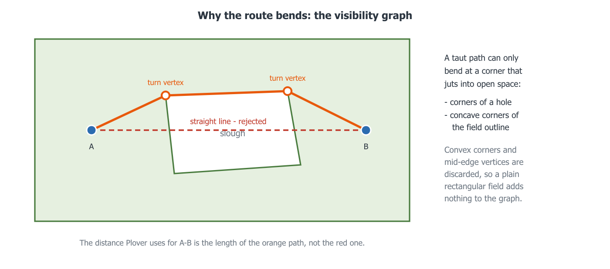
  <br><em>Figure 8.1. A taut path bends only at corners that jut into the open space. The straight line from A to B is rejected because it leaves the permitted region; the distance Plover records for that pair is the length of the path around the slough.</em>
</p>
**Stage 3 — Build the visibility graph.** Plover takes the waypoints plus the surviving boundary vertices and tests every pair: if the straight segment between them stays inside the permitted region, that pair gets an edge whose weight is the straight-line distance.

This is the expensive stage, so the containment test uses a *prepared geometry* — a form the geometry engine optimises once and then reuses for thousands of tests.

With no boundary, no test is needed and every pair is simply connected.

**Stage 4 — Measure true distances between waypoints.** The graph gives distances between *neighbours*, but the solver needs the real travel distance between every pair of waypoints — going around obstacles where necessary. Plover runs Dijkstra's shortest-path algorithm **once per waypoint**, which fills in an entire row of the distance matrix at a time, and caches the actual path taken so it can be redrawn later.

At the end of this stage Plover checks whether any waypoint is unreachable from the start and reports it rather than faking a straight line.

**Stage 5 — Choose the visiting order, then draw it.** With a full distance matrix the problem becomes pure ordering. Plover:

1. builds several starting tours with **nearest-neighbour** construction from different beginnings;
2. improves the best of them with **2-opt**, which repeatedly reverses a section of the tour when doing so shortens it — this is what removes crossings;
3. improves it further with **Or-opt**, which relocates short runs of one to three stops to a better position;
4. alternates the two until neither can find an improvement.

Finally the chosen order is expanded back into a real polyline using the cached shortest paths, so each leg follows the true route around obstacles rather than a straight line.

#### 8.7 What this means in practice

- **Rectangular fields with no sloughs are very fast.** The boundary contributes nothing to the graph, so cost is driven almost entirely by the number of points.
- **Complex boundaries cost more than many points do.** A field traced in fine detail with several sloughs has many turn vertices, and graph construction grows with the square of the node count.
- **Progress is not linear.** The bar moves through graph construction, then the distance matrix, then optimisation. A pause partway through is normal.
- **The run is cancellable** because it happens on a background thread. QGIS stays responsive and you can pan and zoom while it works.

The project README records a benchmark against the older 2.7.0 engine on a synthetic 100-point field with an 80-vertex boundary and two sloughs: wall time fell from 2.9 s to 0.26 s, and tour length from 6749 m to 6405 m.

---

### Part C — Limitations and Good Practice

#### 8.8 It optimises distance, not driving time

Plover minimises geometric distance inside a polygon. It knows nothing about:

- roads, tracks, field approaches or gates
- soil conditions, wet spots or where you would actually get stuck
- speed differences between headland and standing crop
- turning circles, implement width or compaction concerns
- traffic, time windows or crew scheduling

Treat the output as a strong first draft of a visiting order, not as a prescription. The visiting order is usually the valuable part; the exact drawn line is a suggestion.

#### 8.9 It has no concept of a real access route

The line Plover draws is the shortest legal path *within the polygon you gave it*. If you must enter the field by a particular gate, add that gate as a point and set it as the start.

#### 8.10 The solver is heuristic, not exact

Plover uses nearest-neighbour construction improved by 2-opt and Or-opt. These reliably produce good tours — typically within a few percent of optimal — but they do not prove optimality, and re-running will not usually find something better.

For field work this is the right trade: a route two percent longer than perfect, computed in under a second, beats a provably optimal route you cannot compute at all. If you need certainty for a small point set, a dedicated exact TSP solver is the correct tool.

#### 8.11 Without a boundary there is no reachability safety net

In no-boundary mode every point connects to every other in a straight line, so the "cannot be reached" check can never trigger. A stray point hundreds of kilometres away — a mis-keyed coordinate, a point imported in the wrong CRS — will be silently included with a very long leg.

Sanity-check the reported total distance against what you expect. If a quarter-section route comes back as 400 km, you have a rogue point.

#### 8.12 Very large point counts

Cost grows quickly with the number of waypoints, because the graph is built pairwise and one shortest-path search is run per waypoint. A few dozen points is instant. Several hundred with a complex boundary will take noticeably longer.

If a job is too large, consider splitting the work by field or by zone and routing each separately — which is usually what you want operationally anyway.

#### 8.13 CRS caveats

- Always work in a **projected** CRS appropriate to your location. Plover refuses geographic CRS outright.
- Distances are in the **working CRS's map units** — metres for UTM. The `length` and `leg_length` attributes carry no unit, so record which CRS a saved route came from.
- Using a projection badly suited to your latitude introduces distance error. For the Canadian prairies, use the correct UTM zone or a provincial projection.

#### 8.14 A short pre-flight checklist

1. Both layers in the same projected CRS, appropriate to the area.
2. Boundary geometry valid; sloughs digitized as holes or as fully-enclosed polygons.
3. Point layer contains the points you expect, and no strays.
4. Decided: fail or skip for points outside the boundary.
5. Buffer set sensibly for your GPS accuracy — typically a few metres.
6. Start point chosen deliberately, usually the field entrance.
7. Plover log panel open if the data is unfamiliar.
8. **Save the outputs** before closing the project.

#### 8.15 Getting help

- **Plover log** — **View ▸ Panels ▸ Log Messages**, **Plover** tab. Always look here first.
- **Issue tracker** — <https://github.com/Dozer3530/Plover/issues>. Include the QGIS version, the Plover version, the exact message, and the traceback if there was one.
- **Source** — <https://github.com/Dozer3530/Plover>.


---

## Appendix A. Quick Reference

### A.1 Dialog settings at a glance

| Control | Default | Remembered? | Notes |
|---|---|---|---|
| Points to visit | *(first point layer)* | No | Required |
| Use only selected points | Off | No | Needs an active selection |
| Boundary layer | *(first polygon layer)* | No | **Optional** — leave empty for a straight-line tour |
| Start at point | *(first feature)* | No | Falls back to the first point if unresolved |
| Boundary buffer | `0.50` map units | Yes | Disabled when no boundary is chosen |
| Points outside boundary | Fail if any point is outside | Yes | Disabled when no boundary is chosen |
| Return to start (round trip) | On | Yes | Off gives a one-way path |
| Also create a numbered visit-order layer | On | Yes | — |

Remembered settings are stored under the `plover/` prefix in QGIS settings and persist between sessions.

### A.2 Processing parameters at a glance

| Key | Type | Optional | Default |
|---|---|---|---|
| `POINTS` | Point feature source | No | — |
| `BOUNDARY` | Polygon feature source | **Yes** | *(unset)* |
| `BUFFER` | Distance | No | `0.5` |
| `START_INDEX` | Integer | No | `0` |
| `ROUND_TRIP` | Boolean | No | `True` |
| `ON_OUTSIDE` | Enum: `0` fail, `1` skip | No | `0` |
| `OUTPUT_ROUTE` | Line sink | No | — |
| `OUTPUT_ORDER` | Point sink | Yes | created by default |

Algorithm id: **`plover:tsproute`**

### A.3 Output fields

**Route layer** — `length` (double), `stops` (integer), `round_trip` (string, `yes` or `no`).

**Visit order layer** — `visit_order` (integer, from 1), `source_fid` (integer), `leg_length` (double).

### A.4 Export formats

| Format | Extension | Reprojected to WGS84 |
|---|---|---|
| GeoPackage | `.gpkg` | No |
| Shapefile | `.shp` | No |
| GeoJSON | `.geojson` | No |
| GPX track | `.gpx` | **Yes** |
| KML | `.kml` | **Yes** |

### A.5 Decision guide

| Situation | What to do |
|---|---|
| Points must all be in this field | Leave **Points outside boundary** on *Fail* |
| One point layer covers many fields | Set it to *Skip points outside the boundary* |
| Points sit right on the field edge | Increase **Boundary buffer** to a few metres |
| You only want a visiting order, no obstacle avoidance | Leave **Boundary layer** empty |
| You finish at a different gate than you started | Untick **Return to start** |
| You only want to route part of the layer | Select those features, tick **Use only selected points** |
| Route must start at the field entrance | Add the gate as a point and set it as **Start at point** |

---

## Appendix B. Glossary

**2-opt** — An improvement step that reverses a section of the tour when doing so shortens it. Removes self-crossings.

**Boundary buffer** — How far outside the strict boundary, and into exclusion zones, the route is permitted to stray. Also absorbs GPS error on points digitized near the field edge.

**Closed tour / round trip** — A route that returns to its starting point.

**CRS (Coordinate Reference System)** — How coordinates map to positions on the earth. Plover requires a *projected* CRS, whose units are linear (usually metres), not a *geographic* one measured in degrees.

**Dijkstra's algorithm** — The shortest-path algorithm Plover runs once per waypoint to find true travel distances through the visibility graph.

**Euclidean TSP** — The plain straight-line version of the problem, with no obstacles. What Plover solves when no boundary is supplied.

**Exclusion zone** — Any area inside the field the route must avoid: slough, wetland, dugout, bush, rock pile, yard site. Represented as a hole in the boundary polygon, or as a polygon fully enclosed by another.

**Feature id (fid)** — QGIS's internal identifier for a feature. Recorded in the visit-order layer's `source_fid` field so you can join results back to the original points.

**Heuristic** — A method that finds a very good answer quickly without proving it is the best possible. Plover's solver is heuristic.

**Hole / interior ring** — A ring inside a polygon's outline that is *not* part of the polygon. How sloughs are normally represented.

**Leg** — One segment of the tour, from one stop to the next.

**Memory layer / scratch layer** — A layer that exists only in the current QGIS session. Plover's outputs are memory layers and are lost unless you save them.

**Nearest-neighbour construction** — Building an initial tour by repeatedly hopping to the closest unvisited point. Fast but rough; Plover then improves it.

**Open path / one-way** — A route that ends at its last stop rather than returning to the start.

**Or-opt** — An improvement step that relocates a short run of one to three stops to a better place in the tour.

**Prepared geometry** — A form of a geometry optimised once so that many repeated tests against it run quickly. Used for the visibility graph's containment tests.

**Reflex vertex / turn vertex** — A corner that juts into the open space, where a taut shortest path can bend. Only these are kept when building the visibility graph.

**Round trip** — See *closed tour*.

**Slough** — A prairie wetland or pothole. The archetypal obstacle Plover was written to route around.

**TSP (Travelling Salesperson Problem)** — Given a set of stops and the distances between them, find the shortest route visiting them all.

**Visibility graph** — A graph connecting every pair of nodes that can "see" each other, meaning the straight line between them stays inside the permitted region.

**Waypoint** — One point from the input layer, as used by the router.

**Working CRS** — The CRS routing happens in: the boundary layer's if a boundary is supplied, otherwise the point layer's. Outputs use this CRS.


---


<div align="center">
<sub>Generated from the Plover source at version 3.2.5. Rebuild with <code>docs/build_guide.js</code> and <code>docs/make_figures.py</code>.</sub>
</div>
